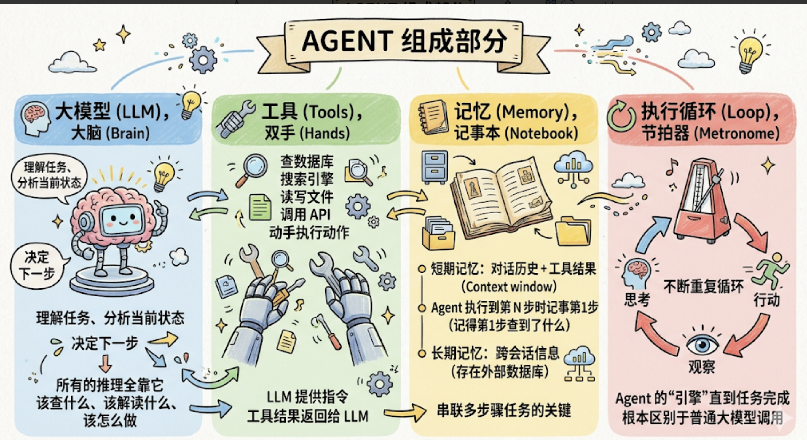

名词扫盲

## Agent

对于 `llm` 和 `prompt` 他都只能进行 `ask` 操作，并不能干，只是能输出

### 什么是 Agent

Agent (智能体) : 能够自主感知环境，作出决策，调用工具，完成多步骤任务的程序

- 自主（Autonomously） ：不需要人在每一步发指令。你给它一个目标，它自己判断下一步做什么
- 多步骤（Multi-step） ：一个任务可能要走 5 步、10 步，Agent 自己把这些步骤串起来
- 工具调用（Tool use） ：调用真实的函数，查数据库、搜网页、发通知、写文件，不只是"说说"，而是真的去做

一句话总结： Agent = 大模型（大脑）+ 工具（双手）+ 执行循环（思考-行动-观察-再思考）

### 为什么需要 Agent

之前我们说过大模型的三大短板：
1. 没有执行能力 ：只能生成文字，不能操作外部系统

2. 知识有截止日期 ：不知道最新数据，看不到你的私有系统

3. 没有持久记忆 ：每次调用对它都是全新的，不能积累任务中间状态

### Agent 的核心组成

1. 大模型（LLM），大脑

负责理解任务、分析当前状态、决定下一步做什么。所有的"推理"都在这里发生，该查什么、查完之后怎么解读、下一步往哪走，全是大模型来判断。

2. 工具（Tools），双手

一个个可以被调用的真实函数：查数据库、调用搜索引擎、读写文件、发通知、调用 API……
大模型告诉 Agent "调用这个工具、传这些参数"，代码层面真正去执行。工具的结果会返回给大模型，供它继续推理。大模型不"直接"操作外部系统，它通过工具来"动手"。

3. 记忆（Memory），记事本

- 短期记忆 ：当前任务里的对话历史 + 每次工具调用的结果，存在 context window 里。Agent 执行第 5 步时，"记得"第 1 步查到了什么，靠的就是这个
- 长期记忆 ：跨会话需要记住的信息，存在外部数据库，需要时检索出来注入 context

为什么需要记忆？多步骤任务里，每一步的结果都是下一步判断的依据。没有记忆，每步都是"从零开始"，Agent 根本没法串联多步骤任务。

4. 执行循环（Loop），节拍器

Agent 的"引擎"。不断重复"思考 → 行动 → 观察"这个循环，直到任务完成。没有这个循环，Agent 只是一次性的问答，无法串联多步骤。这个循环是 Agent 和普通大模型调用之间最根本的区别。



### Agent 是怎么工作的. ReAct 循环

目前主流的 Agent 工作范式叫做 `ReAct` 即 `Reasoing+Acting` 即 推理 + 行动 + 观察 + 在推理 .. 


```
用户：帮我调查今晚 23:00 的数据库报警

[第 1 轮]
Think：需要先拿到具体的报警详情
Act：调用 get_alarm_details(time="23:00")
Observe：返回"连接数突增，连接池耗尽，持续 8 分钟后自动恢复"

[第 2 轮]
Think：连接数突增，需要看是哪些查询造成的
Act：调用 query_slow_log(timerange="22:50-23:10")
Observe：发现 3 条全表扫描的慢查询，来自同一个用户 ID

[第 3 轮]
Think：根因已经清楚，生成分析报告
Act：输出最终分析结论（Final Answer）
```

几个关键机制：

- 结果回流 ：每一轮的工具调用结果都会追加到 context window 里，大模型下一轮能"看到"所有历史。所以它能基于已有发现继续推理，而不是每次都从零开始。这就是为什么前面"记忆"那个组件如此重要。

- 动态决策 ：每一步该怎么走，是大模型实时推理出来的，不是你提前写好的。发现是慢查询，它就去查慢查询日志；如果发现是网络问题，它就会去查网络相关的工具。路径是活的，不是死的。

- 何时停止 ：大模型判断任务已完成时输出"最终答案"，或者达到预设的最大轮数上限。两个条件任意满足一个，循环结束。
这就是"自主"的含义，你给任务目标，它自己决定怎么走到终点。

### Agent 的另一个工作模式  Plan and Execute

ReAct 很好用，但有一个先天的弱点。

ReAct 是「边想边做」，每一步只看眼前，这一步的结果决定下一步的方向。对于 2-3 步能解决的短任务，这完全没问题。但如果任务很复杂、步骤很多呢？

**问题一：长任务容易「迷路」**

ReAct 跑了 8 轮之后，context window 里已经堆满了历史操作记录。大模型要在这一大堆信息里同时维持「当前在第几步」「最终目标是什么」「还缺哪些信息」，注意力越来越稀释，越往后越容易偏离最初的目标。

**问题二：容易绕弯路**

没有全局规划，每步只看眼前，就像在迷宫里随机探索，走了 5 步之后才发现方向不对，只能回头重来，白白消耗了好几轮 LLM 调用。

**问题三：token 消耗滚雪球**

ReAct 每一轮都要把完整的对话历史带上。步骤越多，每轮的 context 越长，后期每次 LLM 调用的 token 消耗都很高，成本直线上升。

这三个问题催生了另一种工作模式： `Plan and Execute（规划-执行模式）` 。

核心思路用一句话说清楚： `先让大模型把整个任务规划成一份清单，再逐步按清单执行，而不是走一步看一步`。


#### Plan and Execute 的两个阶段

**第一阶段：Planner（规划阶段）**

大模型拿到任务，先不调任何工具，专注做一件事： 把任务完整拆解成一份有序的子任务清单 。

```
用户：「帮我调查今晚 23:00 的数据库报警，写一份完整的故障分析报告」

Planner 输出的计划：
  步骤 1：获取 23:00 报警的详细信息（报警类型、持续时间、影响范围）
  步骤 2：查询报警时间段内的慢查询日志，定位异常 SQL
  步骤 3：查询报警时间段内的数据库连接数、CPU、内存指标
  步骤 4：关联步骤 2 和步骤 3 的结果，分析根因
  步骤 5：生成完整的故障分析报告，包含时间线、根因和改进建议
```

**第二阶段：Executor（执行阶段）**

```
执行步骤 1：
  → 调用 get_alarm_details(time="23:00")
  ← 返回「连接数突增，连接池耗尽，持续 8 分钟后自动恢复」

执行步骤 2：
  → 调用 query_slow_log(timerange="22:50-23:10")
  ← 发现 3 条全表扫描的慢查询，来自同一个用户 ID

执行步骤 3：
  → 调用 get_db_metrics(timerange="22:50-23:10")
  ← CPU 正常，连接数峰值达到上限 500，内存无异常

执行步骤 4：
  → 大模型综合步骤 2、3 结果进行分析
  ← 结论：慢查询导致连接长时间占用，连接池耗尽触发报警

执行步骤 5：
  → 生成故障分析报告
  ← 完整报告输出，任务完成
```

### Re-planning （重新规划）

执行中途如果遇到了计划没预料到的情况，比如步骤 2 查不到慢查询，但发现了大量锁等待，Executor 可以把这个新信息反馈给 Planner，重新生成后续步骤的计划，而不是一条路走到黑。

```
用户任务
  ↓
[Planner]  大模型一次性生成完整计划
  ↓
执行计划 = [步骤1, 步骤2, 步骤3, 步骤4, 步骤5]
  ↓
[Executor] 按顺序执行每个步骤
  步骤1 → 调工具 → 结果
  步骤2 → 调工具 → 结果      ← 遇到意外？触发 Re-planning，重新调整后续计划
  步骤3 → 调工具 → 结果
  ...
  ↓
最终结果汇总 → 输出给用户
```

### ReAct vs Plan and Execute：怎么选？

| 对比维度 | ReAct | Plan and Execute |
| --- | --- | --- |
| 决策时机 | 每一步实时决策 | 开始前一次性规划 |
| 全局视野 | 弱（只看当前这步） | 强（提前看到全貌） |
| 灵活性 | 强（随时根据结果调整） | 弱（计划一旦生成，调整成本高） |
| 适合任务步骤 | 少（3 步以内） | 多（5 步以上的复杂任务） |
| token 消耗 | 随步数线性增长，后期很贵 | 规划阶段集中消耗，执行阶段可控 |
| 实现难度 | 低（结构简单） | 中（需要管理计划状态和 Re-planning 逻辑） |


简单记忆：

- 任务步骤少、目标模糊、需要随机应变 → 用 ReAct

- 任务步骤多、目标明确、需要全局把控 → 用 Plan and Execute

- 系统复杂、两者都需要 → Plan and Execute 做外层框架，每个子任务内部跑 ReAct

最后这种「外层 Plan and Execute + 内层 ReAct」的搭配，在实际生产系统里最常见，用规划保证大方向不跑偏，用 ReAct 保证每个子任务执行时足够灵活。

### Agent vs Workflow

`Workflow`（工作流）是你提前写好所有步骤和分支逻辑的流程：先做 A，再做 B，如果 B 的结果是 X 就走流程 C，否则走流程 D。大模型只是其中某个步骤里被调用一次，整体流程是硬编码的。

`Agent` 是你只给任务目标，大模型自己实时决定每一步做什么、调用什么工具、根据结果决定下一步。执行路径是动态的，每次运行可能走不同的路径。

| 对比维度 | Workflow | Agent |
| --- | --- | --- |
| 决策者 | 你（写死的代码逻辑） | 大模型（实时推理） |
| 执行路径 | 固定 | 动态 |
| 适合场景 | 步骤明确、重复性高 | 任务开放、情况多变 |
| 可预测性 | 高 | 低 |
| 成本 | 低 | 高（多轮 LLM 调用） |

两者没有高下之分，适合不同的场景：

- 流程能写清楚、步骤是固定的 → 优先用 Workflow ，更稳、更省钱、更可预期

- 任务是开放式的、需要根据中间结果动态决策 → 用 Agent

- 最常见的实际架构： Workflow 做骨架，Agent 负责其中需要判断的环节 ，两者结合，不是非此即彼

### 一个真是的 agent


```python
def run_agent(user_message):
    messages = [
        {"role": "system", "content": SYSTEM_PROMPT},
        {"role": "user",   "content": user_message},
    ]

    while True:
        # 1. 调用大模型，让它思考下一步
        response = llm.call(messages)

        # 2. 如果大模型说"我完成了"，退出循环
        if response.is_final_answer:
            return response.content

        # 3. 否则，执行大模型指定的工具
        tool_result = execute_tool(response.tool_name, response.tool_args)

        # 4. 把工具结果追加到 messages，供下一轮参考
        messages.append({"role": "tool", "content": tool_result})
```

## 总结

整理一下这一章的核心认知：

`Agent 是什么` ：以大模型为大脑，能自主调用工具、完成多步骤任务的程序。让大模型从"只能说"变成"能干"。

`核心组成` ：大模型（大脑）+ 工具（双手）+ 记忆（记事本）+ 执行循环（节拍器）

`核心机制`：Think → Act → Observe 循环，每轮工具结果都回流给大模型，直到完成

`和 Workflow 的本质区别` ：决策者不同，Workflow 是你提前写好的代码逻辑，Agent 是大模型实时推理。两者不是竞争关系，实际系统里经常结合使用
