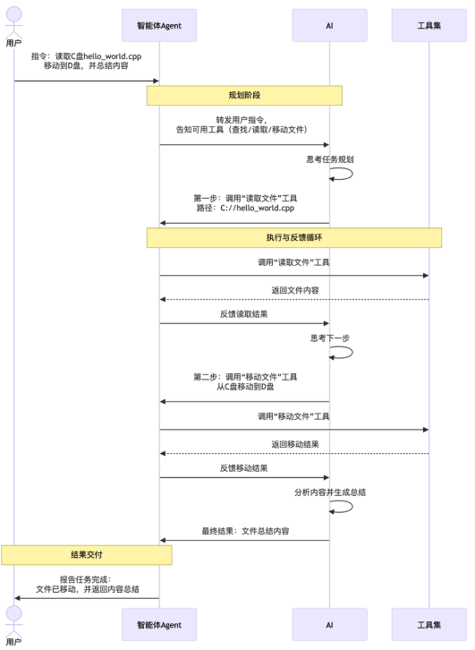

如果想让 AI 给你输出一套方案 或者是分类规则 是非常容易的

但是想让他给你查看今天天气，或者是预定明天机票一般来说都不能很完美的进行

而 `Tool` 就是为了实现这些内容

## Agent 和 Tool

`Agent`在上一篇文章中指出 是负责作出决策和调用工具，所以 `Agent`主要负责的就是 调度和决策

用户 : 提供需求

大模型 LLM :  负责决策，先做什么 后做什么

Agent : 负责 Tool 的调度，和 LLM  调度

Tool : 实际处理解决 问题的操作

---
具体来说，当你给 Agent 下一条指令：「帮我读取 C 盘目录下的 hello_world.cpp 文件，移动到 D 盘目录下，最后给我总结一下这个文件的核心内容」，整个执行流程是这样的：



1. **Agent 把需求 + 工具清单打包，发给大模型** ：「用户想做这件事，你有这些工具可以用，第一步该怎么做？」
2. **大模型做决策，返回指令** ：「调用【读取文件】工具，路径是 C://hello_world.cpp」
3. **Agent 执行指令，调用工具** ：真正去磁盘上读文件
4. **Agent 把结果回传给大模型** ：「文件读取成功，内容是……」
5. **大模型根据结果，决定下一步** ：「好，现在调用【移动文件】工具，把它移到 D 盘」
6. **循环执行，直到任务完成** ：所有步骤跑完，大模型生成最终总结
7. **Agent 把结果反馈给你** ：任务完成
   你看，这整个过程里，「决策」始终在大模型，「执行」始终在工具，而 Agent 就是那个来回传话、推进任务的协调员。

## Tool

我们在写 `skills` 的时候，经常会用到 `python` 处理脚本

那么 `python` 代码就是 `tool` 吗

### Tool 的四要素

#### 函数本体

函数本体 ： 真正干活的代码

name (名称) : 大模型的识别标签

description (描述) ： 整个工具定义最重要的字段

parameters (参数定义) : 告诉大模型我们应该怎么填参数


函数本体 :

```python
# ===== 第一部分：函数本体（大模型看不到，Agent 负责执行）=====
import requests

def get_weather(city: str, date: str) -> dict:
    """调用天气 API，查询指定城市指定日期的天气"""
    response = requests.get(
        "https://api.weather.com/v1/forecast",
        params={"city": city, "date": date}
    )
    data = response.json()
    return {
        "city": city,
        "date": date,
        "weather": data["condition"],   # 晴/多云/雨
        "temperature": data["temp_c"],  # 摄氏度
        "humidity": data["humidity"]    # 湿度百分比
    }
```

工具说明书 包含 name + description + parameters

```json
// ===== 第二三四部分：工具说明书（大模型看到的部分，靠这个决定要不要调用）=====
{
  "name": "get_weather",
  "description": "查询指定城市在指定日期的天气情况。当用户询问某地天气、出行建议、是否需要带伞等问题时使用此工具，返回天气状况、气温和湿度信息。",
  "parameters": {
    "type": "object",
    "properties": {
      "city": {
        "type": "string",
        "description": "要查询天气的城市名称，例如：北京、上海、广州"
      },
      "date": {
        "type": "string",
        "description": "查询日期，格式：YYYY-MM-DD，例如：2025-03-21"
      }
    },
    "required": ["city", "date"]
  }
}
```

