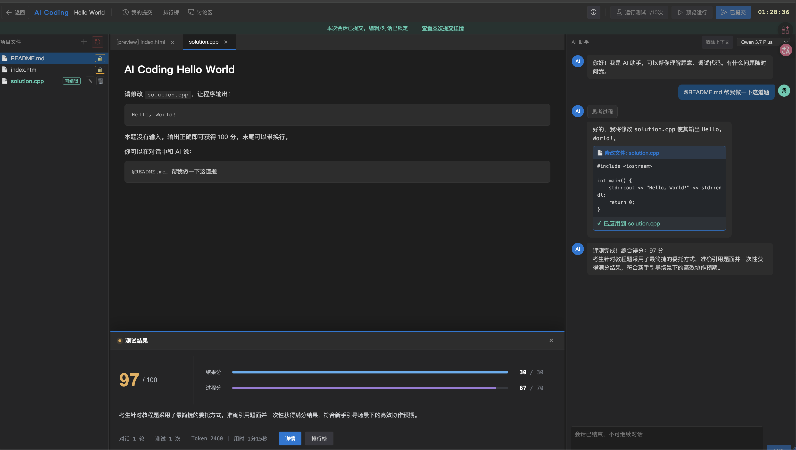
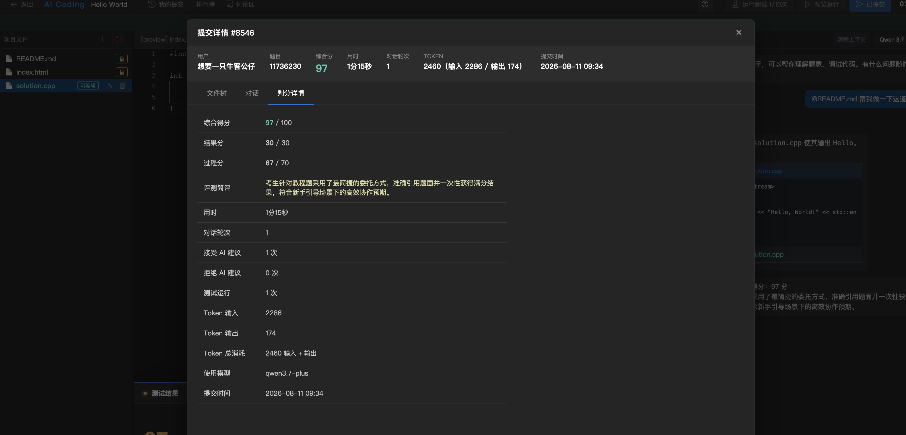
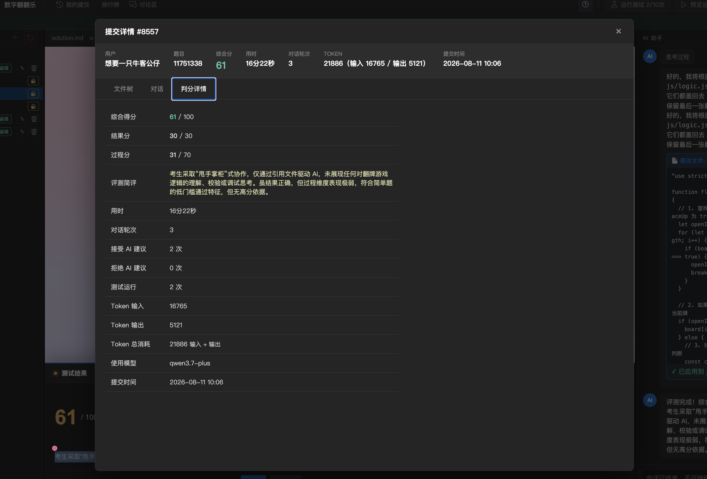
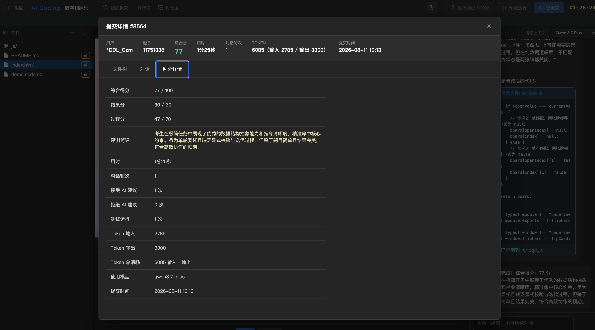
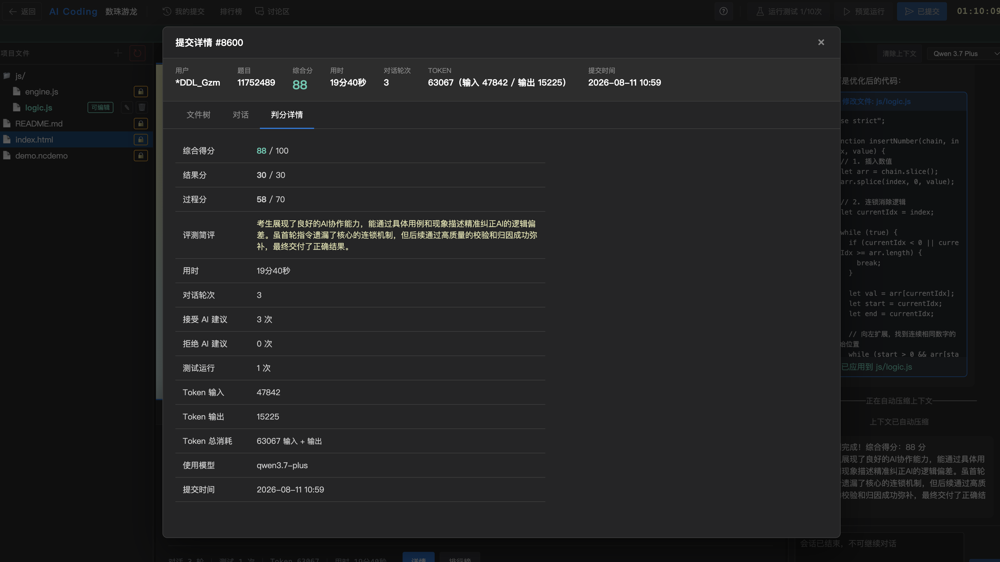

## 前言

由于不少面试最近都增加了 Ai Coding 的题目 特别先来熟悉一下 

看了一眼 LeetCode 和 牛客 发现只有牛客有 所以单独开辟一个专栏看一下


### HelloWorld

做这道题 可以看到 右边有一个 AI Agent。 可以沟通 第一题很简单直接给出了做法 。 

具体做法预计就是 

1. 把自己的思路写到 一个文档里面 。 

2. 然后@Agent 进行执行

感觉和日常开发一样。 另外 我们最终文件是可以编辑的 。 



不过这里竟然没有满分，只有97分 

我们发现过程分占了很多 70 分去了 。结果分只有30分 。看来 AI coding 更注重的不是算出结果

这个过程分没有给出合理的解释 不过看现有的维度有

1. 对话的轮次

2. 用时

3. 接受 AI 建议

4. 拒绝 AI 建议

5. 运行的次数

6. Token 输入

7. Token 输出



因此可以总结出第一个 高分思路

目的 :
1. xxxx

思路 :
1. 根据 xxxx 
2. 通过 xxxx
3. 实现 xxxx

要求 :
1. 优化文字回答内容,要求清晰简单

下面我们继续看下一题吧

### 卡牌翻翻乐

这道题 一开始编写了一个 soultion.md . 之前开发的习惯, 喜欢使用 md 存放思路 然后@给Agent。因为之前输入的prompts不能太长。使用文件传入 Cursor会优化

1. 简单给了 要求和示例 以及 题目给的描述 就直接给AI了

这里增加了一轮回答 因为我 md 内容中是 `logic.js` , AI访问不到 ,让我重复提交了一次 `commit` 应该是 `js/logic.js `

2. 第一次抽奖没抽出来，功能性只有70分。看了一下 发现我实现的效果 和 预期效果差点意思。所以又使用 `upgrade` 根据产品的角度额外调整了一下

soultion.md :
```md
目的 : 完善 @js/logic.js 的逻辑。 使得 @index.html 能够实现 翻牌数字匹配的游戏

思路 :
function flipCard(board, index)
board 是牌桌数组。
每个位置为 null，或一个 [value, faceUp] 二元数组。
value 是整数，faceUp 是布尔值。
null 表示该位置当前没有牌。
index 使用从 0 开始的数组下标。
调用时，index 一定指向一个 [value, false]；牌桌中至多有一个 [value, true]。
返回处理后的完整牌桌，数组长度和元素格式不变。可以修改传入数组，也可以返回新数组。


要求 :
1. 保留文件末尾的导出方式：
if (typeof module !== "undefined") module.exports = { flipCard };
if (typeof window !== "undefined") window.flipCard = flipCard;

2. 优化文字回答的内容,要求简单清晰


示例：
flipCard(
  [[1, false], [2, false], [1, false], [2, false]],
  0
);
// 返回：
// [[1, true], [2, false], [1, false], [2, false]]
保留文件末尾的导出方式：
if (typeof module !== "undefined") module.exports = { flipCard };
if (typeof window !== "undefined") window.flipCard = flipCard;
```

upgrade.md :

```go
优化现有的 @js/logic.js 逻辑, 保证 @index.html 中的逻辑符合如下内容 :

目的 :

1. 我们如果点开两个不一样的牌, 需要清空两个牌的展示。不需要保留最后一次牌的内容 

相关资料可以参考 :

@solution.md 
```



第一次提交后的分数很低 。 这个评价也很扯，认为我直接引用文件 没有思考

然后第二次 我尝试把文件的内容塞到 prompts里面进行求解。 并且一次命中 。得分也只有77分

1. 虽为单轮委托且缺乏显式校验与迭代过程

我不确定这个显示校验是什么，写一个ut ？ 迭代过程可能就是缺少了多轮对话 毕竟我们是一次命中的 。



#### 总结

1. 做题不和开发一样 。 尽量使用 prompts的形式进行 避免使用 markdown @file 的形式

2. 对于不再同一个层级的包或者是其他文件可能会有权限问题，需要额外 @ 

3. 需要增加一些产品类型的描述。 细化每个功能的细节


### 数珠游龙


目的 : 实现 @js/logic.js 中的内容 。 在 @index.html 实现一个 数珠游龙 的游戏 。 

function insertNumber(chain, index, value)
chain 是一个由整数组成的一维数组，也可能为空。
index 是插入位置，范围为 0 到 chain.length；0 表示最前方，chain.length 表示最后方。
value 是本次插入的整数。
返回本次操作结束后的完整一维整数数组。可以修改传入数组，也可以返回新数组。

功能需求 :

1. 用户操作会发送一个小球进入到本次队列
2. 对于相同数字 例如 `<2,2>,<3,3>` 需要进行消除。 
3. 如果是不同的数字 直接插入到当前位置例如 `<2,3,4>` 在`<3,4>`中间插入了一个数`5`那么队列变成 `<2,3,5,4>` 


思路 :
1. 根据 xxxx 
2. 通过 xxxx
3. 实现 xxxx

要求 :
1. 优化文字回答内容,要求清晰简单

2. 保留文件末尾的导出方式：
if (typeof module !== "undefined") module.exports = { insertNumber };
if (typeof window !== "undefined") window.insertNumber = insertNumber;

示例：
insertNumber([2, 4, 1], 2, 3);
// 返回 [2, 4, 3, 1]


优化 @js/logic.js 保证 @index.html 满足:
1. 消除逻辑不对，对于初始队列 `<4,2,2,4,1,3,3,2>` 我在末尾插入一个 `2` 前面的数字就都消失了
2. 可以参考 @demo.ncdemo 的实现

优化 @js/logic.js 保证 @index.html 满足:
1. 消除逻辑不正确 , 我们需要保证对于 `<2,2>` 相同的形式是被消除的 。 对于`<2,2,2>`也应该全部消除，而不是只保留`<2>`


