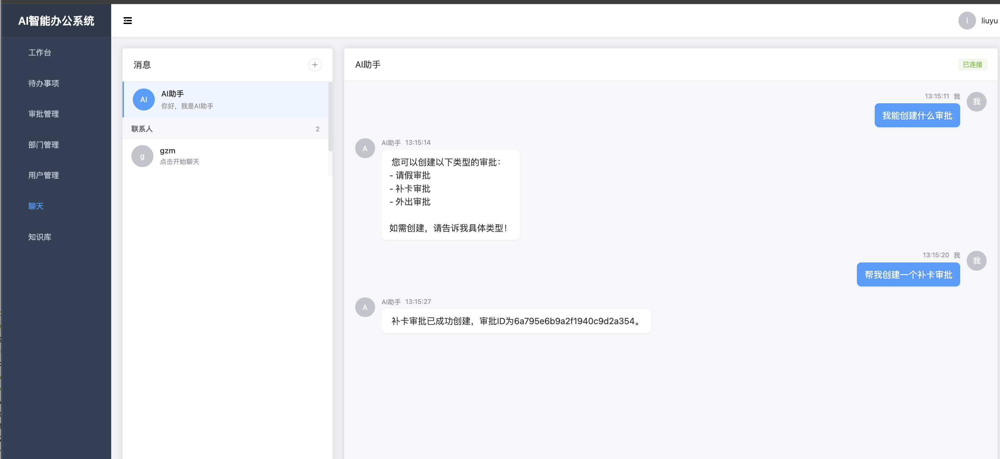
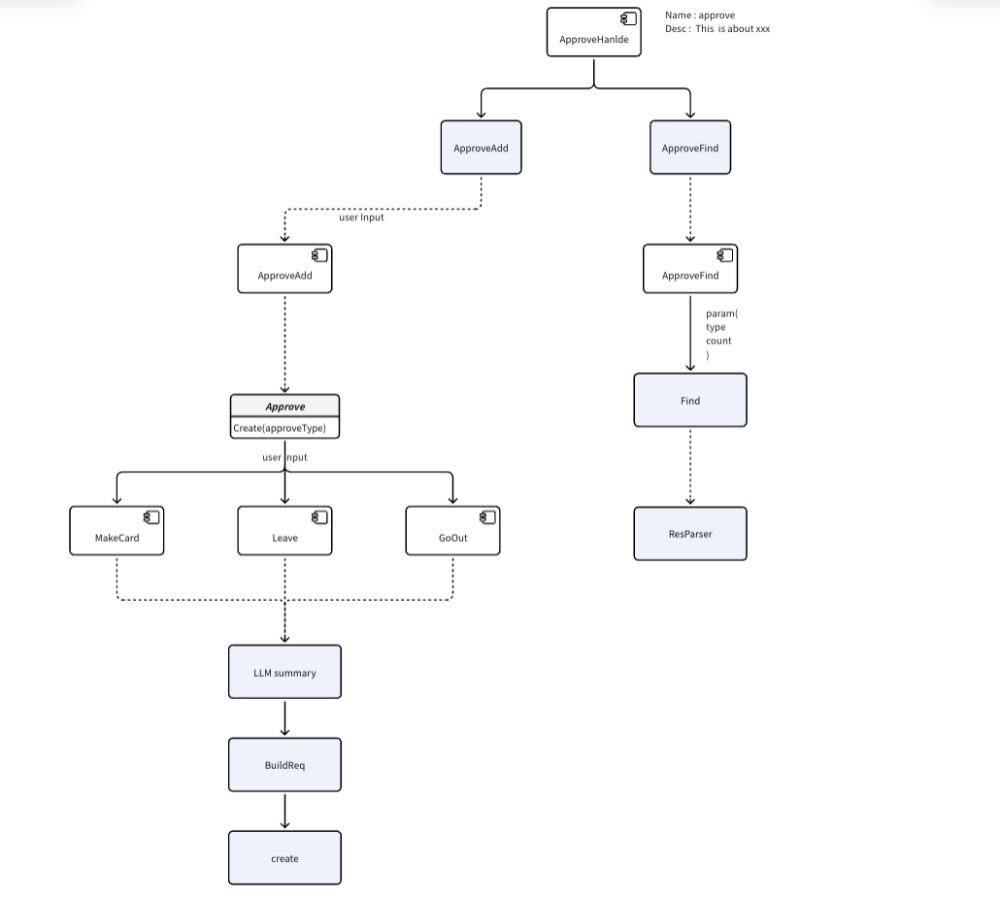

## 最终实现

1. 能够自动创建对应的请假审批




## 整体流程如下

1. 注册 ApproveHandle 这里由上层 Agent 判断调度

2. ApproveHandle 支持 ApproveAdd 和 ApproveFind 分别对应创建审批和查找审批



## 细节


### ApproveAdd

这里的逻辑很简单

1. 根据 Agent 传递的 input 解析出对应的 参数

2. 根据参数build对应的 Service实现

3. 然后透传 用户原始信息去 Create

```go

// Call 解析审批类型与原文，并创建审批
func (a *ApprovalAdd) Call(ctx context.Context, input string) (string, error) {
	// ... 
	out, err := a.outputparser.Parse(input)
	if err != nil {
		return "", err
	}
	data := out.(map[string]any)

	var approvalType float64
	if t, ok := data["type"]; ok {
		switch v := t.(type) {
		case float64:
			approvalType = v
		case int:
			approvalType = float64(v)
		}
	}
	userInput := input
	if v, ok := data["input"].(string); ok && v != "" {
		userInput = v
	}

	// 保留用户原文，同时补充工时上下文供二级抽取使用
	enriched := fmt.Sprintf("%s\n%s", userInput, workHoursHint)

	ap, err := approval.NewApproval(a.svc, model.ApprovalType(approvalType))
	if err != nil {
		return "", err
	}

	id, err := ap.Create(ctx, enriched)
	if err != nil {
		return "", err
	}

	return Success + "\n created approval id : " + id, nil
}

```
2. 我们可以看到一个 Create实现，这里由额外进行了一次LLM操作，根据透传的 input 进行额外的解析


```go
func (m *GoOut) Create(ctx context.Context, input string) (string, error) {
	out, err := chains.Predict(ctx, m.c, map[string]any{
		langchain.Input: input,
	}, chains.WithCallback(m.svc.Callbacks))
	if err != nil {
		return "", xerr.WithMessage(err, "chains.Predict : "+input)
	}

	v, err := m.outPutParser.Parse(out)
	if err != nil {
		return "", xerr.WithMessage(err, "m.outPutParser.Parse")
	}

	var data domain.GoOut
	if err := decodeJSON(v, &data); err != nil {
		return "", xerr.WithMessage(err, "decode goOut")
	}

	return createApproval(ctx, m.svc, domain.Approval{
		Type:  int(model.GoOutApproval),
		GoOut: &data,
	})
}

```
### ApproveFind

1. Approve Find 同样 内容更加简单

```go
func (a *ApprovalFind) Call(ctx context.Context, input string) (string, error) {
	if a.Callback != nil {
		a.Callback.HandleText(ctx, "approval find start input : "+input)
	}

	out, err := a.outputparser.Parse(input)
	if err != nil {
		return "", err
	}

	data := out.(map[string]any)
	if data == nil {
		data = make(map[string]any)
	}

	// List API 使用当前登录用户；type 为「我提交/我审核」
	listType := float64(model.ApprovalSubmit)
	if t, ok := data["type"].(float64); ok && t > 0 {
		listType = t
	}
	data["type"] = int(listType)
	if data["count"] == nil {
		data["count"] = 10
	}
	if data["page"] == nil {
		data["page"] = 1
	}

	res, err := curl.GetRequest(token.GetTokenStr(ctx), a.svc.Config.Host+"/v1/approval/list", data)
	if err != nil {
		return "", err
	}

	if a.Callback != nil {
		a.Callback.HandleText(ctx, "approval find end data : "+string(res))
	}

	return ResParser(res, domain.ApprovalFind, nil)
}

```