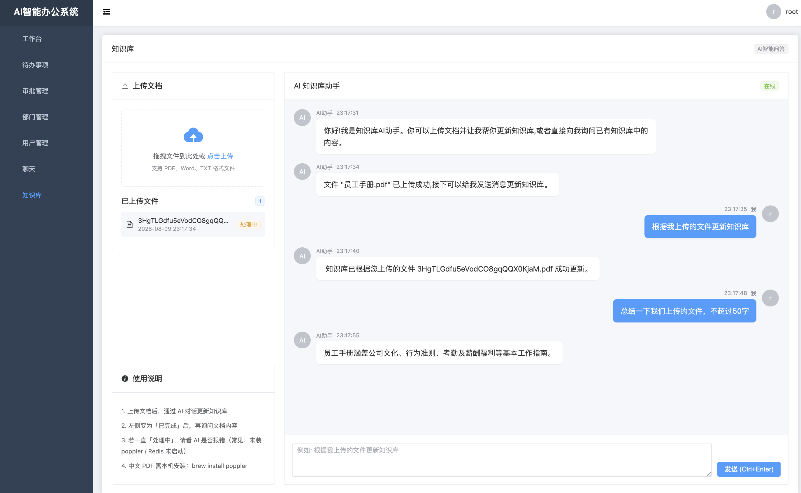
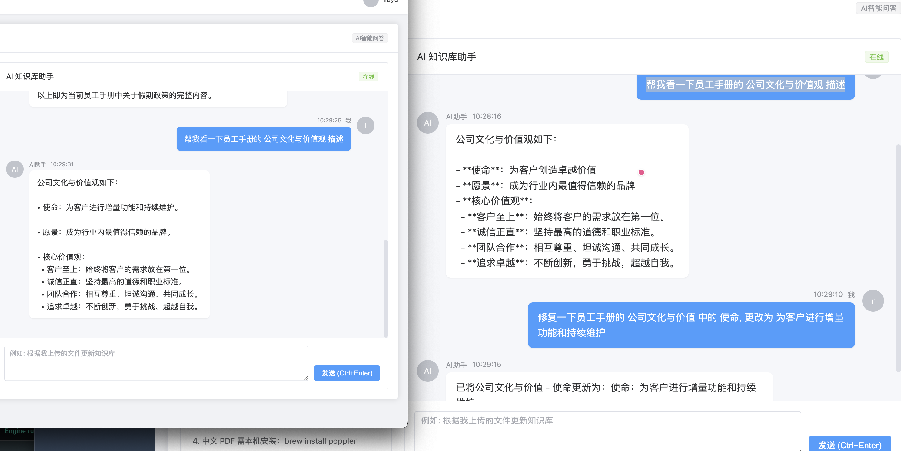
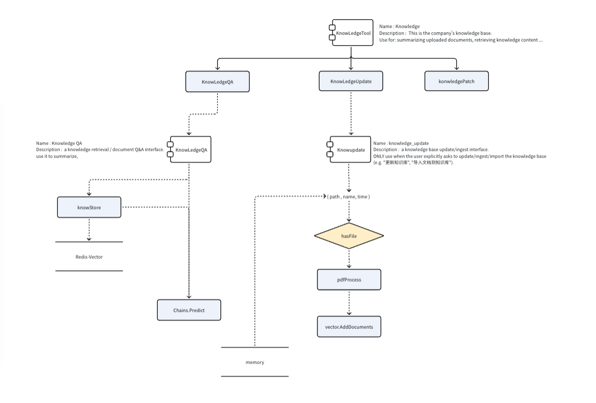

## 最终实现

1. 我们能够通过前端上传 pdf 进行知识库的更新

2. 我们可以通过 自然语言询问 文章里面的内容 。 并且更新对应的内容

3. 同样我们可以重新上传文章进行更新





## 细节

### 大体框架

1. 我们提供了一个 KnowLedgeHandle 其中 .  介绍 我们这个 Handle 是做什么内容的

```
Name : knowledge
Desc : This is the company's knowledge base.
Use for: summarizing uploaded documents, retrieving knowledge content, answering questions about employee manuals, attendance, leave, approval process, and other office policies.
Also use for updating/ingesting the knowledge base from uploaded files, and for revising/correcting knowledge facts (e.g. 更改工作时间).
Prefer this destination whenever the user mentions 知识库 / 文档 / 手册 / 总结 / 更改手册内容
```

这个Handle 对应3个 Tool

1. KnowledgeQA 用于进行 RAG 回答问题

2. KnowledgePatch 部分更新 vector 中的内容

3. KnowledgeUpdate 更新全量的文章





### knowledgeQa

我们看一下 knowledgeQa 这里做的内容 

1. 获取 Store  也就是获取我们的 Redis CLi

2. 后去其中的 Content 内容 。并且存入到 qa 里面 。 这里使用了 RAG 相似度匹配

3. 然后去询问 AI

整个流程大致这样，相似度匹配也是框架帮我们做的事

```go
func (k *KnowledgeRetrievalQA) Call(ctx context.Context, input string) (string, error) {
	var err error
	if k.qa == nil {
		k.store, err = getKnowledgeStore(ctx, k.svc)
		if err != nil {
			return "", fmt.Errorf("连接知识库向量存储失败(请确认 Redis Stack 已启动): %v", err)
		}

		// topK 取多块，目录/全文结构类问题才有足够上下文
		k.qa = chains.NewRetrievalQAFromLLM(k.svc.LLMs, vectorstores.ToRetriever(k.store, 5))
	}

	res, err := chains.Predict(ctx, k.qa, map[string]any{
		"query": input,
	})
	if err != nil {
		return "", err
	}

	return `请基于检索资料回答用户。写作要求：
1. 直接输出当前有效规定，语气像员工手册正文，条理清晰。
2. 若资料里同一主题有多条说法，只保留最新有效内容合并进答案；不要对比新旧，不要出现「修订」「原规定」「冲突」「优先于」「最新版本」等词。
3. 用户问某类政策时，尽量给出完整条目，而不是只讲变更点。
检索资料：
` + res, nil
}
```

### KnowledgeUPdate

KnowledgeUPdate 就好像是一个 Python 脚本，可以看作想是一个skills


不过这里还是有几点需要注意的

1. Param . 我们可以看到 Update 在操作之前解析了参数 path,name,time . 这几个参数从哪里来？ 

1. 我们上传完文件之后会传入到 放入到 memory 中

```go
func (l *chat) File(ctx context.Context, files []*domain.FileResp) (err error) {
	// ... 
	err = l.memory.SaveContext(ctx, map[string]any{ // 将文件信息保存到记忆机制中
		langchain.OutPut: string(b), // langchain.OutPut: `[{"Path":"upload/xxx.pdf","Name":"...","Time":"..."}]`
	}, map[string]any{
		langchain.OutPut: "uploaded files", // AI 的回复内容
	})
	// ...
}
```

然后框架会自动 把 memory 挂载到 history 中 。 从而模型就能够看到这部分memory

```go
newValues := memory.LoadMemoryVariables(...)  // → {"history": "Human: [{Path,Name,Time}]\nAI: uploaded files\n..."}
合并进 fullValues
```

2. 通过 PDFprocess 解析pdf文件 然后通过 redis 重新更新 Vector

```go
func NewKnowledgeUpdate(svc *svc.ServiceContext) *KnowledgeUpdate {
	return &KnowledgeUpdate{
		//. .. 
		outPutParser: outputparserx.NewStructured([]outputparserx.ResponseSchema{
			{
				Name:        "path",
				Description: "the path to file",
			}, {
				Name:        "name",
				Description: "the name to file",
			}, {
				Name:        "time",
				Description: "file update time",
			},
		}),
	}
}

func (k *KnowledgeUpdate) Call(ctx context.Context, input string) (string, error) {
	 // ... 
	var data any
	data, err := k.outPutParser.Parse(input)
	// ... 

	file := data.(map[string]any)
	filePath := resolveKnowledgeFilePath(fmt.Sprintf("%v", file["path"]))

	if _, err := os.Stat(filePath); err != nil {
		return "", fmt.Errorf("文件不存在: %s", filePath)
	}

	pdfProcessor := NewPDFProcessor()
	chunkedDocuments, err := pdfProcessor.LoadAndSplitPDF(ctx, filePath, 800, 100)
	if err != nil {
		return "", fmt.Errorf("PDF处理失败: %v", err)
	}
	if len(chunkedDocuments) == 0 {
		return "", fmt.Errorf("PDF处理失败: 未生成任何文档块")
	}

	// ... 
	if _, err = k.store.AddDocuments(ctx, chunkedDocuments); err != nil {
		return "", fmt.Errorf("写入知识库失败: %v", err)
	}

	return fmt.Sprintf("%s：文件 %s 已入库，共 %d 个文档块（已覆盖同内容旧数据）。若用户还要求总结或问答文档内容，请继续调用 knowledge_retrieval_qa；若仅要求更新知识库，再给出 Final Answer。",
		knowledgeUpdateSuccessPrefix, filepath.Base(filePath), len(chunkedDocuments)), nil
}
```

## 遗留问题

1. memory 的实现

2. 多个Handle共用memory
	- 方案 ： chatid = uid + busienss_type 根据业务进行区分

	