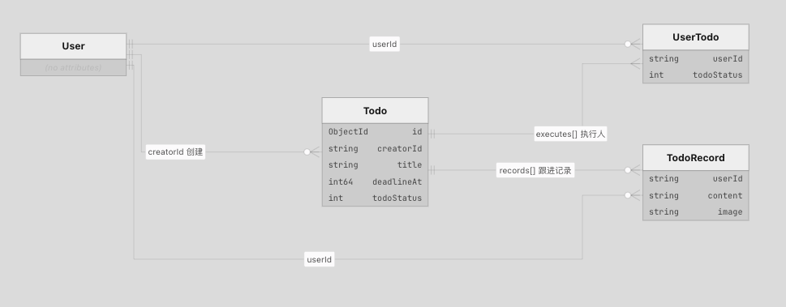
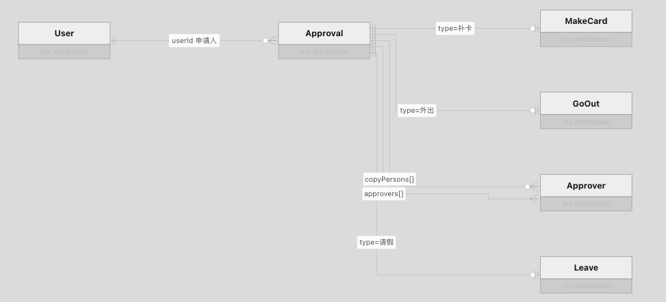

## 鉴权 & 白名单


使用 `group` 加上  Jwt Parse 实现 Check 

```go
func (h *User) InitRegister(engine *gin.Engine) {
	g0 := engine.Group("v1/user")
	g0.POST("/login", h.Login)

	g1 := engine.Group("v1/user", h.svcCtx.Jwt.Handler)
	g1.GET("/:id", h.Info)
	g1.POST("", h.Create)
	g1.PUT("", h.Edit)
	g1.DELETE("/:id", h.Delete)
	g1.GET("/list", h.List)
	g1.POST("/password", h.UpdatePassword)
}

func (m *Jwt) Handler(ctx *gin.Context) {
	r, err := m.tokenParser.ParseWithContext(ctx.Request)
	if err != nil {
		httpx.FailWithErr(ctx, err)
		ctx.Abort()
		return
	}

	ctx.Request = r
	ctx.Next()
}


```

 同样的 我们在 Websocket 那边也是使用 JWT 进行鉴权 

 ```go
func (s *Ws) auth(r *http.Request) (uid string, tokenStr string, err error) {
	// 优先从请求头中获取WebSocket认证Token（保持原有功能）
	tok := r.Header.Get("websocket")
//...

	// 解析JWT Token，获取用户身份信息
	claims, tokenStr, err := s.tokenParser.ParseToken(tok)
	if err != nil {
		return "", "", err
	}
	//...
}
 ```

 ## 用户模块

 支持 Login、Info、Create、Edit、Delete、List、UpdatePassword

 这一部分基本上都是 CRUD 并且没有做并发控制。 

 ```go
 // User 用户业务逻辑接口
type User interface {
	// Login 用户登录验证
	Login(ctx context.Context, req *domain.LoginReq) (resp *domain.LoginResp, err error)
	// Info 根据ID获取用户信息
	Info(ctx context.Context, req *domain.IdPathReq) (resp *domain.User, err error)
	// Create 创建新用户
	Create(ctx context.Context, req *domain.User) (err error)
	// Edit 更新用户信息
	Edit(ctx context.Context, req *domain.User) (err error)
	// Delete 删除指定用户
	Delete(ctx context.Context, req *domain.IdPathReq) (err error)
	// List 分页查询用户列表
	List(ctx context.Context, req *domain.UserListReq) (resp *domain.UserListResp, err error)
	// UpdatePassword 更新用户密码
	UpdatePassword(ctx context.Context, req *domain.UpdatePasswordReq) (err error)
}
 ```

### 表结构设计

```go
type User struct {
	ID primitive.ObjectID `bson:"_id,omitempty" json:"id,omitempty"`
	// TODO: Fill your own fields

	Name     string `bson:"name" json:"name"`
	Password string `bson:"Password" json:"Password"`
	Status   int    `bson:"status" json:"status"`
	IsAdmin  bool   `bson:"isAdmin" json:"isAdmin"` // 是否为管理员
	UpdateAt int64  `bson:"updateAt" json:"updateAt"`
	CreateAt int64  `bson:"createAt" json:"createAt"`
}

```


 ## Department

 1. `Soa` 方法 会根据所有的部门构建一个部门树进行展示

	- 全量查出所有部门
	- 按 ParentPath 分组
	- 否则按照父路径放进 groupDep
```
公司(A) ParentPath=""
  └─ 技术部(B) ParentPath=":A"
       └─ 后端组(C) ParentPath=":A:B"
```

其他的 设计基本上都是 CRUD

 ```go
 type Department interface {
	Soa(ctx context.Context) (resp *domain.DepartmentSoaResp, err error)
	Info(ctx context.Context, req *domain.IdPathReq) (resp *domain.Department, err error)
	Create(ctx context.Context, req *domain.Department) (err error)
	Edit(ctx context.Context, req *domain.Department) (err error)
	Delete(ctx context.Context, req *domain.IdPathReq) (err error)
	SetDepartmentUsers(ctx context.Context, req *domain.SetDepartmentUser) (err error)
	AddDepartmentUser(ctx context.Context, req *domain.AddDepartmentUser) (err error)
	RemoveDepartmentUser(ctx context.Context, req *domain.RemoveDepartmentUser) (err error)
	DepartmentUserInfo(ctx context.Context, req *domain.IdPathReq) (resp *domain.Department, err error)
}
 ```


### 表结构设计

设计一个 部门数据表 一个部门用户表

```go
type Department struct {
	ID         primitive.ObjectID `bson:"_id,omitempty" json:"id,omitempty"`                // 部门ID
	Name       string             `bson:"name" json:"name"`                                 // 部门名称
	ParentId   string             `bson:"parentId,omitempty" json:"parentId,omitempty"`     // 父部门ID
	ParentPath string             `bson:"parentPath,omitempty" json:"parentPath,omitempty"` // 父部门路径
	Level      int                `bson:"level" json:"level"`                               // 部门层级
	LeaderId   string             `bson:"leaderId,omitempty" json:"leaderId,omitempty"`     // 部门负责人ID
	Leader     string             `bson:"leader,omitempty" json:"leader,omitempty"`         // 部门负责人姓名
	Count      int64              `bson:"count" json:"count"`                               // 部门人数
	UpdateAt   int64              `bson:"updateAt,omitempty" json:"updateAt,omitempty"`     // 更新时间
	CreateAt   int64              `bson:"createAt,omitempty" json:"createAt,omitempty"`     // 创建时间
}
```

```go
type DepartmentUser struct {
	ID primitive.ObjectID `bson:"_id,omitempty" json:"id,omitempty"` // 关联ID

	DepId  string `bson:"depId,omitempty"`  // 部门ID
	UserId string `bson:"userId,omitempty"` // 用户ID

	UpdateAt int64 `bson:"updateAt,omitempty" json:"updateAt,omitempty"` // 更新时间
	CreateAt int64 `bson:"createAt,omitempty" json:"createAt,omitempty"` // 创建时间
}
```

## Todo

基本上也都是CRUD接口

```go
type Todo interface {
	Info(ctx context.Context, req *domain.IdPathReq) (resp *domain.TodoInfoResp, err error)   // 获取待办事项详情
	Create(ctx context.Context, req *domain.Todo) (resp *domain.IdResp, err error)            // 创建待办事项
	Edit(ctx context.Context, req *domain.Todo) (err error)                                   // 编辑待办事项
	Delete(ctx context.Context, req *domain.IdPathReq) (err error)                            // 删除待办事项
	Finish(ctx context.Context, req *domain.FinishedTodoReq) (err error)                      // 完成待办事项
	CreateRecord(ctx context.Context, req *domain.TodoRecord) (err error)                     // 创建待办操作记录
	List(ctx context.Context, req *domain.TodoListReq) (resp *domain.TodoListResp, err error) // 获取待办事项列表
}
```

### 表结构设计



```go
type TodoRecord struct {
	TodoId   string `json:"todoId,omitempty"`
	UserId   string `json:"userId,omitempty"`
	UserName string `json:"userName,omitempty"`
	Content  string `json:"content,omitempty"`
	Image    string `json:"image,omitempty"`
	CreateAt int64  `json:"createAt,omitempty"`
}

type Todo struct {
	ID          string        `json:"id,omitempty"`
	CreatorId   string        `json:"creatorId,omitempty"`
	CreatorName string        `json:"creatorName,omitempty"`
	Title       string        `json:"title,omitempty"`
	DeadlineAt  int64         `json:"deadlineAt,omitempty"`
	Desc        string        `json:"desc,omitempty"`
	Status      int           `json:"status,omitempty"`
	Records     []*TodoRecord `json:"records,omitempty"`
	ExecuteIds  []string      `json:"executeIds,omitempty"` // 待办执行人
	TodoStatus  int           `json:"todoStatus,omitempty"`
}

type UserTodo struct {
	ID         string `json:"id,omitempty"`
	UserId     string `json:"userId,omitempty"`
	UserName   string `json:"userName,omitempty"`
	TodoId     string `json:"todoId,omitempty"`
	TodoStatus int    `json:"todoStatus,omitempty"` // 待办事项的状态
}

type TodoInfoResp struct {
	ID          string        `json:"id,omitempty"`
	CreatorId   string        `json:"creatorId,omitempty"`
	CreatorName string        `json:"creatorName,omitempty"`
	Title       string        `json:"title,omitempty"`
	DeadlineAt  int64         `json:"deadlineAt,omitempty"`
	Desc        string        `json:"desc,omitempty"`
	Records     []*TodoRecord `json:"records,omitempty"`
	ExecuteIds  []*UserTodo   `json:"executeIds,omitempty"`
	Status      int           `json:"status,omitempty"`
	TodoStatus  int           `json:"todoStatus,omitempty"`
}
```

## 审批

基本上也是CRUD

```go
func (h *Approval) InitRegister(engine *gin.Engine) {
	// 创建审批路由组，添加JWT中间件进行身份验证
	g := engine.Group("v1/approval", h.svcCtx.Jwt.Handler)
	g.GET("/:id", h.Info)        // 获取审批详情
	g.POST("", h.Create)         // 创建审批申请
	g.PUT("/dispose", h.Dispose) // 处理审批（通过/拒绝/撤销）
	g.GET("/list", h.List)       // 获取审批列表
}

```

### 表结构设计

一张超级无敌巨宽的表



```go
	Approval struct {
		ID primitive.ObjectID `bson:"_id,omitempty" json:"id,omitempty"` // 数据库ID

		UserId   string         `bson:"userId,omitempty" json:"userId,omitempty"`     // 申请人用户ID
		No       string         `bson:"no,omitempty" json:"no,omitempty"`             // 审批编号
		Type     ApprovalType   `bson:"type,omitempty" json:"type,omitempty"`         // 审批类型
		Status   ApprovalStatus `bson:"status,omitempty" json:"status,omitempty"`     // 审批状态
		Title    string         `bson:"title,omitempty" json:"title,omitempty"`       // 审批标题
		Abstract string         `bson:"abstract,omitempty" json:"abstract,omitempty"` // 审批摘要
		Reason   string         `bson:"reason,omitempty" json:"reason,omitempty"`     // 申请理由

		ApprovalId    string      `bson:"approvalId,omitempty"`    // 当前审批人ID
		ApprovalIdx   int         `bson:"approvalIdx,omitempty"`   // 当前审批人索引
		Approvers     []*Approver `bson:"approvers,omitempty"`     // 审批人列表
		CopyPersons   []*Approver `bson:"copyPersons,omitempty"`   // 抄送人列表
		Participation []string    `bson:"participation,omitempty"` // 参与人员ID列表

		FinishAt    int64 `bson:"finishAt,omitempty" json:"finishAt,omitempty"`       // 完成时间戳
		FinishDay   int64 `bson:"finishDay,omitempty" json:"finishDay,omitempty"`     // 完成日期
		FinishMonth int64 `bson:"finishMonth,omitempty" json:"finishMonth,omitempty"` // 完成月份
		FinishYeas  int64 `bson:"finishYeas,omitempty" json:"finishYeas,omitempty"`   // 完成年份

		MakeCard *MakeCard `bson:"makeCard,omitempty" json:"makeCard,omitempty"` // 补卡申请详情
		Leave    *Leave    `bson:"leave,omitempty" json:"leave,omitempty"`       // 请假申请详情
		GoOut    *GoOut    `bson:"goOut,omitempty" json:"goOut,omitempty"`       // 外出申请详情

		UpdateAt int64 `bson:"updateAt,omitempty" json:"updateAt,omitempty"` // 更新时间戳
		CreateAt int64 `bson:"createAt,omitempty" json:"createAt,omitempty"` // 创建时间戳
	}

	// Approver 审批人数据模型
	Approver struct {
		UserId   string         `bson:"userId,omitempty"`   // 用户ID
		UserName string         `bson:"userName,omitempty"` // 用户姓名
		Status   ApprovalStatus `bson:"status,omitempty"`   // 审批状态
		Reason   string         `bson:"reason,omitempty"`   // 审批理由
	}

	// MakeCard 补卡
	MakeCard struct {
		Date      int64         `bson:"date,omitempty"`          //补卡时间
		Reason    string        `bson:"reason,omitempty"`        //补卡理由
		Day       int64         `bson:"day,omitempty"`           //补卡日期(20221011)
		CheckType WorkCheckType `bson:"workCheckType,omitempty"` //补卡类型
	}

	// Leave 请假
	Leave struct {
		Type      LeaveType      `bson:"type,omitempty"`      //请假类型
		StartTime int64          `bson:"startTime,omitempty"` //开始时间
		EndTime   int64          `bson:"endTime,omitempty"`   //结束时间
		Reason    string         `bson:"reason,omitempty"`    //请假原由
		TimeType  TimeFormatType `bson:"timeType,omitempty"`  //请假类型  1=小时 2=天
	}

	// GoOut 外出
	GoOut struct {
		StartTime int64   `bson:"startTime,omitempty"` //开始时间
		EndTime   int64   `bson:"endTime,omitempty"`   //结束时间
		Duration  float32 `bson:"duration,omitempty"`  //时长(小时)
		Reason    string  `bson:"reason,omitempty"`    //外出原由
	}
```

## Chat

# AiHelper WebSocket 聊天技术总结

结论：聊天能力集中在后端独立 WS 服务（`gorilla/websocket`），与 Gin REST 共用 JWT；`front/` 为空，无正式客户端。仓库内无架构图，设计意图主要体现在代码注释与 `Chat_API_测试指南.md`。

---

## 1. 整体架构

进程内双服务并行启动（共享同一 `svc.ServiceContext`）：

| 服务 | 框架 | 默认地址 | 职责 |
|------|------|----------|------|
| REST API | Gin | `0.0.0.0:8888` | 登录、用户管理等 |
| WebSocket | `net/http` + gorilla | `0.0.0.0:9000`，路径 `/ws` | 实时私聊/群聊 |

```
客户端
  │
  ├─ POST /v1/user/login ──► Gin API ──► JWT(AccessToken)
  │
  └─ WS /ws (Header: websocket: <JWT>)
         │
         ▼
   handler/ws.Ws ──► logic.Chat ──► MongoDB chat_log
         │
         └─ 内存 uidToConn / ConnToUid 推送
```

入口：`/Users/gzm/gopath/src/AiHelper/backend/main.go`  
- `api.NewHandle(svcContext).Run()`  
- `ws.NewWs(svcContext).Run()`

依赖：`github.com/gorilla/websocket v1.5.3`（无 nhooyr、无 gin-websocket）

---

## 2. 连接生命周期

核心文件：`/Users/gzm/gopath/src/AiHelper/backend/internal/handler/ws/ws.go`

| 阶段 | 函数 | 行为 |
|------|------|------|
| 启动 | `Ws.Run` | `http.HandleFunc("/ws", ServerWs)` + `ListenAndServe` |
| 握手前鉴权 | `Ws.auth` | 读 Header `websocket`，JWT 解析取 uid |
| 升级 | `ServerWs` → `Upgrader.Upgrade` | 响应头回写 `websocket: <token>` |
| 登记连接 | `addConn` | 写入双向 map；同 uid 旧连接先 `Close`（单点在线） |
| 读循环 | `handleConn`（goroutine） | `ReadMessage` → JSON → 按 `chatType` 分发 |
| 发送 | `send` / `sendByUids` | TextMessage + JSON |
| 断开 | `closeConn` | 读失败或处理失败时清理 map 并关闭 |

要点：
- `CheckOrigin` 恒为 `true`（注释写明生产应收紧）
- 鉴权失败只打日志并 return，**不写 HTTP 错误体**
- JSON 解析失败或业务错误会 `return` 结束循环，但**不一定走 `closeConn`**（潜在连接泄漏）
- 无 ping/pong、心跳、重连协议

---

## 3. 消息协议

领域模型：`domain.Message`（`/Users/gzm/gopath/src/AiHelper/backend/internal/domain/ws.go`）

```json
{
  "conversationId": "string",
  "recvId": "string",
  "sendId": "string",
  "chatType": 1,
  "content": "string",
  "contentType": 1
}
```

| 字段 | 说明 |
|------|------|
| `conversationId` | 群聊强制 `"all"`；私聊空则服务端生成 |
| `recvId` | 私聊必填；群聊可空 |
| `sendId` | **服务端强制覆盖为 JWT uid**，防伪造 |
| `chatType` | 见下表（以**代码**为准） |
| `content` / `contentType` | 内容；`contentType` 注释为 1 文字 / 2 图片 / 3 表情等，**未入库** |

`model.ChatType`（`chatlogtypes.go`）：

| 值 | 常量 | 含义 |
|----|------|------|
| **1** | `GroupChatType` | 群聊 |
| **2** | `SingleChatType` | 私聊 |

分发（`handleConn`）：
- `SingleChatType` → `privateChat` → `logic.Chat.PrivateChat` → `sendByUids(recvId)`
- `GroupChatType` → `groupChat` → `logic.Chat.GroupChat` → `sendByUids()`（全员广播）

注意：`backend/doc/Chat_API_测试指南.md` 把私聊写成 `chatType:1`、群聊写成 `2`，与代码**相反**；以 `domain`/`model` 注释为准。

无独立事件类型字段（无 `event`/`type`/`ack`）；协议即「一条 JSON = 一条聊天消息」。

---

## 4. Auth / Session 与 REST 关系

**登录（REST）**  
- `POST /v1/user/login` → `User.Login` → `logic.user.Login`  
- `token.GetJwtToken(secret, iat, expire, user.ID.Hex())`  
- Claims：`exp`/`iat` + 自定义键 `aihelper`（常量 `token.Identify`）= uid  
- 响应：`LoginResp.AccessToken`（JSON 字段名 `token`）

**REST 鉴权**  
- Header：`Authorization: Bearer <JWT>`  
- 中间件：`middleware.Jwt.Handler` → `token.Parse.ParseWithContext`

**WS 鉴权**  
- Header：`websocket: <JWT>`（非 Bearer）  
- `Ws.auth` → 同一 `token.Parse` + 同一 `Jwt.Secret`  
- 连接期把 uid/token 放入 `context`（`Ws.context`），供业务/日志使用

会话模型：
- **无**独立 chat room / WS session 表
- 在线态 = 进程内 `uidToConn` / `ConnToUid`
- 会话 ID：
  - 群聊：`"all"`（全局大厅）
  - 私聊：`GenerateUniqueID(sendId, recvId)` = 排序后拼接 → SHA256 → Base64Raw 取前 22 位（顺序无关、稳定）

持久化：`ChatLogModel.Insert` → MongoDB `chat_log`；**无**按会话拉历史的 REST/WS API（模型仅有 Insert/FindOne/Update/Delete）。

---

## 5. 关键组件与数据流

### 关键文件

| 路径 | 角色 |
|------|------|
| `backend/main.go` | API + WS 双 goroutine 启动 |
| `backend/internal/handler/ws/ws.go` | 连接管理、鉴权、读写循环 |
| `backend/internal/handler/ws/conversation.go` | `privateChat` / `groupChat` 推送 |
| `backend/internal/domain/ws.go` | `Message` 协议结构 |
| `backend/internal/logic/chat.go` | 落库、`GenerateUniqueID` |
| `backend/internal/model/chatlogtypes.go` | `ChatLog`、`ChatType` |
| `backend/internal/model/chatlogmodel.go` | MongoDAO |
| `backend/pkg/token/{token,ctxtoken}.go` | JWT 签发/解析 |
| `backend/internal/middleware/jwt.go` | REST JWT |
| `backend/internal/logic/user.go` | 登录发 Token |
| `backend/internal/config/config.go` + `etc/*/api.yaml` | `Ws.Addr`、`Jwt.*` |
| `backend/doc/Chat_API_测试指南.md` | 手工联调文档（部分与代码不一致） |
| `backend/internal/logic/chat_test.go` | 仅测 `GenerateUniqueID` |

### 客户端

- `front/` 目录为空  
- 文档用 `wscat -c ws://localhost:9000/ws -H "websocket:{token}"`

### 数据流（私聊）

1. A 发 JSON（`recvId=B`, `chatType=2`）  
2. `handleConn` 设 `SendId=A`  
3. `PrivateChat` → 必要时生成 `conversationId` → `Insert`  
4. `sendByUids(ctx, msg, B)` → 仅 B 在线则推送  
5. **发送者 A 收不到自己消息的 echo**（代码注释已说明）

### 数据流（群聊）

1. `chatType=1` → `ConversationId="all"` → 落库  
2. `sendByUids` 无 uid → 广播**所有在线用户（含发送者）**  
3. 文档写「除发送者外」与代码不符；也**不是**真实群组房间，而是全站在线广播

---

## 6. 重要设计决策

1. **API/WS 端口分离**：Gin 与裸 `net/http` 各占端口，共享 Mongo/JWT 配置  
2. **共享 ServiceContext**：避免双实例初始化竞态（`main.go` 注释）  
3. **Header 传 Token**：自定义 `websocket` 头，规避部分 WS 客户端难带 `Authorization` 的问题  
4. **服务端信任边界**：`sendId` 只认 JWT，客户端不可伪造  
5. **单连接/用户**：新连踢旧连  
6. **轻量会话**：无私聊房间实体；群聊固定 `"all"`  
7. **先存后推**：落库成功再推送；接收方离线则只落库、不推  
8. **内存连接表**：单机、无 Redis；水平扩展需改造  
9. **协议极简**：无 ACK、回执、已读、错误帧、心跳  
10. **安全简化**：全放行 Origin；鉴权失败无标准 HTTP 状态

---

## 7. 配置与联调

本地配置示例（`backend/etc/local/api.yaml`）：

- API：`0.0.0.0:8888`  
- WS：`0.0.0.0:9000`  
- JWT：`Secret` + `Expire`

推荐联调顺序（与文档一致、`chatType` 按代码）：
1. `POST /v1/user/login` 取 `token` 与 `id`  
2. `wscat` 带 `websocket` 头连 `/ws`  
3. 私聊：`chatType: 2` + `recvId`  
4. 群聊：`chatType: 1`

---

## 8. 缺口与风险（实现现状）

- 无前端 WS 客户端  
- 无聊天历史查询 API  
- `contentType` 未持久化  
- 文档 `chatType`、群聊是否回显发送者与代码不一致  
- 处理错误路径可能未清理连接  
- 群聊非真实群组，而是全局广播  
- 无多实例在线路由能力