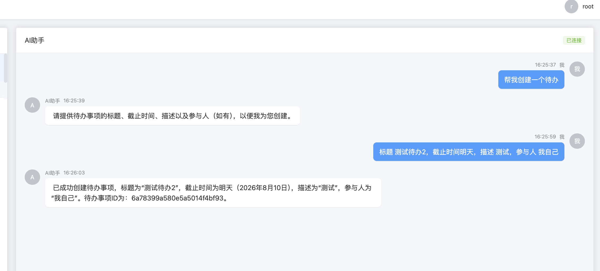
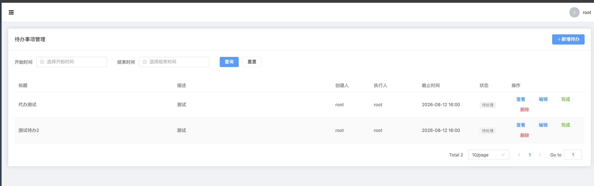
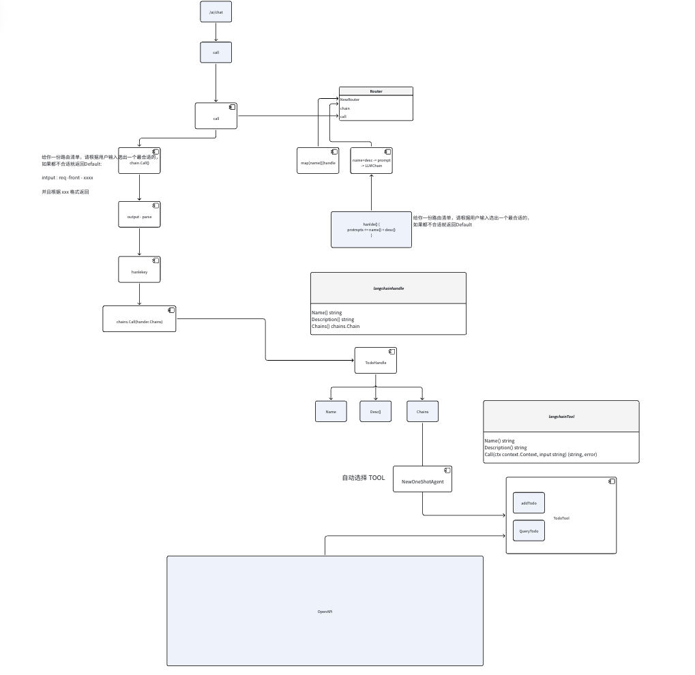
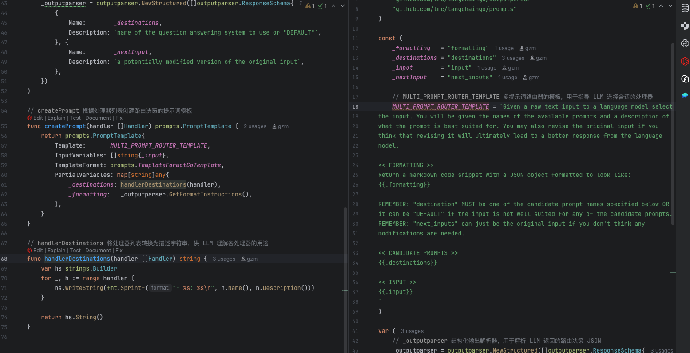

## 最终实现

1. 在聊天窗口让 AI 创建一个待办。给出具体信息之后 会创建对应的待办信息






## 整体流程如下

1. 前端 调用 `/call` 接口传入自然语言信息

2. 后端 拼接已经注册的 路由Handle + input 去查找 然后返回对应的 key

```txt
给你一份路由清单，请根据用户输入选出一个最合适的，
如果都不合适就返回Default:

intput : req -front - xxxx

并且根据 xxx 格式返回
```

3. 查找到对应的 Handle 然后去访问对应 Handle 支持的 Tool

4. 使用 langchain.OneShotAgent 再次询问AI 应该访问哪一个 Tool

5. 调用Tool 发起请求 。返回响应




## 细节

### 第一次 LLM 拼接 prompts 

我们在 `NewRouter` 的时候 就把所有已经实现的 Handler 写进去 . 这里会根据 handle 进行整合 opt 

```go
func NewRouter(llm llms.Model, handler []Handler, opts ...Option) *Router {
	opt := executorDefaultOptions(handler)
	for _, o := range opts {
		o(&opt)
	}
	// ...
}
```
Option 会返回一个 prompt . 类型 `PromptTemplate`

我们可以看到 这里会遍历没用过 hander 然后拼接他们的 Name() 和 Descritipn()

```go
type Option func(options *Options)

// executorDefaultOptions 创建默认的路由器配置选项
func executorDefaultOptions(handler []Handler) Options {
	return Options{
		prompt: createPrompt(handler),
		memory: memory.NewSimple(),
	}
}


func createPrompt(handler []Handler) prompts.PromptTemplate {
	return prompts.PromptTemplate{
		Template:       MULTI_PROMPT_ROUTER_TEMPLATE,
		InputVariables: []string{_input},
		TemplateFormat: prompts.TemplateFormatGoTemplate,
		PartialVariables: map[string]any{
			_destinations: handlerDestinations(handler),
			_formatting:   _outputparser.GetFormatInstructions(),
		},
	}
}

```




这里可以看到 `handle` 的定义如下 , 和 Tool 一样自带说明书


```go
func NewTodoHandle(svc *svc.ServiceContext) *TodoHandle {
	//...
}

// Name 返回处理器名称，用于路由识别
func (t *TodoHandle) Name() string {
	return "todo"
}

// Description 返回处理器描述，帮助 AI 理解何时使用此处理器
func (t *TodoHandle) Description() string {
	return "suitable for todo processing, such as todo creation, query, modification, deletion, etc"
}

// Chains 返回处理链，使用转换链包装代理输出
func (t *TodoHandle) Chains() chains.Chain {
	return chains.NewTransform(t.transform, nil, nil)
}
```


### 寻找Handle进行处理


因为我们在提示词中增加了,格式化返回 . 我们可以从 会使用 `outputparser` 解析对应的 `output`

我们通过 `chains.Call(ctx, r.handlers[next].Chains(), inputs)` 调用对应的 Tool 


```txt
<< FORMATTING >>
Return a markdown code snippet with a JSON object formatted to look like:
{{.formatting}}
```


```go
func (r *Router) Call(ctx context.Context, inputs map[string]any, options ...chains.ChainCallOption) (map[string]any, error) {
// ... 
	out, err := r.outputparser.Parse(text.(string))
	if err != nil {
		return nil, err
	}

	if r.callbacks != nil {
		r.callbacks.HandleChainEnd(ctx, map[string]any{
			"out": out,
		})
	}

	data := out.(map[string]string)
	next, ok := data[_destinations]
	if !ok || next == Empty || r.handlers[next] == nil {
		if r.emptyHandle != nil {
			return chains.Call(ctx, r.emptyHandle.Chains(), inputs)
		}
		return nil, ErrNotHandles
	}

	return chains.Call(ctx, r.handlers[next].Chains(), inputs)
}
```

### Agents Find tool

我们可以看到 TodoHandle 支持了 todoAdd和 TodoFind 这两个Tool 

对于每一个 Tool 都会有格式化输出配置 同样也有 Name +Desc 。Tool 的基本定义 一个说明书


```go
func NewTodoHandle(svc *svc.ServiceContext) *TodoHandle {
	return &TodoHandle{
		svc: svc,
		// 创建包含待办工具的 AI 代理
		agentChain: agents.NewExecutor(agents.NewOneShotAgent(svc.LLMs, []tools.Tool{
			toolx.NewTodoAdd(svc),  // 待办创建工具
			toolx.NewTodoFind(svc), // 待办查询工具
		})),
	}
}


func NewTodoAdd(svc *svc.ServiceContext) *TodoAdd {
	return &TodoAdd{
		svc:      svc,
		callback: svc.Callbacks,
		// 配置结构化输出解析器，定义待办事项的字段格式
		outputparser: outputparserx.NewStructured([]outputparserx.ResponseSchema{
			{
				Name:        "title",
				Description: "todo title",
			}, {
				Name:        "deadlineAt",
				Description: "calculate the final deadline based on the time information entered by the user and combined with today's time. a Unix time",
				Type:        "int64",
			}, {
				Name:        "desc",
				Description: "todo description",
			}, {
				Name:        "executeIds",
				Description: "list of participating users in the backlog. the data type is a set of string ids. none is empty",
				Type:        "[]string",
			},
		}),
	}
}

// Name 返回工具名称，用于 AI 代理识别
func (t *TodoAdd) Name() string {
	return "todo_add"
}

// Description 返回工具描述和使用说明，包含输出格式指令
func (t *TodoAdd) Description() string {
	template := `
	a todo add interface.
	use when you need to create a todo.
	keep Chinese output.
` + t.outputparser.GetFormatInstructions()

	return template
}
```

我们看 NewOneShotAgent ，这里也是单独创建了一个 LLM Chain 。并且使用自己的 `getMrklPrompt` 传入了 `tools` 用于寻找 tool .方式和我们实现 Router 一样

```go
func NewOneShotAgent(llm llms.Model, tools []tools.Tool, opts ...Option) *OneShotZeroAgent {
	options := mrklDefaultOptions()
	for _, opt := range opts {
		opt(&options)
	}

	return &OneShotZeroAgent{
		Chain: chains.NewLLMChain(
			llm,
			options.getMrklPrompt(tools),
			chains.WithCallback(options.callbacksHandler),
		),
		Tools:            tools,
		OutputKey:        options.outputKey,
		CallbacksHandler: options.callbacksHandler,
	}
}
```