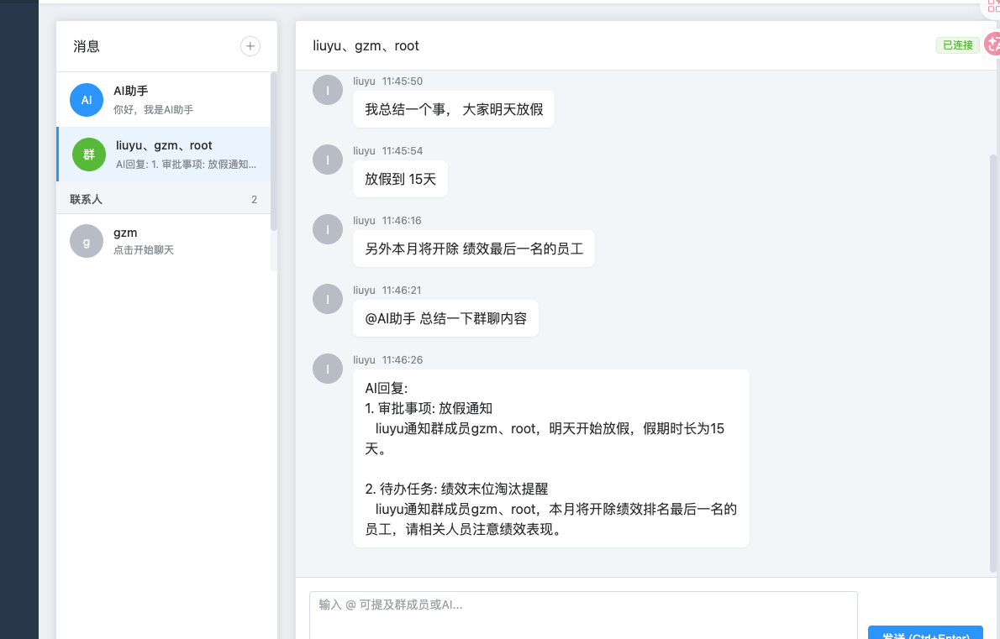
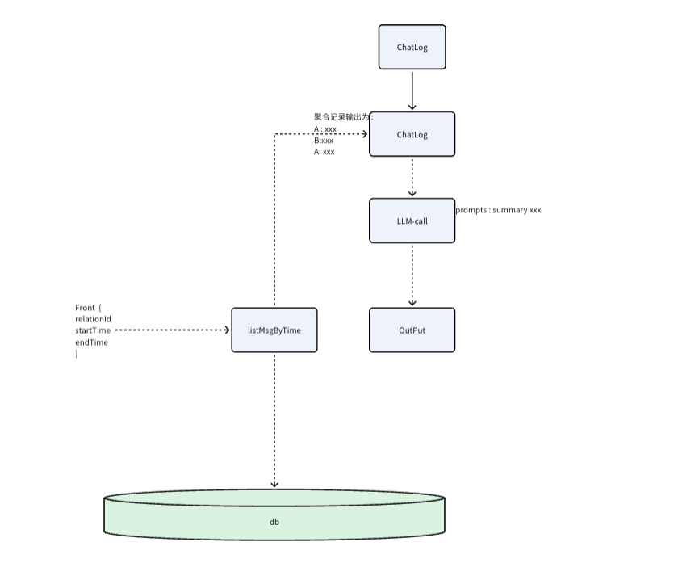

## 最终实现

1. 用户可以通过 @机器人, 实现总结自己所发的内容





## 整体流程如下

1. 前端发起调用 传入 Time Range 

2. 后端获取对应的群聊消息 。整理聚合给 LLM

3. LLM 处理之后进行输出



## 细节

1. 创建的时候 制定一下 templatePrompt ，然后自己开辟一条chain

```go
func NewChatLogHandle(svc *svc.ServiceContext) *ChatLogHandle {
	return &ChatLogHandle{
		svc: svc,
		chains: chains.NewLLMChain(svc.LLMs, prompts.NewPromptTemplate(
			_defaultChatLogPrompts, []string{"input"},
		)),
	}
}

func (c *ChatLogHandle) Chains() chains.Chain {
	return chains.NewTransform(c.transform, nil, nil)
}
```

2.  去数据库获取对应的MSG 然后整合给LLM 进行输出

```go
func (c *ChatLogHandle) transform(ctx context.Context, inputs map[string]any,
	opts ...chains.ChainCallOption) (map[string]any, error) {

//...

	msgs, err := c.chatLog(ctx, cid, startTime, endTime)
	if err != nil {
		return nil, err
	}
//...
	res, err := chains.Call(ctx, c.chains, map[string]any{
		"input": msgs,
	}, opts...)
	if err != nil {
		return nil, err
	}

	text, ok := res[langchain.OutPut].(string)
	if !ok {
		return nil, chains.ErrInvalidOutputValues
	}
//...
	if err != nil {
		return nil, err
	}
	return map[string]any{
		langchain.OutPut: string(b),
	}, nil
}
```