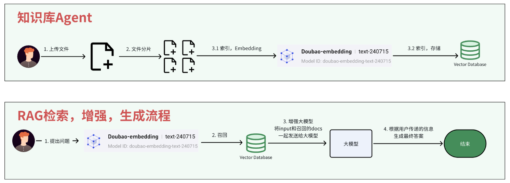
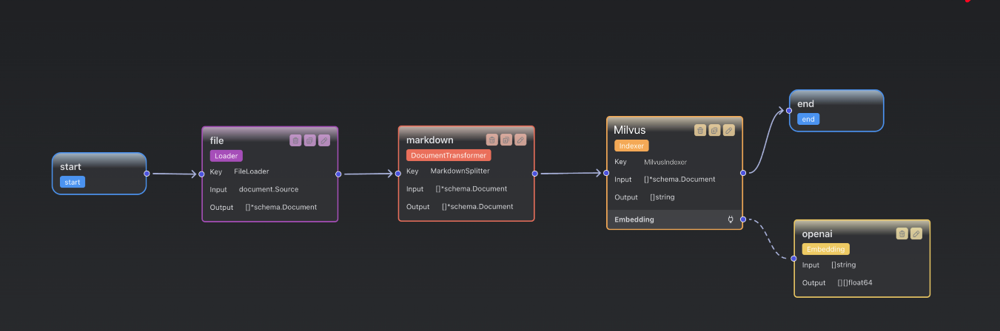
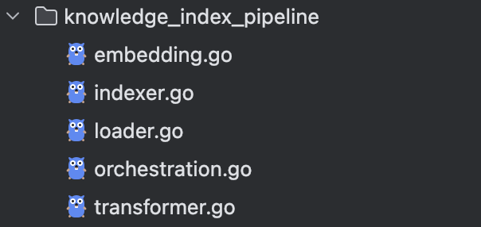
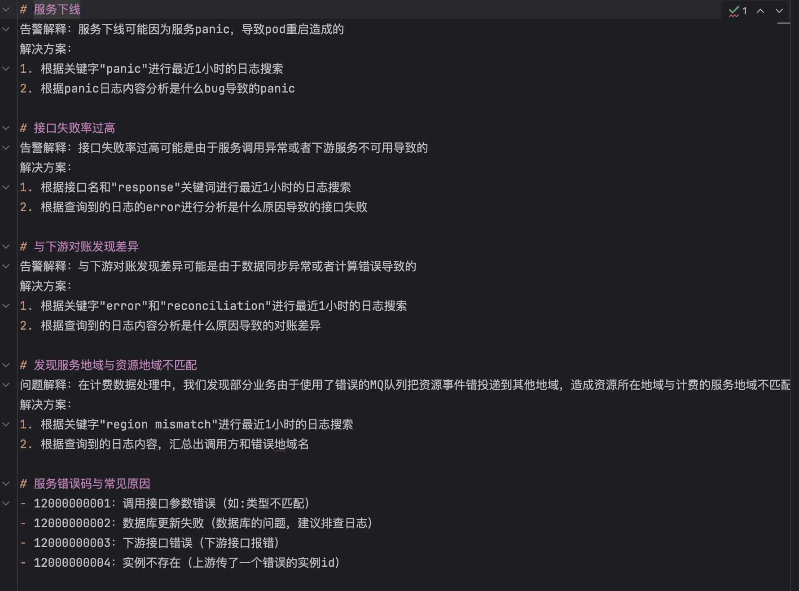
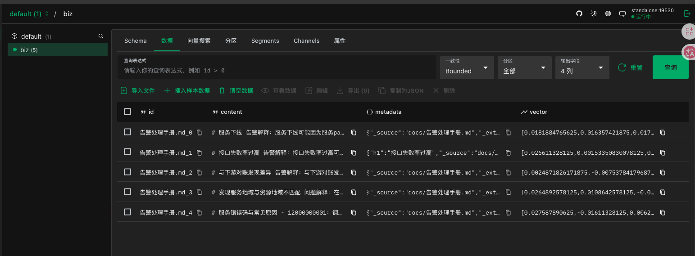

## RAG

本篇的目的是为了 将文件向量化后 存到数据库中 这里面的步骤有

1. 读取文件

2. 切分文件

3. 索引 （embedding 和 存醋）





### 流程编排


解释一下 下面的这个流程

1. Start 程序启动

2. File  loader 读取文件 转换成 schema.Document (文档对象列表)

3. Markdown Transfomer 转换成 Markdown 格式

4. Milvus  Index 向量索引

	- 使用 oepnai 进行 Embedding 把文本变成向量
	- 然后 把 [原文 + 向量 + 元数据] 写入 Milvus Collections

5. 结束



生成完后，会在目录看到这些组件




### 最终实现

1. 我们的一个文本 最后会被分片插入到向量数据库中






## 代码解析

首先调用 `knowledge_index_pipeline.BuildKnowledgeIndexing` 创建了一个 runner 

并且使用 `r.Invoke` 传入了文件的地址

```go
func main() {
	ctx := context.Background()
	r, err := knowledge_index_pipeline.BuildKnowledgeIndexing(ctx)
	if err != nil {
		panic(err)
	}
	err = filepath.WalkDir("./docs", func(path string, d fs.DirEntry, err error) error {
		if err != nil {
			return fmt.Errorf("walk dir failed: %w", err)
		}
		if d.IsDir() {
			return nil
		}

		if !strings.HasSuffix(path, ".md") {
			fmt.Printf("[skip] not a markdown file: %s\n", path)
			return nil
		}

		fmt.Printf("[start] indexing file: %s\n", path)
		ids, err := r.Invoke(ctx, document.Source{URI: path})
		if err != nil {
			return fmt.Errorf("invoke index graph failed: %w", err)
		}
		fmt.Printf("[done] indexing file: %s, len of parts: %d，%s\n", path, len(ids), ids)
		return nil
	})
	if err != nil {
		panic(err)
	}
}

```

### Runnable

详细拆解一下 `BuildKnowledgeIndexing` 

1. 我们可以看到 这个方法返回了一个 `compose.Runnable[document.Source, []string]` 接口 使用 doucument 返回 []string 

2. Invoke 在注释里面说明 。 是输出的意思 


```go
func BuildKnowledgeIndexing(ctx context.Context) (r compose.Runnable[document.Source, []string], err error) {
	// ... 
}

// Runnable is the interface for an executable object. Graph, Chain can be compiled into Runnable.
// runnable is the core conception of eino, we do downgrade compatibility for four data flow patterns,
// and can automatically connect components that only implement one or more methods.
// eg, if a component only implements Stream() method, you can still call Invoke() to convert stream output to invoke output.
type Runnable[I, O any] interface {
	Invoke(ctx context.Context, input I, opts ...Option) (output O, err error)
	Stream(ctx context.Context, input I, opts ...Option) (output *schema.StreamReader[O], err error)
	Collect(ctx context.Context, input *schema.StreamReader[I], opts ...Option) (output O, err error)
	Transform(ctx context.Context, input *schema.StreamReader[I], opts ...Option) (output *schema.StreamReader[O], err error)
}
```

### BuildKnowledgeIndexing

详细看一下其他流程

1. 这里有很多 AddEdge 。 我们看里面的参数 `start, fileLoader, markdown...` 可以看出来 就是我们在 `Eino` 里面绘制的点

2. 也就是这里组装了一下整个流程 然后返回一个执行器

```go
func BuildKnowledgeIndexing(ctx context.Context) (r compose.Runnable[document.Source, []string], err error) {
	const (
		FileLoader       = "FileLoader"
		MarkdownSplitter = "MarkdownSplitter"
		Indexer          = "Indexer"
	)
	g := compose.NewGraph[document.Source, []string]()
	fileLoaderKeyOfLoader, err := newLoader(ctx)
	if err != nil {
		return nil, err
	}
	_ = g.AddLoaderNode(FileLoader, fileLoaderKeyOfLoader)
	markdownSplitterKeyOfDocumentTransformer, err := newDocumentTransformer(ctx)
	if err != nil {
		return nil, err
	}
	_ = g.AddDocumentTransformerNode(MarkdownSplitter, markdownSplitterKeyOfDocumentTransformer)
	indexerKeyOfIndexer, err := newIndexer(ctx)
	if err != nil {
		return nil, err
	}
	_ = g.AddIndexerNode(Indexer, indexerKeyOfIndexer)
	_ = g.AddEdge(compose.START, FileLoader)
	_ = g.AddEdge(Indexer, compose.END)
	_ = g.AddEdge(FileLoader, MarkdownSplitter)
	_ = g.AddEdge(MarkdownSplitter, Indexer)
	r, err = g.Compile(ctx, compose.WithGraphName("KnowledgeIndexing"), compose.WithNodeTriggerMode(compose.AnyPredecessor))
	if err != nil {
		return nil, err
	}
	return r, err
}

```

### Loader

我们看下面的这个代码 可以看 返回值是一个 `document.Loader` 的接口

这个接口需要实现 `load` 方法


```go
func newLoader(ctx context.Context) (ldr document.Loader, err error) {
	// UseNameAsID 必开：Redis Indexer 的默认映射要求 doc.ID 非空。
	config := &file.FileLoaderConfig{
		UseNameAsID: true,
	}
	ldr, err = file.NewFileLoader(ctx, config)
	if err != nil {
		return nil, err
	}
	return ldr, nil
}

type Loader interface {
	Load(ctx context.Context, src Source, opts ...LoaderOption) ([]*schema.Document, error)
}

```


#### File Load

详细看一下官方的  file loader 是怎么实现的 

1. OpenFile 打开文件

2. 读取文件 

3. 构建元数据 ExtraMeta

4. 构造返回值 然后返回

```go
func (f *FileLoader) Load(ctx context.Context, src document.Source, opts ...document.LoaderOption) (docs []*schema.Document, err error) {
// ... 
	file, err := openFile(src.URI)
//...
	name := filepath.Base(src.URI)
	ext := filepath.Ext(src.URI)

	meta := map[string]any{
		MetaKeyExtension: ext,
		MetaKeyFileName:  name,
		MetaKeySource:    src.URI,
	}

//...
	o := document.GetLoaderCommonOptions(&document.LoaderOptions{}, opts...)

	docs, err = f.Parser.Parse(ctx, file, append([]parser.Option{parser.WithURI(src.URI), parser.WithExtraMeta(meta)}, o.ParserOptions...)...)
	if err != nil {
		return nil, fmt.Errorf("file parse err of [%s]: %w", src.URI, err)
	}

// ... 
	return docs, nil
}

func (dp TextParser) Parse(ctx context.Context, reader io.Reader, opts ...Option) ([]*schema.Document, error) {
	data, err := io.ReadAll(reader)
	if err != nil {
		return nil, err
	}

	opt := GetCommonOptions(&Options{}, opts...)

	meta := make(map[string]any)
	meta[MetaKeySource] = opt.URI

	for k, v := range opt.ExtraMeta {
		meta[k] = v
	}

	doc := &schema.Document{
		Content:  string(data),
		MetaData: meta,
	}

	return []*schema.Document{doc}, nil
}

```

### Transformer

`newDocumentTransformer` 返回一个 `Transformer` 的接口

```go
func newDocumentTransformer(ctx context.Context) (tfr document.Transformer, err error) {
	// 按 Markdown 标题级别切分；Headers 为必填，key 只能是 '#' 组成。
	config := &markdown.HeaderConfig{
		Headers: map[string]string{
			"#":   "h1",
			"##":  "h2",
			"###": "h3",
		},
		TrimHeaders: false,
		// 每个 chunk 需要唯一 ID，否则 Redis 会用同一个 key 互相覆盖。
		IDGenerator: func(_ context.Context, originalID string, splitIndex int) string {
			return fmt.Sprintf("%s_%d", originalID, splitIndex)
		},
	}
	tfr, err = markdown.NewHeaderSplitter(ctx, config)
	if err != nil {
		return nil, err
	}
	return tfr, nil
}

type Transformer interface {
	Transform(ctx context.Context, src []*schema.Document, opts ...TransformerOption) ([]*schema.Document, error)
}
```

### HeaderSplitter

1. 可以看 这里先进行了 Split

2. 然后每个切片复制一个 uuid

3. 并且给每个分片增加元数据信息

4. 返回

```go
func (h *headerSplitter) Transform(ctx context.Context, docs []*schema.Document, opts ...document.TransformerOption) ([]*schema.Document, error) {
	var ret []*schema.Document
	for _, doc := range docs {
		result := h.splitText(ctx, doc.Content)
		for i := range result {
			nDoc := &schema.Document{
				ID:       h.idGenerator(ctx, doc.ID, i),
				Content:  result[i].chunk,
				MetaData: deepCopyAnyMap(doc.MetaData),
			}
			if nDoc.MetaData == nil {
				nDoc.MetaData = make(map[string]any, len(result[i].meta))
			}
			for k, v := range result[i].meta {
				nDoc.MetaData[k] = v
			}
			ret = append(ret, nDoc)
		}
	}
	return ret, nil
}
```


### Index

1. 构建 Indexer 返回一个 Indexer 接口


```go
func newIndexer(ctx context.Context) (idr indexer.Indexer, err error) {
	embeddingIns, err := newEmbedding(ctx)
	if err != nil {
		return nil, err
	}
	// 写入 Attu 中看到的 default/biz；向量维度需与 embedding 模型一致（vision=2048）。
	config := &milvus2.IndexerConfig{
		ClientConfig: &milvusclient.ClientConfig{
			Address: "localhost:19530",
		},
		Collection: "biz",
		Vector: &milvus2.VectorConfig{
			Dimension:  2048,
			MetricType: milvus2.COSINE,
			VectorField: "vector",
		},
		Embedding: embeddingIns,
	}
	idr, err = milvus2.NewIndexer(ctx, config)
	if err != nil {
		return nil, err
	}
	return idr, nil
}

type Indexer interface {
	// Store stores the documents.
	Store(ctx context.Context, docs []*schema.Document, opts ...Option) (ids []string, err error) // invoke
}
```

#### Milvus Indexer 

1. 首先是 对分片 进行向量 获取向量数组 

2. 构造符合 milvus 表记录的结构体 。  id、content、vector、metadata 

3. 构造完成记录后 , 插入到数据库 。最后返回所有 id


```go
func (i *Indexer) Store(ctx context.Context, docs []*schema.Document, opts ...indexer.Option) (ids []string, err error) {
// ... 
	vectors, err := i.embedDocuments(ctx, co.Embedding, docs)
	if err != nil {
		return nil, err
	}

	upsertResult, err := i.upsertDocuments(ctx, docs, vectors, io.Partition)
	if err != nil {
		return nil, err
	}

// .. 

	return upsertResult, nil
}

func (i *Indexer) embedDocuments(ctx context.Context, emb embedding.Embedder, docs []*schema.Document) ([][]float64, error) {
	if emb == nil {
		return nil, nil // Return nil vectors if no embedder
	}

	texts := make([]string, 0, len(docs))
	for _, doc := range docs {
		texts = append(texts, doc.Content)
	}

	vectors, err := emb.EmbedStrings(i.makeEmbeddingCtx(ctx, emb), texts)
	if err != nil {
		return nil, fmt.Errorf("[Indexer.Store] failed to embed documents: %w", err)
	}
	if len(vectors) != len(docs) {
		return nil, fmt.Errorf("[Indexer.Store] embedding result length mismatch: need %d, got %d", len(docs), len(vectors))
	}
	return vectors, nil
}


func (i *Indexer) upsertDocuments(ctx context.Context, docs []*schema.Document, vectors [][]float64, partition string) ([]string, error) {
	columns, err := i.config.DocumentConverter(ctx, docs, vectors)
	if err != nil {
		return nil, fmt.Errorf("[Indexer.Store] failed to convert documents: %w", err)
	}

	insertOpt := milvusclient.NewColumnBasedInsertOption(i.config.Collection)
	if partition != "" {
		insertOpt = insertOpt.WithPartition(partition)
	}
	for _, col := range columns {
		insertOpt = insertOpt.WithColumns(col)
	}

	result, err := i.client.Upsert(ctx, insertOpt)
	if err != nil {
		return nil, fmt.Errorf("[Indexer.Store] failed to upsert documents: %w", err)
	}

	ids := make([]string, 0, result.IDs.Len())
	for idx := 0; idx < result.IDs.Len(); idx++ {
		idStr, err := idValueAsString(result.IDs, idx)
		if err != nil {
			return nil, fmt.Errorf("[Indexer.Store] failed to get id: %w", err)
		}
		ids = append(ids, idStr)
	}

	return ids, nil
}

```

## 总结

总到来看，主要就是我们上面编排的流程

1. 文件加载 

2. 文件分块

3. 文件索引 (分片 - 向量化)