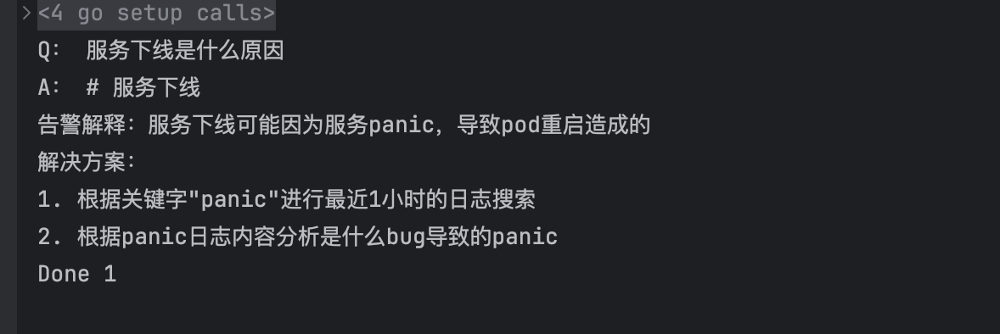
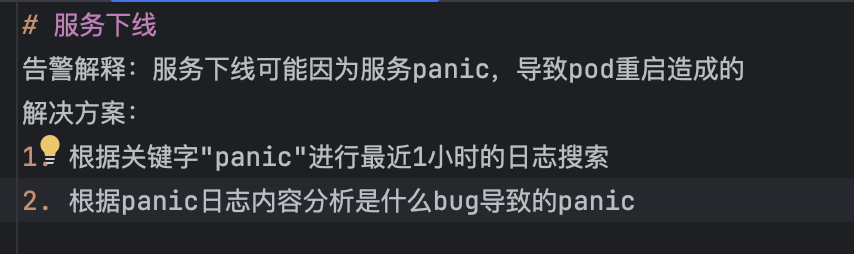
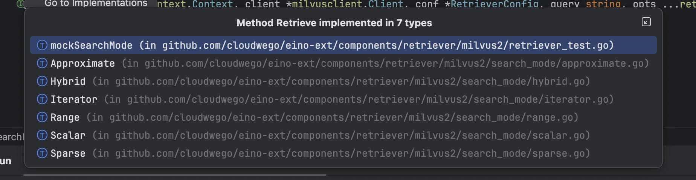

## RAG

本篇的目的是为了 使用 LLM 进行 RAG 的召回 也就是我们的下面的流程

1. 在我们做完 文件索引和向量化存储 之后

2. 我们需要进行 提问  召回向量数据库中国呢的信息

3. 将 input和 召回的  docs 一起发给大模型


## 结果

```go
func main() {
	ctx := context.Background()
	r, err := retriever.NewMilvusRetriever(ctx)
	if err != nil {
		panic(err)
	}
	query := "服务下线是什么原因"
	docs, err := r.Retrieve(ctx, query)
	if err != nil {
		panic(err)
	}
	fmt.Println("Q：", query)
	for _, doc := range docs {
		fmt.Println("A：", doc.Content)
	}
	fmt.Println("Done", len(docs))
}

```





## 拆解实现

### NewMilvusRetriever


1. 我们创建  milvus 的 Retriver

2. 要求指定向量字段 Vector。并且需要返回的字段有 id、content、metadata 


```go
func NewMilvusRetriever(ctx context.Context) (rtr retriever.Retriever, err error) {
	eb, err := embedder.DoubaoEmbedding(ctx)
	if err != nil {
		return nil, err
	}
	r, err := milvus2.NewRetriever(ctx, &milvus2.RetrieverConfig{
		ClientConfig: &milvusclient.ClientConfig{
			Address: milvusAddress,
		},
		Collection:  milvusCollectionName,
		VectorField: "vector",
		OutputFields: []string{
			"id",
			"content",
			"metadata",
		},
		TopK:       1,
		SearchMode: search_mode.NewApproximate(milvus2.COSINE),
		Embedding:  eb,
	})
	if err != nil {
		return nil, err
	}
	return r, nil
}

```

### Retrive


这里的 Retrieve 支持多种方法 ，不过大体思路都是

1. 对于输入的问题进行 向量化 `EmbedQuery`

2. 然后调用相似度查询接口 `client.Search`

3. 构造返回结构体并且返回


```go
type Retriever interface {
	Retrieve(ctx context.Context, query string, opts ...Option) ([]*schema.Document, error)
}

func (r *Retriever) Retrieve(ctx context.Context, query string, opts ...retriever.Option) (docs []*schema.Document, err error) {
// ... 
	docs, err = r.config.SearchMode.Retrieve(ctx, r.client, r.config, query, opts...)
 // ... 
	return docs, nil
}

func (a *Approximate) Retrieve(ctx context.Context, client *milvusclient.Client, conf *milvus2.RetrieverConfig, query string, opts ...retriever.Option) ([]*schema.Document, error) {
	if conf.Embedding == nil {
		return nil, fmt.Errorf("embedding is required for approximate search")
	}

	queryVector, err := EmbedQuery(ctx, conf.Embedding, query)
	if err != nil {
		return nil, err
	}

	searchOpt, err := a.BuildSearchOption(ctx, conf, queryVector, opts...)
	if err != nil {
		return nil, fmt.Errorf("failed to build search option: %w", err)
	}

	result, err := client.Search(ctx, searchOpt)
	if err != nil {
		return nil, fmt.Errorf("failed to search: %w", err)
	}

	if len(result) == 0 {
		return []*schema.Document{}, nil
	}

	return conf.DocumentConverter(ctx, result[0])
}

```


这几个 Mode  :

这里其实叠了两层概念，容易混在一起。


| Mode | 作用 |
|------|------|
| **Approximate** | ANN 近似最近邻（你们现在用的） |
| **Range** | 按半径/阈值过滤 |
| **Hybrid** | 稠密 + 稀疏/BM25 混合 |
| **Sparse** | 稀疏向量检索 |
| **Iterator** | 分批迭代拉取 |
| **Scalar** | 标量查询 |


