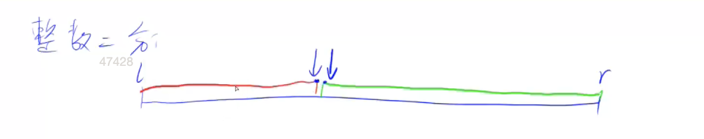

## 二分排序

## 整数二分

### 算法思路

比较玄学的一句话目前还没懂

`二分不一定单调，但是单调一定二分` 

算法思路

1. 对于一个区间可以拆分成 左边不满足条件 右边满足条件 的数据，可以求满足或者是不满足的数据的边界



对于边界的的定义 有 `左边界` 和 `右边界`

整体抽象思路如下

1. 设定 mid 
2. `check(mid)` 如果 `mid` 符合 右区间/左区间
3. 那么答案一定在 右区间/左区间, 将 l/r 指针移动到  mid

对于答案在右区间来说，那么需要把 `l` 移动到 `mid` 因为 mid 也可能是答案 ，否则到话 `r=mid-1`

同样答案在左区间来说，那么需要把 `r` 移动到 `mid` 否则到话 `l=mid+1` 

需要注意的是 因为程序 下取整的原因，需要保证 在移动 `l=mid` 的时候 `mid =l+r+1>>1`

### 核心代码展示

````cpp
        while(l < r) {
            int mid = l+r>>1;
            if(a[mid] >= x) r = mid ;
            else l = mid + 1; 
        }
        if(a[l] != x) {
            cout<<"-1 -1"<<endl;
        }else {
            cout<<l-1<<" ";
            l = 1,  r= n ;
            while(l < r) {
                int mid = l+r+1>>1;
                if(a[mid] <= x) l = mid;
                else r = mid - 1; 
            }
            cout<<r-1<<endl;
        }
````

### 时间复杂度分析

每次操作都将区间一分为二，最多logn次求解

### 感悟

1. 左区间调动右指针，右区间调动左指针有点反直觉 但是实际理解下来还好

这个是我下班的时候看的，一开始没想明白，回家锻炼之后然后今天突发的想要跑步，跑了个5公里回来继续看 写下的
