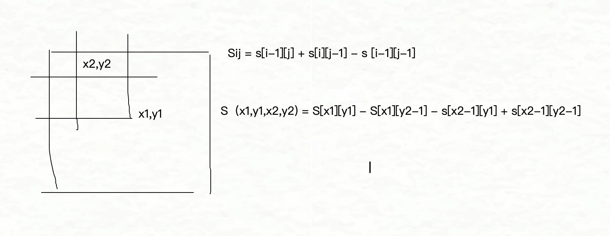
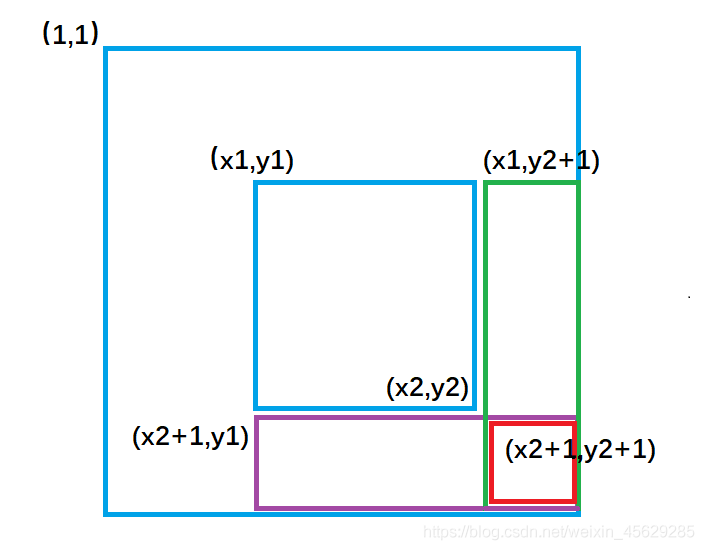

## 前缀和

## 一维前缀和

### 算法思路

1. 使用 Sum 数组累加计算数值数组的和

`sum[i] = sum[i-1] + a[i]`

从而可以很快的求出某个区间的和，例如

`sum[l~r] = sum[r] - sum[l-1]`

### 核心代码展示

````c++
    for(int i = 1; i <= n ; i ++ ) cin>>a[i];
    for(int i = 1; i <= n ; i ++) s[i] = s[i-1] + a[i];
    while(m -- ) {
        int l , r ;  cin >> l >> r;
        cout<<s[r] - s[l-1]<<endl;
    }
````


### 时间复杂度分析

1. 在只有一次区间询问的时候 和 for 循环直接计算无异 都是`o(n)`

但是在多次区间询问的时候可以提前把和计算出来从而使得 `o(n*m)` 变成 `o(n+m)`


### 感悟

小学数学

## 二维前缀和


### 算法思路

1. 通过数学方法将 `Sxy` 代表二维空间中矩形的面积，从而根据二维关系进行处理

2. 不过需要注意的是 我们在处理一个区域的面积大时候， 需要保证角落上的点也被计算所以就需要 `S[x1][y2-1]` 以及 `s[x2-1][y1]` 这种处理 

由于作图的时候 只有点线，并没有画出具体的面，所以导致写代码的时候很少联想到



### 核心代码展示

```c++
    for(int i = 1; i <= n; i ++ ) 
        for(int j = 1; j <= m ; j ++ ) {
            cin>>a[i][j];
            s[i][j] = a[i][j] + s[i-1][j] + s[i][j-1] - s[i-1][j-1];
        }
    
    while(q -- ) {
        int x1,y1,x2,y2 ;
        cin >> x1>>y1>>x2>>y2;
        cout<< s[x2][y2] - s[x2][y1-1]  - s[x1-1][y2] + s[x1-1][y1-1]<<endl;
    }

```

### 时间复杂度分析

1. o(n*m)


### 感悟

不用死记公式，根据二维图像脑中进行想象

## 差分

## 一维差分

### 算法思路

1. 使用 Sum 数组累加计算数值数组的和

`sum[i] = sum[i-1] + a[i]`

从而可以很快的求出某个区间的和，例如

`sum[l~r] = sum[r] - sum[l-1]`

### 核心代码展示

````c++
    for(int i = 1; i <= n ; i ++ ) cin>>a[i];
    for(int i = 1; i <= n ; i ++) s[i] = s[i-1] + a[i];
    while(m -- ) {
        int l , r ;  cin >> l >> r;
        cout<<s[r] - s[l-1]<<endl;
    }
````


### 时间复杂度分析

1. 在只有一次区间询问的时候 和 for 循环直接计算无异 都是`o(n)`

但是在多次区间询问的时候可以提前把和计算出来从而使得 `o(n*m)` 变成 `o(n+m)`


### 感悟

小学数学

## 二维前缀和


### 算法思路

构造数组 `b[i]=a[i]-a[i-1]` 是的 `Sum[b[]] = a[i]` 

如果我们需要对一个区间进行一次操作，如 `计算 区间 [l,r] +c `之后的总和，我们很自然的可以想到 `s[r]-s[l-1] + (r-l+1)*c`

但是如果我们需要对不同的区间进行多次操作,我们就没办法这样

基于 `sum[b[]] = a[i]` 的性质，我们对 `b[l]+c` 并且对 `b[r+1]-c` 我们得到的数组就是


`b[l]=a[l]-a[l-1]+c, b[l+1] = a[l+1]-a[l], .... b[r+1] = a[r+1] - a[r] - a[r]`

如果计算前缀和的话 会变成

`a[l] + ... a[r] + (r-l+1)*c` 


### 核心代码展示

```c++
void insert(int l,int r,int c) {
    b[l]  += c ;
    b[r+1] -= c;
}

int main() {
	ios::sync_with_stdio(false);
	cin.tie(nullptr);
    cin>>n>>m;
    for(int i = 1; i <= n; i ++ ) cin >> a[i];
    for(int i = 1 ; i <= n ; i++) insert(i,i,a[i]);
    while(m -- ) {
        int l, r, c; cin>>l>>r>>c;
        insert(l,r,c);
    }
    for(int i = 1; i <= n ; i ++ ) b[i] += b[i-1];
    for(int i = 1; i <= n; i ++ ) cout<<b[i]<<" ";
    return 0;
}
```

### 时间复杂度分析

1. 差分时间复杂度 O(1)


### 感悟

这里说实话就有点抽象了，不实际想想或者是推导很难理解这部分代码


## 二维差分


### 算法思路

我们在已知 一维差分的操作会因为前缀和的原因导致 操作值累加在区间上

在不推导 差分数组的前提下 :

我们可以直观的想想 如果我们在 `x1,y1`增加 `c` 那么剩下的范围都会被影响，即取一个差集

所以我们如果需要给 `x1,y1` ,`x2,y2` 增加 `c`  的话我们应该

`x1,y1 +c`,`x1,y2+1 -c`, `x2+1,y1 -c` , `x2+1,y2+1 +c` 

从而使得我们的矩形能够加 `c` 




反过来如果我们 给 `x1,y1,x1,y1` 这个区间增加 `c` 那么最终我们得到的就是原始的数组


### 核心代码展示

```c++
void insert(int x1,int y1,int x2,int y2,int c) {
    b[x1][y1] += c;
    b[x2+1][y1] -= c;
    b[x1][y2+1] -= c;
    b[x2+1][y2+1] += c;
}

int main() {
	ios::sync_with_stdio(false);
	cin.tie(nullptr);
    
    cin>>n>>m>>q;
    for(int i = 1; i <= n ; i ++ )
        for(int j = 1 ; j <= m ; j ++ ){
            int c ;cin>>c;
            insert(i,j,i,j,c);
        }
    
    while(q -- ) {
        int x1,x2,y1,y2; cin>>x1>>y1>>x2>>y2;
        int c ; cin>>c;
        insert(x1,y1,x2,y2,c);
    }
    
    for(int i = 1; i <= n ; i ++ )
        for(int j = 1; j <= m ; j ++ )
        b[i][j] += ( b[i-1][j] + b[i][j-1] - b[i-1][j-1]);
    for(int i = 1; i<= n ; i ++ ) {
        for(int j = 1; j <= m ;j ++ ){
        cout<<b[i][j]<<" ";
         }
         cout<<endl;
    }
        
    return 0;
}
```

### 时间复杂度分析

O n*m 

### 感悟

二维差分说实话一开始没反应过来，我听y总讲的时候，感觉怎么跳的这么快，连构造数组都不出，原来这里反向思考了一下

而且对于  (x2 + 1) 我刚开始以为 x 是 列，问了 gemini 后才知道是行