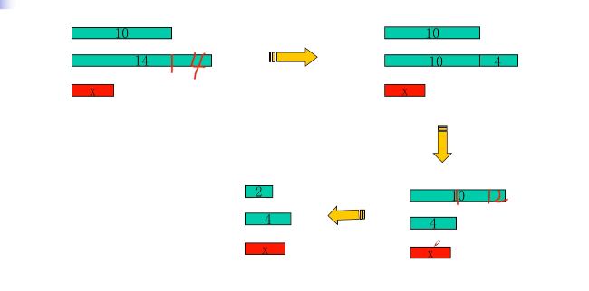

# 引导问题

## 整数求和

````
Hey, welcome to HDOJ(Hangzhou Dianzi University Online Judge).

In this problem, your task is to calculate SUM(n) = 1 + 2 + 3 + ... + n.

Input
The input will consist of a series of integers n, one integer per line.

Output
For each case, output SUM(n) in one line, followed by a blank line. You may assume the result will be in the range of 32-bit signed integer.
````

1. 常规做法是 for-each 后对 sum 进行累加，然后输出
2. 我们可以根据 等差数列高斯公式求得 `(a + b) * n / 2 `
3. 不过这题需要注意的是
   4. 我们计算乘法的时候可能暴 int , 因为对于两个 `int32` 的数相乘必然会爆 `int32` 所以我们需要开辟成 `int64`

题目链接如下, 由于不支持 `GO` 所以不做

https://vjudge.net/problem/HDU-1001

# 例题
## 最小公倍数
````
输入两个整数 a 和 b，请你编写一个函数，int lcm(int a, int b)，计算并输出 a 和 b 的最小公倍数。

输入格式
共一行，包含两个整数 a 和 b。

输出格式
共一行，包含一个整数，表示 a 和 b 的最小公倍数。

数据范围
1≤a,b≤1000

输入样例：
6 8
输出样例：
24
````

**朴素做法** 
1. 我们从最大的数开始枚举，如 8,9,10...  每次都判断是否能整除最小数
2. 简单优化，我们可以直接枚举 最大数的倍数 。 可是最大数的倍数, 我们有很大概率爆`int` 的风险

**正解**

1. `lcm(A,B) = A * B / gcd(A,B)`
2. 优化一下 `= A / gcd(A,B) * B`
3. 问题引导为 `如何求最大公约数`

[Acwing-最小公倍数](https://www.acwing.com/file_system/file/content/whole/index/content/4337/)

## 最大公约数
1. 我们现在要求 10, 14 的最大公约数 。 
2. 我们假设 `X` 为这两个数的最大公约数，可以知道，对于 `(14%10)` 的余数，也应该是 `X` 的倍数
3. 从而我们可以依次类推 `(10,14) , (10,4) , (2,4), (2,0)` 则 `2` 就是最大公约数

todo  : 很抓马的一件事，我用 `go` 写这个程序 TLE 了
````go
package main

import(
    "fmt"
)

func gcd(a,b int) int {
    if a > b {
        a,b = b,a
    }    
    for ; a != 0 ;  {
        a, b = b%a,a
    }
    return b 
}

func main() {
    var n int 
    fmt.Scan(&n)
    for i := 0 ; i < n ; i ++ {
        var a,b int 
        fmt.Scan(&a,&b)
        fmt.Println(gcd(a,b))
    }
}
````

````cpp
#include <iostream> 
using namespace std ;
int gcd(int a,int b)  {
    int temp ; 
    if(a > b) {
        temp = a;
        a = b ;
        b = temp;
    } 
    for( ; a != 0 ; ) {
        temp = a;
        a = b%a;
        b = temp ;
    }
    return b ; 
}

int main() {
    int a,b ;
    int n;
    cin>>n;
    for(int i  = 1; i <= n ; i ++ ) {
        cin>>a>>b;
        cout<<gcd(a,b)<<endl;
    }
}
````
