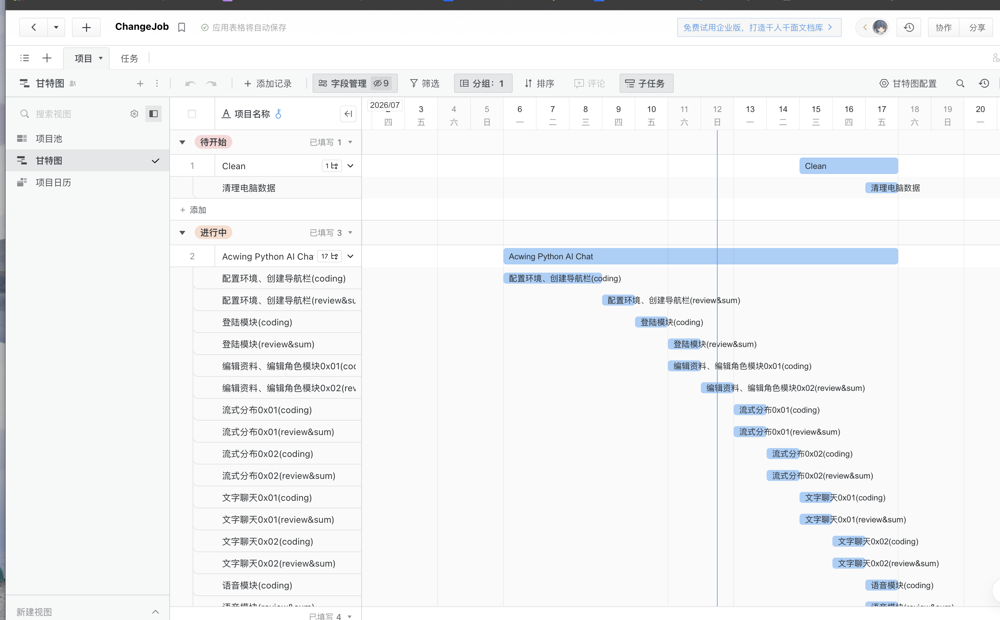

写在前头 :

最近生活没有了特别明确的目标，活着确实有点不自在

## 反差

离职的时候写了2-3篇文章说是已经规划好了，但是实际只是简单算了一下故事点和整合内容

实际任务编排并没有特别有规划或者是目的的进行

当然并不是说我没有做，我确实是做了，我在整理完之后就开始寻找能够平替飞书甘特图的内容

毕竟之前上班都是用的那个，每天上班无非就是打开甘特图，打开backlog 看一下要做什么 昨天有什么没做的，都是安排好的

我记得我找了好久，最后使用石墨文档的甘特图，然后排了这两周的任务，但是实际排完之后第二天就没运行了

我排了两个3个任务

1. 完成 Acwing AI Chat 项目
    - 周一做完XXX模块
    - 周二做完XXX模块
2. 算法学习项目
    - 周一学XXX算法
    - 周二学XXX算法
3. Tidy 任务
    - 整理个人todo
    - 整理公司todo
    - 整理规划这几个月发展
    - 整理个人业务闪光点

但是最终没运行

## 我的一天

昨天因为要吃一顿散伙饭所以没有特地记录，今天的话可以说是可以好好记录一下

今天早上 10:00 左右起床的， 不过9:00就起来了，昨天在玩 堆叠大陆，买了2个DLC，然后熬了会夜看攻略

今天早上起来还在看大概看到了 10:00 然后起床洗漱

然后开始玩游戏玩到了中午12:30 开始吃饭，点的外卖 不想自己做饭

然后吃完饭后，看了会抖音大概看到了 13:30. 然后好像就去看电视剧去了大概看了2个小时 看到了 15:30

然后开始打开百度云看一个 《golang训练营 从0到1》 总共28周，我预计是想要一天学一周的内容，这样子可以控制在一个月内学完，但是因为昨天耽搁了，所以今天在赶昨天的进度

现在还是很简单的内容今天主要学习了

- 项目结构
- 普通的登陆和注册
- 错误的基本处理
- 数据库的连接
- session 和 cookie
- 以及密码加密什么的

都是一些大学阶段就应该掌握的内容，我现在2年后又重新掌握一遍，但是我并没有把我的commit推送，我甚至没有把这个项目当作我的仓库项目，只是放在那里

也就是说 需要更新到我简历的项目目前还没有开始写

然后18:30左右开始做饭，今天正常无氧 20分钟

然后吃饭，吃完饭后洗澡，打游戏，刷抖音。大概好像就到了21:00左右了

出门跑步，跑了半个小时，最近拉肚子，跑步跑的不是很得劲，然后走了1.5公里回去，大概 22:10左右回到家

然后洗澡，再清一会游戏体力

大概到了23:00开始学习算法，学了预计半小时吧还是40分钟

学完之后补一下 commit 和 blog 然后开始写这篇随便总结的文章

## 下一步

下一周其实还有一些公司的活需要干，例如写交接文档，完成todo

但是我的心思已经不在公司那边了

## 随便写点

说实话 我原本预计一天学习8小时的，这样子可以在一个半月内追完进度

但是实际今天只学习了4个小时，也就是说在buffer范围内，我需要花费 3个月的时间才行，这很显然对我来说不是很乐观

随便写点，或许明天有空会继续补内容，因为正好 0:00 了 我要上床了，这是习惯