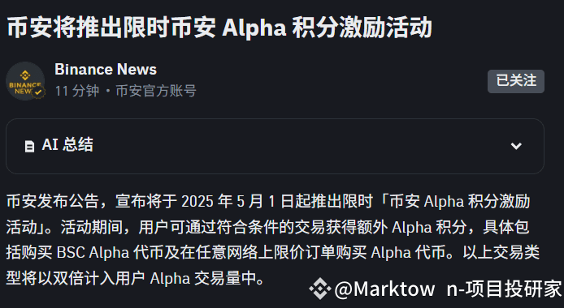
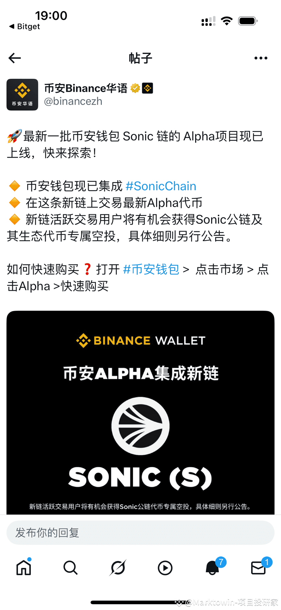
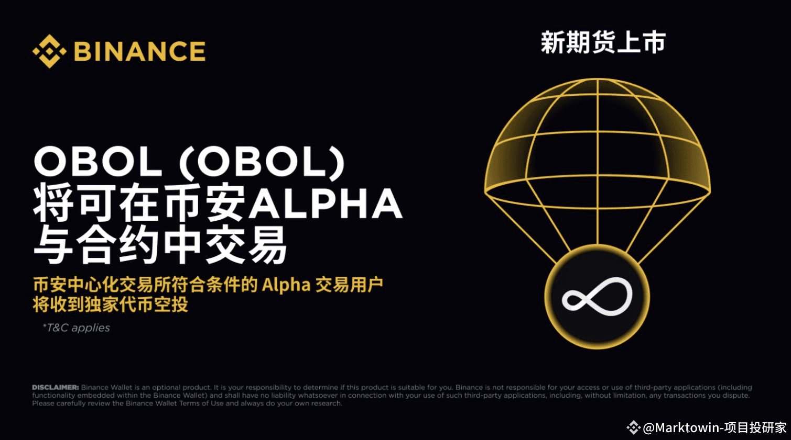

# 资产策略现状

1. 自从第一篇笔记开始，现在每天都有一个 todo list 需要给 `binance` 刷一下交易量，有点ptsd了

| DATE  | BUY | SELL | DIFF |
|-------|-----|------|------|
| 04-29 | 513 | 509  | 4U   |
| 04-30 | 513 | 509  | 4U   |
| 04-30 | 513 | 509  | 4U   |
| 05-01 | 513 | 509  | 4U   |
| 05-02 | 513 | 509  | 4U   |
| 05-03 | 513 | 511  | 2U   |
| 05-04 | 513 | 510  | 3U   |

1. 目前总共磨损  4 *5 + 5 = 25U , 预计磨损 100U 破防。 按照 4 U 一天计算的话，大概还有25天破防
2. 现在积分 `85` , 最近一波在 5月7号，大概还有`3`天, 预计我还可以刷 22 分 ，也就是 `118` . 预计是 140 ，大概是赶不上

# binance 活动整理

## 双倍积分 

1. `BINANCE` 推出积分双倍计算双倍活动 。 用交易所的限价单 和 BINANCE CHAIN 上刷交易量都是以双倍的形式计算
   2. 即交易量 512 u 的 会以1024U计算，多个1积分
3. `binance chain` 暂时不考虑，手续费实在是太贵了
4. 那么限价单是否有购买的必要呢 ？ 用限价单的话，大概率磨损会多个 1U - 2U ,多花个 1U - 2U 购买`1积分` 实际上很不划算 . 而且对于`限价单`, 需要把资产从钱包转移到交易所，很麻烦 。

## 新链

binance 钱包推出了 `Sonic` 链的项目。 对于活跃用户会有空投的奖励

## 新币打新 OBOL

1. 活动时间 5.7 号，18:00 
2. 不确定积分多少，预计要 `130` . 大概率达不到 ~
