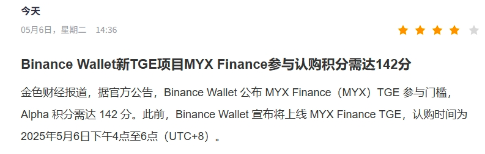

# 新一期的 TGE 
1. 目前分数 115 
2. 从 4.29 日的 `75` 分，经过 `8 `天，就飞升到了 `142` 分，总共差额 `67` ,平均 `9.5(除去当天)`
3. 简单可以计算出，top 层级的玩家基本上一天会刷个 `10` 分，资产人均 `2分` 加上 `8`分交易量 ，大概是 `256u`

`115 + 11 * x  =  142 + 10 * x  `

`x = 142 - 115 = 27` 

按照这个趋势，我需要吃满 27 天， 不过 `x` 可以翻倍，从而缩短我的进程 

# 策略更改
1. 目前更改了一下策略，从钱包 飞到了 交易所 
2. 从原先的 BASE 链 回到了 solana 和 bnb chain  . Base链的滑点太高了，导致我每次都被吃了很多的费用
3. 我们可以看见 
   4. 我做了一笔 solana 的 popcat  , `512u` 实际到手 `511.6u` , 加上 `0.02 + 0.01` 的 gas , 总共一次 就 `0.43u`
   5. 我同样做了一笔 bnb chain 的 b2 , `513u` 实际到手 `511.79u`, 加上 `0.43 + 0.43` 的 gas , 总共一次 就 `2.71u`
   6. 同样都设置的 滑点 `0.5%` , 很显然 bnb chain 那个滑点爆炸了 。 不过他的gas费也不低，虽然一次是 `double 积分`

4. 综上，目前策略预计改成 `solana chain` , per `512/trade`. 
5. 积分是递增的即 `512`, `1024`,`2048`, `4096`
6. 按照一次 `0.43u` 的磨损来看，我`2u`可以亏损 5 次，即`512 * 4` = `2560` ，这样子会把 `x` 大成为 3，即我9天内就可以赶上
7. 如果采用限价单双倍的策略,我很容易吃到 `4096` 那么我 `6.75` 天就可以吃满

# Other 
行情 ： https://www.geckoterminal.com/zh/bsc/pools/0xc1a780989734a0e5df875cebe410748562e1c5e6