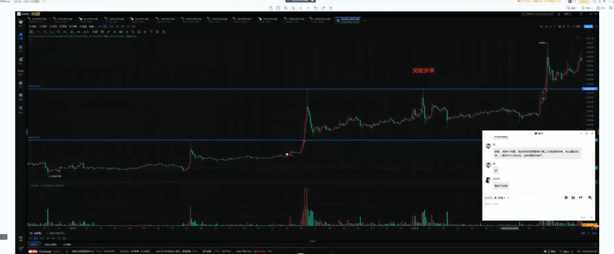

## 总结

视频来源 : https://www.youtube.com/watch?v=83-jhmek0iQ&list=PLv62PVNSGzGD2614LkngWETWL-fZebdja

视频目的 :

1. 开单的逻辑
2. 开单的细节
3. 最近哪些单子做的不好，哪些单子做的好
4. 一周下来我的问题要怎么调整
5. 一周下来我做的好的方向要怎么坚持
6. 心态崩的单子还原整个心理路程
---
1. 不会去解答每一个问题
   1. 并不能解答明白
   2. 也没有那么多精力
---
第一项内容 :

1. 整体市场这一周来在做一个什么事情
2. 整体市场在进行怎么样一个动作，市场的情绪是怎么样的
3. 复盘每一个单子，开单逻辑技术细节，有什么问题避免什么问题

第二项内容 :

1. 财富密码，接下来重点关注的机会

---
1. 主升浪的上涨中没有一笔空单
 

单子 :
1. 主升浪
2. 上方有空间

小分歧 
1. 尽量做低吸 不要做突破
---
1. 市场青睐次新股，因为没有太多套牢盘，比较好拉盘
2. 在分歧结束的位置去做单