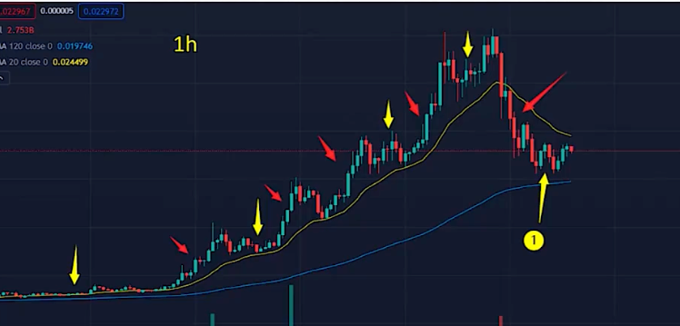
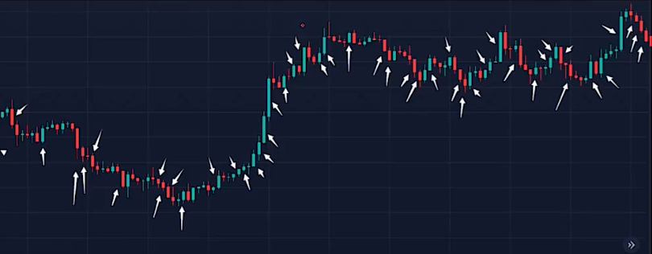
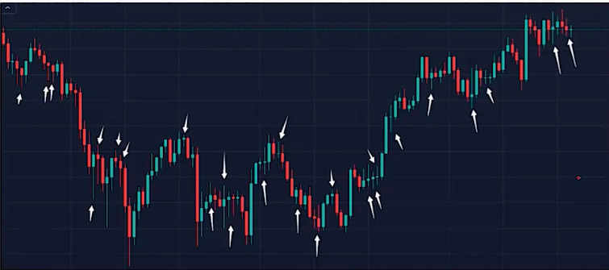
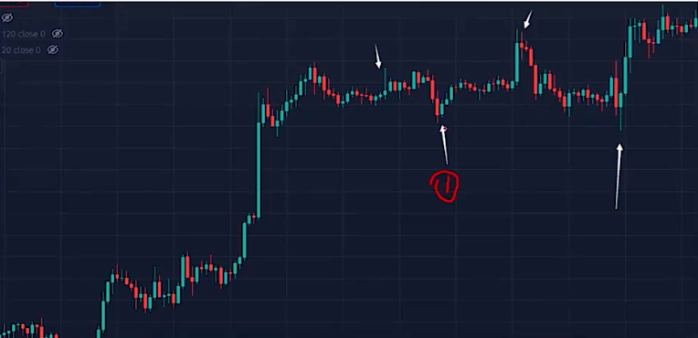
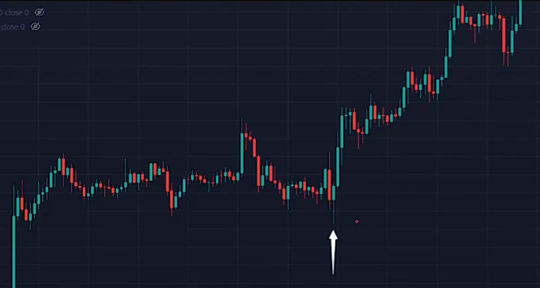

## 概念

**价格行为 :**
指价格动作的形态，适用各种品种，各种周期，各种图标，走势变化就是价格行为的例子，每一次价格变动都是价格行为。

**市场运动 :**
市场只有 `趋势运动` 和 `非趋势运动` 两种状态

黄色箭头都是 `非趋势运动`

对于黄色的`1`, 是一个 `区间运动` 而不是 `趋势运动`。处于一个区间震荡没有趋势

**趋势 K 线**

1. 实体较长
2. 影线很短，实体占主要部分
3. 和上一根 /上几根 K 线没有太多重叠

**非趋势 K 线**
1. 实体很小
2. 影线很长
3. 和上一根 / 上几根 K 线没有太多的重叠

类似 `十字星` 没有很明显的多空力量 

**信号 K 线**
1. 入场 K线 即是信号K 线

**反转 K 线**

1. 一根多头的反转 K 线 最低要求是 收盘高于开盘 或者 收盘高于 K线中位 
2. 下影线达到 K线高度 大约 1/3 ~ 1/2， 没有上影线或很短
3. 信号 K 线的后一根 K 线不是十字星内包 K 线， 而是强入场 K 线 （多头趋势K 线，实体较长，影线较短）
