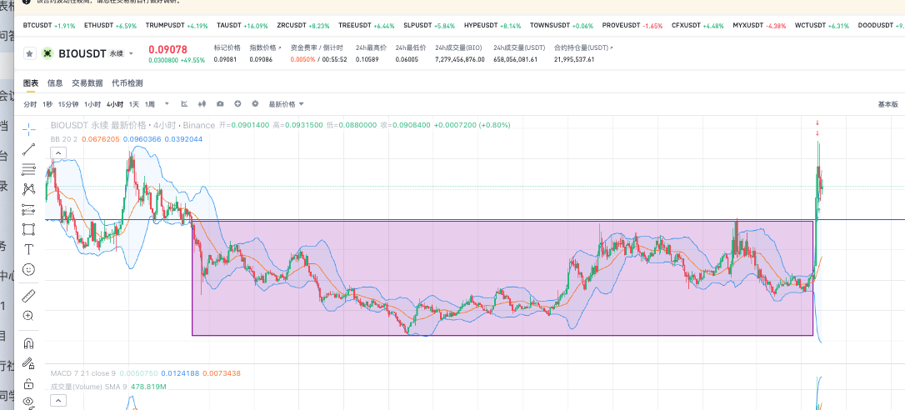
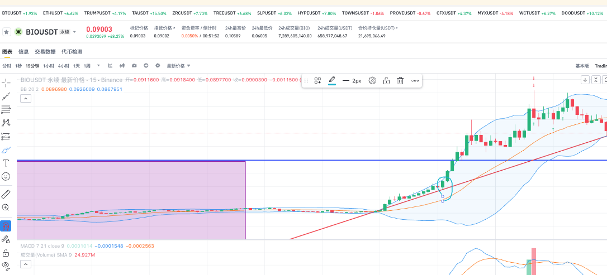
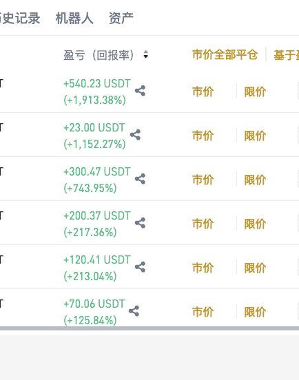
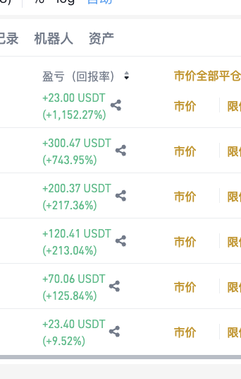

## 前言
简单总结一下 目前的一个 `交易系统` 

可以作用于 `山寨币` 或者是容易出现 `趋势行情` 的标的中 .  不适用于大盘,因为大盘最近处于 `大级别的震荡行情`

山寨季的定义 : 
1. 当大盘在盘整区间,资金流出,流入到各个小的标的. 那么会导致 这种标的有大额涨幅

## 过程

### 1. 选标的

如何一个可能突破的标的 ？

1. 各种群聊群友喊单
2. 广场 Kol 喊单 @投研看剑 @crypto 七安  or 其他
3. 飞机群喊单 (没加过感觉听神秘的)

由他们根据市场信息，热度，板块，解锁时间，链上信息，或者是形态等多方面分析之后，可以过滤出很多标的

1. 涨幅榜前 30 ，不用做任何调研，我们只需要根据 `市场热度` , 市场有热度就会有资金流入

### 2. 如何判断突破

1. 我们需要先确定 `有效压力位`, 我们可以去 `4小时` , `天` , `1小时` 找到仍然在盘整区间
2. 我们看下面这个k线图，4小时级别一直都在一个箱体里面震荡，且出现一个很明显的上顶和下底
3. 那么我们可以认为 这个`上顶` 就是一个大区间的压力位

1. 我们画一条k线，如果他突破了压力位那么就会 `大概率`会直接起飞. 这是因为市场会产生`合力` .简单来说就是  ( 老韭菜们都知道这里要突破了所以都会大资金进来这就是合力 )

## 3. 如何确定入场点

1. 我们从大级别 切换到小级别 `30min`, `15min`,`5min`,`1min` 画一条 `上升趋势线` 当多次回踩趋势线的时候我们就可以入场 。 常见情况是第三次回踩趋势线的时候
2. 并且这里出现了7小连阳，市场信息倍增
3. 所以我们可以在第三次回踩趋势线的时候入场，或者是等他 `突破的时候入场` 即带量突破上方压力位。或者是`突破压力位回踩`的时候进场

## 4. 如何有效的止损

两个逻辑

1. 我们可以设置`大级别震荡区间的最低点` 进行止损，因为如果突破失败 他还是会回震荡区间进行下一次突破. 为了避免频繁止损 保守点可以设置在这
2. 当然激进一点我们可以设置在 `趋势线前一个回踩点`, 因为如果趋势线跌破 市场会没有信息，当然也可能是来`扫损的` 所以这个止损有点激进

## 5. 如何有效的止盈

1. 如果我们在趋势线进场, 那么止盈就是突破压力位的时候，需要`止盈50%` ，因为避免假突破
2. 其他的话我们可以 在左侧压力位分批止盈，即`左侧每一个阴线的收盘价止盈`

## 6. 其他

1. 这次写的比较匆忙很多细节未补充，可能周末补充一下～  。但是大致逻辑是这样 
2. 希望各位看到这条博客有元人发大财 ～

另外这只是在 `大级别区间震荡` 能用的做法
1. 如果出现极致的单边行情 如 `yala`, `myx`, `a2z` 这种在 `第三次回踩趋势线的时候可以直接进去` 
2. 止损点设置在第二次回踩的时候,所以就会出现 `我插了好几次myx，止损了好几次总算进去了` 这种言论

## 忠告

1. 开单必设止损
2. 交易系统因 个人性格原因 所以同一个交易系统在不同人身上也会有不一样的效果
3. 仅个人的玩法，仅供参考，切勿大资金乱玩。
4. 交易市场本质就是一个零和博弈，没有常胜将军除非他对冲

##  实战截图
 

