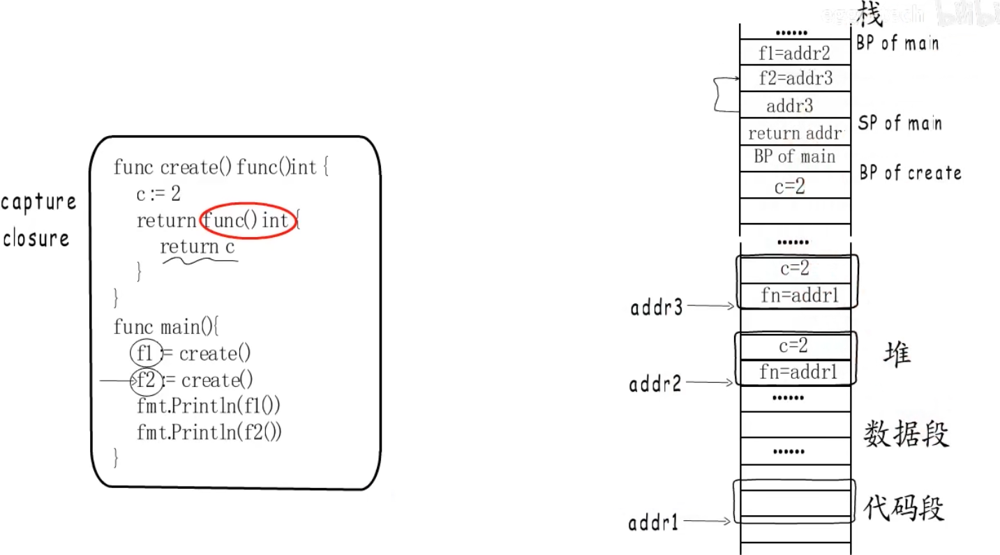

## 基础概念

闭包 :  引用了自由变量的函数，即 函数 + 引用环境

例子 :

```go
func intSeq() func() int {

	i := 0
	return func() int {
		i++
		return i
	}
}

func main() {
	nextInt := intSeq()

	fmt.Println(nextInt())
	fmt.Println(nextInt())

	nextInt2 := intSeq()
	fmt.Println(nextInt2())
}
```

输出如下

```
1
2
1
```

我们发现，对于程序内定义的变量 `i`, 他被外部函数引用了 。 并且对于 `nextInt` 和 `nextIn2` 是两个不同的环境，他们拥有不同的 `i`

怎么理解这个过程 :

1. 函数的局部变量是分配在栈上面的
2. 但是闭包上的变量会`逃逸`到堆上

原理如下 :

1. 对于一个以函数返回到形式的 Func，我们称为 FuncValue 其分配是在堆上
2. 当我们通过其他变量进行接收的时候，会先去堆上找到该 FuncValue 的地址，由于闭包 Capture 了局部变量 所以会在堆上额外分配一块地址




## 垃圾回收

以下是一些概念

逃逸 :

1. 变量生命周期超出声明它的函数栈帧，编译器不得不把它放到 堆 上


GC回收 :

1. 堆上对象在没人引用后，由 GC 回收；程序结束进程退出时也会一起释放


对于下面这种形式，因为 `nextInt` 已经输出完成了，虽然`main`函数没有退出，但是已经没有引用了，虽然产生了逃逸 但是同样会被回收
```go
func main(){
	nextInt := intSeq()
	fmt.Println(nextInt())
	fmt.Println(nextInt())

	nextInt2 := intSeq()
	fmt.Println(nextInt2())

	for {} // 卡住不让 main 退出
}
```

只有在循环内一直被引用，以及包级变量引用的时候才不会被回收 。 

```go
for {
    _ = nextInt() // 循环里还在用 → 仍存活
}
```


```go
var keep func() int // 包级变量

nextInt := intSeq()
fmt.Println(nextInt())
keep = nextInt       // 挂到全局 → 一直可达

for {}
```

包级变量理论上来说是和 当前进程一起存活的 。但是如果在引用期间，主动进行解引用同样也会被回收

```go
var keep func() int

func main() {
	keep = intSeq()
	fmt.Println(keep())

	keep = nil        // 断掉引用
	runtime.GC()      // 演示用；生产里不必手动调

	for {}            // 之后闭包就可能已被回收
}
```

## 应用场景

### 隔离数据

如果不想让其他人访问该数据,例如生成一个 斐波那契数列，但是不想让其他人更改其 value

```go
func main() {
  gen := makeFibGen()
  for i := 0; i < 10; i++ {
    fmt.Println(gen())
  }
}

func makeFibGen() func() int {
  f1 := 0
  f2 := 1
  return func() int {
    f2, f1 = (f1 + f2), f2
    return f1
  }
}
```

### 封装函数 和 创建中间件

Go 的函数是一等公民，如果我们想要实现一个，接口在运行前后的请求耗时中间件的话

我们需要使用到闭包进行处理，因为 `handleFunc` 需要接受一个 `FuncValue` 

```go
func main() {
  http.HandleFunc("/hello", timed(hello))
  http.ListenAndServe(":3000", nil)
}

func timed(f func(http.ResponseWriter, *http.Request)) func(http.ResponseWriter, *http.Request) {
  return func(w http.ResponseWriter, r *http.Request) {
    start := time.Now()
    f(w, r)
    end := time.Now()
    fmt.Println("The request took", end.Sub(start))
  }
}

func hello(w http.ResponseWriter, r *http.Request) {
  fmt.Fprintln(w, "<h1>Hello!</h1>")
}
```

不过这并不会产生 OOM ，因为端口一直监听，但是堆上的逃逸只产生了一次

同理可以分析下面这两个情况，对于 第一个场景，我们只产生了一个新的环境，而对于第二个场景我们每次都产生了新环境

```go
nextInt := intSeq()
for {
	nextInt()
} 

for {
	nextInt := intSeq() // 每次新环境
	_ = nextInt
	// 若再塞进全局 cache / 切片 → 环境越堆越多 → 可能 OOM
}
```

### sort 包

```go
people := []string{"Alice", "Bob", "Dave"}
sort.Slice(people, func(i, j int) bool {
    return len(people[i]) < len(people[j])
} )
fmt.Println(people)
```

## 面试

### 什么是闭包 ？ 闭包有什么缺陷？ 

闭包的本质是 引用了自由变量的函数，即 函数+引用环境 是闭包

闭包有什么缺陷 :  在我们反复使用新环境引用闭包变量的时候，会产生大量的内存逃逸 从而使得CPU上涨和OOM

闭包的优点 :
1. 可以规避一些函数定义的接收器不允许传入的参数, 例如中间件只允许传入 Write 和Request .但是我们如果想要引用其他 Param，那么就需要定义一个 FuncValue的返回， func(otherParm) FuncValue
2. 做数据的隔离 防止一些不想让其他人访问该数据。例如 Sort

```markdown
🛠️ 改进项与“满分回答”建议 (Improvements)
为了在面试中拿到 9-10 分，你可以将回答按照“定义 -> 常见应用(优点) -> 底层代价(缺陷) -> 语言特有陷阱”的逻辑来组织。

你可以参考以下改进后的表述：

1. 什么是闭包？（保持你的精准定义）
闭包的本质是函数体加上它所引用的外部环境（自由变量）的结合体。在 Go 中，当一个匿名函数引用了它外部作用域的变量时，就形成了闭包。

2. 闭包的优点（优化你的实战案例）
函数签名适配与状态保持（柯里化）：在 Web 开发中，标准库的 http.HandlerFunc 只接受 ResponseWriter 和 Request。我们可以利用闭包将外部配置（如 DB 连接池、日志记录器）封装进去，返回一个符合签名的函数。

数据封装与隔离：闭包可以用来隐藏状态，实现类似面向对象中“私有变量”的效果。比如实现一个计数器生成器，每次调用返回的函数都能修改外层的局部变量，而这个变量对全局是不可见的。同时，在使用 sort.Slice 时，闭包能直接捕获并操作外部的切片，免去了繁琐的参数传递。

3. 闭包的缺陷与坑（重点重构）
性能代价（内存逃逸与 GC 压力）：
闭包引用的外部变量，其生命周期会超越原本的函数调用栈。因此，Go 编译器会通过逃逸分析将这些变量分配到堆上，而不是栈上。如果高频创建闭包，会导致堆内存分配增多，加重 GC（垃圾回收）的负担，进而可能引发 CPU 占用率上升。

经典陷阱：循环变量捕获问题：
(重点展示你的技术深度和对 Go 版本更迭的了解)
在 Go 1.22 之前，for 循环中的迭代变量是共享同一个内存地址的。如果在循环里启动 Goroutine 并使用闭包引用该变量，往往会导致所有 Goroutine 最终打印的都是最后一个元素的值。
补充加分项：不过，自 Go 1.22 起，官方已经修改了 for 循环的语义，每次迭代都会创建一个新的变量，从而从根本上解决了这个经典的闭包陷阱。

面试官点评：如果你能在面试中流利地按照上述逻辑回答，不仅展现了你扎实的理论功底和实战经验，还顺带秀了一把底层（逃逸分析、GC）原理，以及对 Go 语言最新版本（1.22+）演进的关注。这绝对是一个一锤定音的高分回答！
```

## 其他

1. 多协程快排的实现