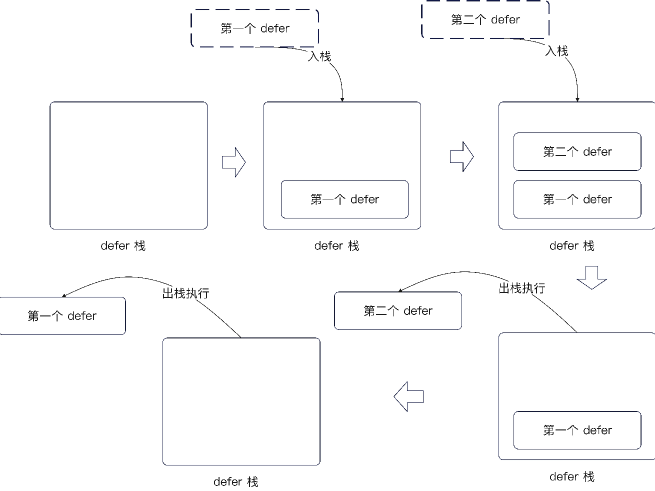

## 函数式编程

Golang 支持定义 方法作为变量即  `myFunc = func(){}, myFunc()` 的形式

同样方法也可以作为返回值

```go
func Say() func(name string) string {
    return func(name string)string {
        return "hello," + name
    }
}
```

### 闭包

closure  ： 方法+它绑定的上下文

组成如下 : 

1. 方法
2. 运行时上下文 : 即 name 变量

```go
func Closure(name string) func() string {
	return func() string {
		return "hello " + name
	}
} 
```

闭包如果使用不当会造成`内存泄漏`, 因为外层 Func 的name变量被直接使用传递出去了 。 如果一个对象被闭包引用，他是不会被`垃圾回收`的


### 不定参数

Golang 支持不定参数传递即,使用`...`进行 ，不定参数可以当作切片进行使用

```go
func hanlder(name string ,alias ...string) {
    println(alias[0])
}
```

其中 `Option模式` 大量应用了不定参数

## Defer

Golang 允许你从方法返回前一刻执行一段逻辑

Defer 的运行逻辑类似于栈即 `后进先出`  

```go
func Defer() {
    defer func() {
        println("第一个defer")
    }()
    defer func() {
        println("第二个defer")
    }()
}
```

输出如下
```
第二个 defer 
第一个 defer
```




### 问题

1. defer 有一个 catch 的机制，主要考 `for` 中的内容，如果是通过闭包传递或者是通过拷贝变量进行copy 他会catch到当前值而不是最后值

```go
func DeferClosureLoopV1() {
	println()
	for i := 0; i < 10; i++ {
		defer func() {
			print(i)
			print(" ")
		}()
	}
}

// 预计是 10,10,10,10 拿到的是最后一个

func DeferClosureLoopV2() {
	println()
	for i := 0; i < 10; i++ {
		defer func(val int) {
			print(val)
			print(" ")
		}(i)
	}
}

// 预计是 1,2,3... 10
// 实际是 9,8 ,7 ,6 ,5,4,3,2,1

func DeferClosureLoopV3() {
	println()
	for i := 0; i < 10; i++ {
		j := i
		defer func() {
			print(j)
			print(" ")
		}()
	}
}

// 预计是 10，10，10 ？
// 实际上是 9,8,7,6,5,4,3,2,1
```

## 基本数据结构

### 切片

语法 `[]type` ,数组的话是 `[int]type`

初始化方式 :

```go 
s1 := []int{1,2,3} //创建了一个 3个亚孙的切片
```

```go
s1 := make([]int,3,4) // 初始化 3个元素，这时候访问 s1[0] = 0 
s2 := make([]int,4) // 创建一个 4个元素的切片， 这时候访问 s1[0] panic
```

推荐使用 `s1 := make([]type,0,cap)` 的方式进行创建

#### 子切片

切片可以通过 `[start:end]` 的形式获取子切片，其中范围是 `左闭右开` 的

内存共享问题 :

1. 在没有发生扩容的情况下， 子切片 和 切片 是共享一个数组的
2. 即如果 子切改变了一个数，那么原本的切片也会改变

## map

初始化方法

```go
m1 := map[string]string {
    "key": "value"
}
```

对于 `for k,v := range map` 来说，每次结果都是不一样的


## 接口 & 结构体

接口是 `一组行为的抽象`

`type name interface{}` 

结构体

```go
type a struct {

}
```


## 衍生类型

如果我们想使用第三方库，但是又没办法修改代码，又想扩展这个库的结构体，我们会使用到这个

衍生类型只共享字段 并不共享实现的方法

即 `typeB` 拥有的方法 , `typeA`并不能够调用

```go
type typeA typeB
```

## 类型别名

不同于 衍生类型， 可以说是一个别名 类型本质上是没有变的

```go
type typeA = typeB
```


## 泛型

对于下面这个例子，其中 `T` 就是泛型可以是任意类型

```go
type List[T any] interface {
}
```

泛型语法

对于 `Number` 来说就是一个 泛型约束

```go
func Sum[T Number](vals ...T) T {
	var res T
	for _, val := range vals {
		res += val
	}
	return res
}

type Number interface {
	int | int64
}
```

## 面试重点

- [✅] 什么是闭包？闭包有什么缺陷

- [✅]  什么情况下会栈溢出
	- 自己循环调用自己


- [✅] 什么是不定参数 ？调用方法的时候 不定参数可以传入 0个值吗？方法内部怎么使用不定参数？
	- 函数参数以 ... 方式进行传递就是不定参数
	- 0值预计是个nil ,会自动初始化
	- 和切片一样使用即可

4. 什么是 defer ? 能解释一下 defer 的运行机制吗 ？
	- Go 语言提供的一种延迟调用机制。它通常用于处理成对出现的操作，比如打开/关闭连接、加锁/释放锁。无论函数是正常执行结束还是发生了 panic，defer 注册的函数都会被确保执行，这能有效防止资源泄漏。
	

- [已删除] 一个方法内部 defer 能不能超过 8个？

- [待定] defer 内部能不能修改返回值? 怎么改？


7. 数组和切片有什么区别？
   - 类型与长度限制：
		- 数组是定长的，长度是其类型的一部分（[3]int 和 [4]int 是不同类型）
		- 切片是动态的，长度不属于类型的一部分（类型统称为 []T）
   - 底层数据结构：
		- 数组是一段连续的内存空间，直接存储了所有的元素。
		- 切片本质上是一个引用类型（描述符），它的底层结构包含三个字段：一个指向底层数组的指针（Pointer）、切片的长度（Len）和容量（Cap）。
	- 函数传参的性能开销: 
		- Go 语言是值传递。如果把数组作为参数传递，会触发整个数组的深拷贝，对于大数组来说内存和 CPU 开销很大。

		- 传递切片时，只会拷贝切片头部的三个字段（指针、长度、容量），开销非常小。并且在函数内部修改切片的元素，会直接影响到底层的真实数组。

	- 扩容机制：

		- 数组创建后不可扩容。切片支持使用 append 函数追加元素，当容量不足时，Go 运行时会自动分配一块更大的新内存，将旧数组的数据拷贝过去，并让切片的指针指向新数组。

8. 切片怎么扩容 ？ 
	- 在 256 以下进行双倍扩容
	- 在 256 以上进行 (原容量 + 3 * 256) / 4 即 1.25倍的扩容


## 最后

1. 了解函数式编程在在业务中的使用
2. 了解内存泄漏，业务上的内存泄漏，排查方法，解决办法
3. 了解垃圾回收的机制
4. 了解 Option 模式
5. slice 的底层实现
6. map 的底层实现
7. defer 的实现原理 和机制
8. 闭包


写出一个 泛型工具支持

1. 切片的辅助方法 : 添加、删除、查找、求并集、交集、map reduce API
2. map 辅助方法
3. 扩展 map 实现 : 接受任意类型的 HashMap, TreeMap, LinkedMap
4. List 实现 : LinkedList, ArraryList 和 SkipList
5. Set: 包括 HashSet 和 TreeSet, SortedSet
6. 队列: 普通队列,优先队列
7. bean 操作操作辅助类 : 高性能高扩展的 bean copier机制
8. 并发扩展工具 : 包括并发队列,并发阻塞队列,并发阻塞优先队列
9. 协程池
