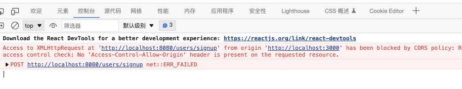
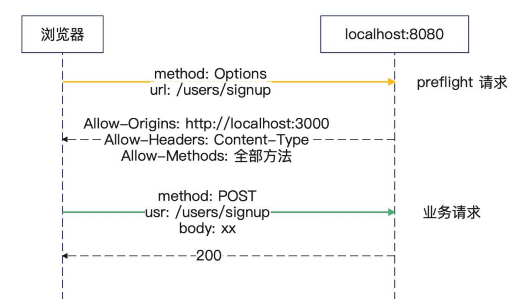
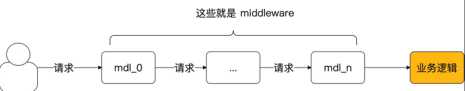

## Gin 入门

### Gin-Engine

在 `Gin` 中, 一个 `Web` 服务器被抽象成为 `Engine`

`Engine` 承担了路由器注册、接入 `middleware` 的核心职责

```go
func main() {
    server := gin.Default()
}

type Engine struct {
	// ... 
    RouterGroup
	// ...
}
```

### Gin-Context

`Gin` 封装的上下文, 其中 `Request` 和 `Writer` 负责 处理请求 和 返回相应

```go
type Context struct {
    writermem responseWriter
    Request   *http.Request
    Writer    ResponseWriter
    
    Params   Params
    handlers HandlersChain
// ..
}
````

对于 `GET` 的参数我们使用 `query` 进行获取参数

```go
code := ctx.Query("code")
```

对于 `POST` 的参数 我们使用 `Bind` 进行获取参数

```go
	type Req struct {
		Code  string `json:"code"`
		Phone string `json:"phone"`
	}
	var req Req
	if err := ctx.Bind(&req); err != nil {
```

### Gin 路由注册

在 `Engine` 的 `RouterGroup` 支持注册 `Restful` 的接口

```go
// ... 
func (group *RouterGroup) POST(relativePath string, handlers ...HandlerFunc) IRoutes {
	return group.handle(http.MethodPost, relativePath, handlers)
}

// GET is a shortcut for router.Handle("GET", path, handlers).
func (group *RouterGroup) GET(relativePath string, handlers ...HandlerFunc) IRoutes {
	return group.handle(http.MethodGet, relativePath, handlers)
}

// DELETE is a shortcut for router.Handle("DELETE", path, handlers).
func (group *RouterGroup) DELETE(relativePath string, handlers ...HandlerFunc) IRoutes {
	return group.handle(http.MethodDelete, relativePath, handlers)
}
// ... 
```

## 基本路由

### 跨域请求

前端端口是 `localhost:3000` 请求到了后端 `localhost:8080`

对于域名和端口任意一个不同都是跨域请求



跨域请求问题 是浏览器那边进行控制的

每次浏览器请求前，会提前发送一个 `Option` 的方法 访问 `allow-origins,allow-headers,allow-method` 

如果不在允许范围内就会失败



### 中间件

对于请求 发送到 实际业务逻辑 。 前后插入的额外处理即是 `middleware`

也就是 `AOP`编程 。




最常见的 AOP 就是 

```go
beforeHook()
do()
afterHook()

限流start --> 熔断start --> handler --> 熔断end --> 限流end
```

Gin 插件支持使用 `Use` 进行中间件的注册

```go
func (group *RouterGroup) Use(middleware ...HandlerFunc) IRoutes {
group.Handlers = append(group.Handlers, middleware...)
return group.returnObj()
}
```

## 面试

1. 什么是 `Gin` 的 `middleware` ？  能用来解决什么问题 ？ 
2. 什么是跨域问题 ，怎么解决？
3. 跨域问题需要设置哪些头部？

## 最后

设计并实现一个 `Gin插件库`

使用 `middleware` 机制实现 `Gin` 插件库支持
1. **Web 治理** ： 熔断限流降级
2. **可观测性** : 包括日志、metrics、tracing
3. **身份认证与鉴权** : 
