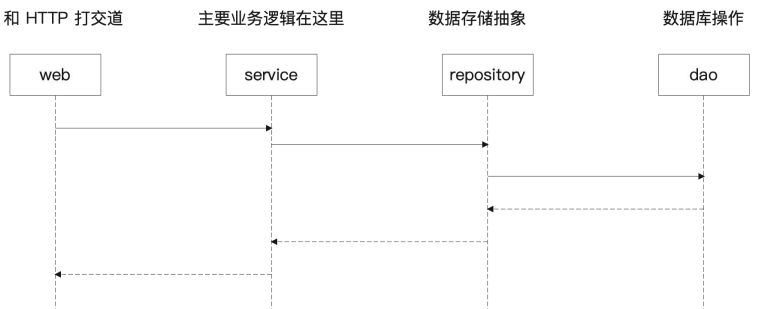

## Gorm

`Orm (Object Relational Mapping)` :  对象关系映射 。  `Orm`框架 提供 不需要关注 实体对象 与 数据库之间的操作关系

## Docker Compose

docker compose 启动 mysql8

基本语法 :

1. services : 服务列表
2. image : 镜像
3. command : 启动命令 (启动命令行参数)
4. volumes : 挂载文件
5. ports : 端口映射关系

```yaml
version: '3.7'
services:
  mysql8:
    image: mysql:8.0.29
    command: --default-authentication-plugin=mysql_native_password
    restart: always
    environment:
      MYSQL_ROOT_PASSWORD: root
    volumes:
      - ./script/mysql/:/docker-entrypoint-initdb.d/
    ports:
      - "13316:3306"
```

基础命令 :

`dokcer compose up` : 初始化 dokcer-compose 并且懂
`docker compose down` : 删除 docker-compose 里面创建的容器

### 项目结构

Service : 代表 领域服务 完整的业务的处理过程

Repository : 按照 DDD 的说法 是代表领域对象的存储 ，可以认为是存储数据的抽象

Dao : 代表数据库操作

domain : 代表领域对象

```
├── domain
│   ├── user.go
├── repository
│   ├── cache

│   ├── dao

│   └── user.go
├── service

```

这里简单提一下 :

我们公司项目的调用逻辑是 :

每一层都有自己相同的 `user` , 从这里看

- `htv2-db` 操作代表 `dao` 
- `exgv2` 层代表 `domain` (和 db 弱关联，但是算是底层数据)
- `cefiacc` 即是 `Repository`
- `ec`代表 `service` 封装给其他组进行调用

```
ec --> cefiacc -->  exgv2 --> htv2(db)
```

### 一些疑问

1. 为什么有了 `repository` 之后 还要有 `dao` ?

   - `repository` 是一个整体抽象，本质上可以考虑用 `ES`或者是`Mysql`或者是 `mongoDB` 并不代表数据库




## HTTP

### 无状态协议 HTTP

HTTP 是无状态协议，对于连续发送的两次请求, `HTTP` 并不知道两次都是同一个人发的

只能引入 `cookie` 和 `session` 进行记录

### Cookie

浏览器存储一些数据到本地，这些数据就是 `Cookie`

因为 `Cokkie` 是放在浏览器本地的，所以很不安全

一些关键配置 :

- `Domain` : `cookie` 可以用在什么域名下

- `Path`  : `cookie` 可以用在什么路径下

- `Max-age` 和 `Expires` : 过期时间

- `Secure` : 只用于 HTTPS 协议


```go
func SetCookie(w http.ResponseWriter, r *http.Request) {

 cookie := http.Cookie{
  Name:     "access_token", 
  MaxAge:   3600,       
  Path:     "/",        
  HttpOnly: true,       
  Secure:   true,     
 }

 // send cookie via header
 http.SetCookie(w, &cookie)
 fmt.Fprintln(w, "Cookie has been set!")
}
```

### Session 

由于 `Cookie` 本身不安全的特性，所以大部分 我们不把一些关键信息放在 `Cookie`

关键数据我们希望放在后端，这个存储的东西就是 `session`

```go
	sess := sessions.Default(ctx)
	sess.Set("userId", user.Id)
	sess.Options(sessions.Options{
		MaxAge: 20,
	})
	sess.Save()
```

---
个人理解 :

1. `session`也离不开本地化存储，大部分都是放在 `cookie`中 如果禁用了`cookie`也会考虑放在`header`或者是`query`中
2. 使用`session`无非是把敏感信息的相关校验放在了后端

## 面试

1. 什么是 cookie 什么是 session ? 
2. cookie 和 Session 比起来有什么缺点
3. Session ID 可以放在哪里 ？
4. 用户密码加密算法选取有什么注意事项
5. 怎么做登陆校验

## 后续

增强扩展 `GORM` 功能

1. 为 GORM 提供可观测性的插件实现
2. 为 GORM 提供读写分离插件
3. 为 GORM 提供 BeforeFind 功能
4. 为 GORM 提供辅助方法