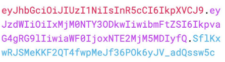
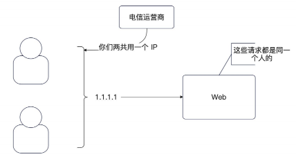

## 场景问题

### 刷新登陆状态

对于一个设置了 `10`分钟过期时间的 `session`，我们应该如何采用刷新策略才能够保证 用户在用着用着就要重新登陆

1. 用户每次访问，我们都刷新

    - 性能差，对 Redis 之类的影响很大 。 小公司看不出来，但是如果是 10w or 100w用户级别


2. 快要过期了我在刷新，例如 10分钟过期，用户9分钟过来访问的时候 刷新
    
    - 如果用户第9分钟没有过来 那就寄了

因此只能考虑使用 `固定时间间隔刷新`,比如 每分钟内的第一次访问我们都刷新

即 

1. 在`sesssion`中维护一个 `updateAt` 的参数
2. 然后在 `middleware` 中进行更新

## JWT

JWT (Json WEB Token)  : 很常见的一种机制，主要用于身份认证

基本原理就是通过 加密生成一个 `token` ,每次访问都带上这个`token`


组成部分 :

1. Header : JWT 的元数据
2. Payload : 数据内容
3. Signature : 签名



基本流程如下 :

1. 使用 `NewWithClaims` 设定指定的算法
2. 并且传入对应的 `userCliams`

```go
func (j *jwtHandler) setJWTToken(ctx *gin.Context, uid int64) error {
    userClaims := UserClaims{
    RegisteredClaims: jwt.RegisteredClaims{
    ExpiresAt: jwt.NewNumericDate(time.Now().Add(time.Minute * 30)),
    },
    UserId:     uid,
    UserAgents: ctx.Request.UserAgent(),
    }
    
    token := jwt.NewWithClaims(jwt.SigningMethodHS256, userClaims)
    tokenStr, err := token.SignedString([]byte("secret"))
	
	ctx.Header("x-jwt-token", tokenStr)
//. ..
}
```

校验方通过同样的 `sign-method` 和 `secret` 校验是否正确

### JWT 的优缺点

和 Session 比起来 优点  :

- 不依赖第三方存储
- 适合用于分布式环境
- 提高性能

缺点 :
- 对加密依赖非常大
- 最好不要在 JWT 中存储敏感信息

## 保护系统

如果有一个人，使用脚本进行大量的发送注册、登陆请求 ，系统负载会提高 所以这时候需要考虑保护系统

最简单的一个办法就是 `限流`

### 限流

如何在登陆之前确定`限流`

1. 我应该怎么认定 是哪个用户发送了什么请求 ？
2. 我应该怎么确定我限流的阈值时多少 ？ 

#### 限流对象

IP 是最容易获取的限流方式之一

其中更好的选择还有 `MAC 地址` 以及 `CPU序列号` 但是在 `web`端很难获取

`APP端`端话可以考虑设备序列号

不过 IP 并不能实际意义上代表一个人，因为两个人可以共用一个 `ip` 但是这已经是较好的一个选择了



### 限流阈值

限流阈值 时通过 `压测` 得到的 。 例如 `压测` 了整个系统，发现最多只能撑住每秒 `1000`个请求，那么阈值就是 `1000`

## 安全

不管是 JWT 还是 Session 一旦被攻击者拿到 关键的 JWT 或 SSid 攻击者就会假冒你

`HTTPS` 可以有效的阻止攻击者拿到你的 `JWT` 或者是 `ssid` 

但是如果你电脑中了病毒，那 `HTTPS` 也无能为力

最好的解决办法是做一个 二次校验，即增加 `发邮件`, `发短信` 的形式进行控制

或者是增加一些额信息 例如 `HTTP` 的`User-Agent`头部，或者是手机硬件信息

## 面试

1. 刷新 Session 过期时间的几种可行的办法

2. 增强登陆的安全性

   - 怎么保护 session id ? 主要还是开启 HTTPS 协议，把 cookie 的 Secure 和 HttpOnly 设置为 true
   - 怎么做到在 Session id 或者是 JWT token 泄漏之后保护住用户？ 要在登陆的时候记录一下 登陆的附加信息，例如 user-Agent 在登陆校验的时候统一校验

3. 如何保护 Web 服务 ？ 针对 IP 限流、整个集群限


## 后续 

支持 Gin 的限流插件 : 

单机限流 :

1. 令牌桶限流
2. 漏桶限流
3. 滑动窗口限流
4. 固定窗口算法

- 基于 Redis 限流
- 给予 Redis 的 IP 限流
