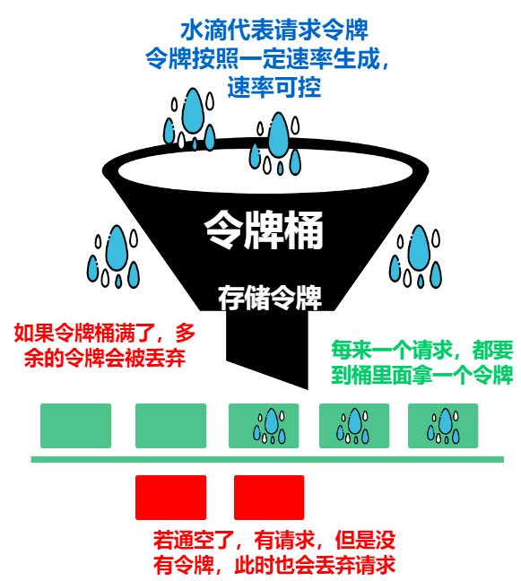
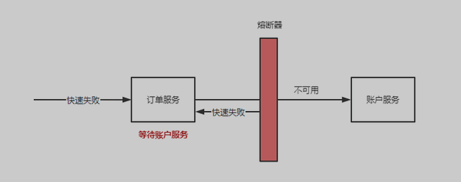

## 限流

### 单机限流


#### 令牌桶算法

算法思路设计 

1. 设计一个带有容量的桶

2. 给定速率的进行生成可用令牌
 
3. 每次请求消耗对应的令牌，如果没有令牌可用则失败



##### 代码

```go
type TokenBucket struct {
	rate       float64    // 令牌生成速率（每秒生成的令牌数）
	capacity   float64    // 令牌桶容量
	tokens     float64    // 当前令牌数
	lastRefill time.Time  // 上次填充令牌的时间
	mutex      sync.Mutex // 保护令牌桶的互斥锁
}

func (tb *TokenBucket) Allow() bool {
	tb.mutex.Lock()
	defer tb.mutex.Unlock()

	now := time.Now()
	elapsed := now.Sub(tb.lastRefill).Seconds()
	tb.lastRefill = now

	// 计算新增的令牌数
	tb.tokens += elapsed * tb.rate
	if tb.tokens > tb.capacity {
		tb.tokens = tb.capacity
	}

	if tb.tokens >= 1 {
		tb.tokens -= 1
		return true
	}
	return false
}
```
#### 漏桶算法

漏桶算法是令牌桶算法的反向思路看着 , 令牌桶是生成一定容量的令牌

漏桶算法则是 以固定速度进行消耗令牌(漏水), 如果请求过来发现水溢出了则禁止访问


##### 代码

```go
type LeakyBucket struct {
	rate     float64    // 漏出速率（每秒处理请求数）
	capacity float64    // 桶容量
	water    float64    // 当前水量（排队请求数）
	lastLeak time.Time  // 上次漏水时间
	mutex    sync.Mutex // 保护内部状态
}

func (lb *LeakyBucket) Allow() bool {
	lb.mutex.Lock()
	defer lb.mutex.Unlock()

	now := time.Now()
	elapsed := now.Sub(lb.lastLeak).Seconds()
	lb.lastLeak = now

	// 按时间漏水
	lb.water -= elapsed * lb.rate
	if lb.water < 0 {
		lb.water = 0
	}

	if lb.water+1 > lb.capacity {
		return false
	}
	lb.water++
	return true
}
```

#### 固定窗口限流

顾名思义 

我们维护一个固定时间的窗口, 在此期间 如果访问请求超过窗口大小则失效 否则成功 。 如果窗口超出设置的窗口时间 则清空窗口

##### 代码

```go
type FixedWindow struct {
	limit       int64         // 窗口内最大请求数
	window      time.Duration // 窗口大小
	count       int64         // 当前窗口计数
	windowStart time.Time     // 当前窗口起始时间
	mutex       sync.Mutex    // 保护内部状态
}

func (fw *FixedWindow) Allow() bool {
	fw.mutex.Lock()
	defer fw.mutex.Unlock()

	now := time.Now()
	if now.Sub(fw.windowStart) >= fw.window {
		fw.count = 0
		fw.windowStart = now
	}

	if fw.count >= fw.limit {
		return false
	}
	fw.count++
	return true
}
```


#### 滑动窗口限流

同滑动窗口，无非是动态维护了一下窗口的请求，不额外补充


#### 算法对比

| 算法 | 文件 | 特点 |
|------|------|------|
| 令牌桶 | `token_bucket.go` | 恒定投放令牌，允许突发 |
| 漏桶 | `leaky_bucket.go` | 恒定漏出，输出更平滑，不允许突发 |
| 固定窗口 | `fixed_window.go` | 实现简单，窗口边界可能双倍突发 |
| 滑动窗口 | `sliding_window.go` | 日志法精确统计，避免边界问题 |


### 基于 Redis 限流

对于多实例部署的应用如果要做到 单IP 限流, 需要考虑使用 `Redis` 

根据 `Redis` 单机单线程的特性可以使用 `lua` + 滑动窗口进行处理

#### 算法 

`lua`脚本 : 

1. 计算 `min` 即窗口的左边界

2. 然后根据 `ZREMRANGEBYSCORE` 删掉左边的请求

3. 如果大于阈值，那么返回限流

4. 否则增加计数, 并且设置过期时间


```lua
-- 基于 Redis ZSET 的滑动窗口限流脚本。
-- KEYS[1]: 限流对象 key
-- ARGV[1]: 窗口大小（毫秒）
-- ARGV[2]: 阈值
-- ARGV[3]: 当前时间戳（毫秒）
-- 返回 "true" 表示应限流，"false" 表示放行。
local key = KEYS[1]
local window = tonumber(ARGV[1])
local threshold = tonumber(ARGV[2])
local now = tonumber(ARGV[3])
local min = now - window

redis.call('ZREMRANGEBYSCORE', key, '-inf', min)
local cnt = redis.call('ZCOUNT', key, '-inf', '+inf')
if cnt >= threshold then
    return "true"
else
    -- member 加入 cnt，避免同一毫秒内多次请求互相覆盖
    redis.call('ZADD', key, now, tostring(now) .. '-' .. tostring(cnt))
    redis.call('PEXPIRE', key, window)
    return "false"
end
```

Go这边的处理

```go

//go:embed slide_window.lua
var slideWindowLua string

func (r *RedisSlideWindowLimiter) Limited(ctx context.Context, key string) (bool, error) {
	return r.cmd.Eval(ctx, slideWindowLua, []string{key},
		r.interval.Milliseconds(), r.rate, time.Now().UnixMilli()).Bool()
}
```


## 熔断

熔断的理解 : 

1. 当一个服务已经出现问题的时候, 需要控制住访问该服务的请求。 

对于 Gin 层面, 我们要做到的就是, 对于下游一个服务崩溃了，能够在请求发送之前就快速返回错误

详细的说就是 :

1. 例如账户服务如果过载了, 数据库请求很慢. 为了防止大量请求 导致请求到数据库上从而崩溃. 需要进行熔断

更简单的就是 :

1. 对于 手机号登陆的功能 , 如果腾讯云失连续超时，那么需要熔断腾讯云30s 防止多次请求连续超时




参考 : 

https://www.liuvv.com/p/2ca9d630.html


### 实现

这里不详细说出具体思路, 对于 `Gin` 层面的熔断

我们可以通过使用 `middleware` 进行判断, 在请求访问之前 判断是否允许访问, 如果不可用则 `abort()` 

否则 `next()` 进入下一个 中间件

记入我们请求成功和失败的次数

```go
func CircuitBreakerMiddleware(cb *CircuitBreaker, opts ...CircuitBreakerOption) gin.HandlerFunc {
	o := &circuitBreakerOptions{
		isFailure: defaultIsFailure,
		fallback:  defaultFallback,
	}
	for _, opt := range opts {
		opt(o)
	}

	return func(c *gin.Context) {
		generation, err := cb.Allow()
		if err != nil {
			o.fallback(c)
			c.Abort()
			return
		}

		c.Next()

		if o.isFailure(c) {
			cb.Failure(generation)
			return
		}
		cb.Success(generation)
	}
}
```

## 降级

Gin 层面的限流确实没看懂，不过可以就 短信服务 谈一下限流

对于 默认使用腾讯云的 短信服务，如果发生了熔断，那么可以考虑使用 阿里云进行 backup 这个过程就是降级

同样的

对于热榜服务，如果热榜服务失效。 可以考虑去使用历史的热榜来代替现有的热榜

