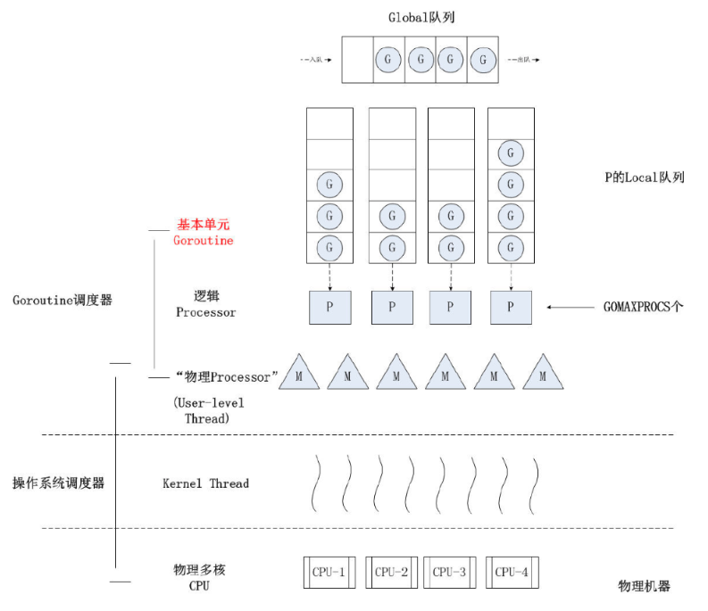
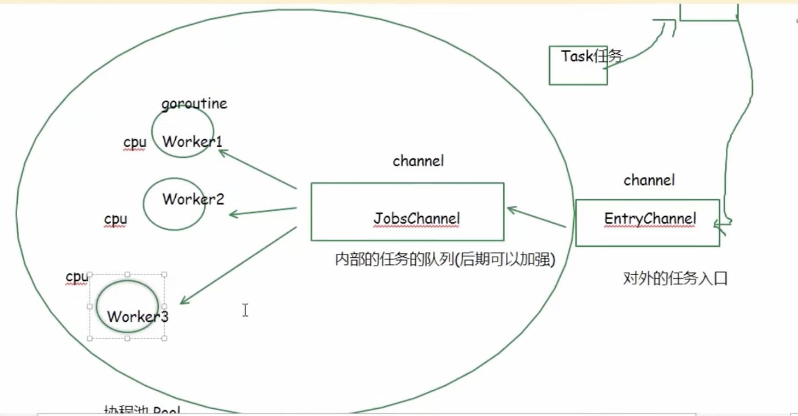

## 池化技术

我们对于一个批量操作，例如 `批量暂停账户` 或者是 `批量删除数据` 

我们很常规的做法就是 接口开放 `[]business_list` 然后通过 `for` 进行处理对应的对应的业务逻辑

```go
func Handler(req) error {
    // ... 
    for _, item := range business_list{
        handle(item)
    }
    // ... 
}
```

但是这种在数据量大的时候会有一个问题 那么就是 `前端等待超时`, 这个超时 我上班的时候看着是 `nginx`还是前端那边特定组件控制的

这时候可能就会想到

1. 我们只提交 `tasks` 然后放入到数据库中，单独开启一个 `go backend_job` 进行处理，并且处理对应的状态流转。 这种思路在我们 批量处理数据的地方 `屡见不鲜`

    - 这里就需要考虑 状态的流转，展示
    - 如果进程重启，还需要恢复
    - 如果数据量很大很大，是不是要考虑 分批分次进行，还需要进度控制

2. 使用 `long-task` 接口，前端发起`req`请求，后端返回一个 `task-id` 然后每次都适用 `task-id`进行请求 查看任务状态 。 

    - 这种做法，我能想到的问题就是，用户会被硬控在前端页面一直`loading` 


池化技术貌似并不能很好的解决 第一个方案，如果数据量真的很大很大，感觉还是要进行分批分次进行 ，并且加上进度控制 。  顶多优化一下每轮的次数

更多的是优化第二个内容，优化接口的响应和返回

```
[AI Asking]: 池化技术在业务中 最多解决哪一类问题？我们什么时候用到池化技术
```

---

突然想起来了 :

1. 这里的池化技术 特指 `并发池` 而不是 `连接池` 对于 连接池的技术不熟悉

## GMP

现在我是一个小白, 例如如果我们要实现 `清理 100w条数据` 那么是否是 开 `100w` 个 `gorutine` 更好呢，毕竟每一个 `gourtine` 单独处理最快



我么可以从 `GMP设计图` 中很直观的看到

1. **全局队列** : 存放等待运行的 `G` 

2. **P的本地队列** : 存放的也是等待运行的 `G` 。 本地队列的限制是 `256`

3. **P列表** : 可以认为是 逻辑上的 CPU . 数量可以认为是 CPU 的核数

4. **M** : 线程 ; 想要运行任务就需要获取 `P`  . 并且通过内核线程 `Kernel Thread` 进行 `CPU` 的相关调度请求

一些调度关系 :

1. 如果 当前 `M` 绑定的 `P` 的 `G` 阻塞了，那么会重新调度一个新的 `M` 进行后续 `G` 的运行

2. `G` 如果运行完之后 会产生对应的 `GC` 占用一定的内存空间

3.  如果当前本地队列 `P` 没有可运行的 `G`, 那么会去全局队列进行寻找


4. 如果 当前本地队列 `P` 没有可运行的 `G` 并且 全局队列为空 ，那么会去其他队列进行偷取 .  (降低性能)


### 大量创建 go 协程的代价

**内存开销:** 

1. 初始阶段 goroutine 大概只有 `2k` 的内存开销  . ps : 一个线程 大概需要 `2M` 的开销 

    `/go/pkg/mod/golang.org/toolchain@v0.0.1-go1.23.4.darwin-arm64/src/runtime/runtime2.go:422`

**调度开销:**

1. 我们可以从上面的图中看到 ，一个`G` 需要先放到全局队列，然后到本地队列，最后到`P` 又需要根据`M`进行绑定最后跑到内核线程 。

2. 并且一个很坏的结果是，当我们的`G` 阻塞后，会创建新的`M` 来进行执行，导致内核的线程开销也会变大


**gc开销:**

1. 协程占用的内存最终需要 Gc 来回收


## 协程池

我们知道 

1. 并发可以提高处理请求的速度
2. 但是并发数量并不是越多越好

这是一个 `规则怪谈` ，所以这时候 引入了 `协程池`，即固定数量的协程

1. 例如 `nginx` 最多支持 每秒钟并发 `5` 个请求，那么我们就可以启动一个数量为`5`的协程池进行批量工作


### 实现 1

#### 架构

1. `work` 实际运行的 `gourtine` 用于并发处理 `func()` 

2. `JobsChannel` 内部任务的队列用于分发任务到 `work()`中

3. `EntryChannel` 对外处理任务的队列，用于对接 `JobsChannel` 的数据




#### 代码剖析

##### Task

定义 Task 其中值字段包含一个 `func value()` 

并且支持一个函数用于执行 `Execute()`

````go
type Task struct {
	f func() error
}

func NewTask(f func() error) *Task {
	return &Task{f: f}
}

func (t *Task) Execute() error {
	return t.f()
}
````

##### Pool 

整个 `pool` 定义如下

```go
type Pool struct {
	EntryChannel chan *Task // 对外的任务入口
	JobsChannel  chan *Task // 内部的队列
	workerNum    int        // 协程池最大的数量
}
```

支持的 `Func` 如下 


单独解释一下 `Run` 过程

1. 这里先通过 遍历`workerNum` 启动 `gourtine`

2. 启动之后会进入到 `JobsChannel` 此时数据里面没有,会进行`阻塞`

然后下方的数据会进行获取数据并且传入

```go
func (p *Pool) worker(workerId int) {
	for task := range p.JobsChannel {
		task.Execute()
		fmt.Println("worker ID ", workerId, " ")
	}
}

func (p *Pool) Run() {
    defer close(p.JobsChannel)

	for i := 0; i < p.workerNum; i++ {
		go p.worker(i)
	}

	for task := range p.EntryChannel {
		p.JobsChannel <- task
	}
}

```

##### 完整运行

```go
func Test_ExamplePool(t *testing.T) {
	a := atomic.Int64{}
	task := NewTask(func() error {
		fmt.Println("task :", a.Add(1))
		return nil
	})
	pool := NewPool(3)

	go func() {
		for i := 10; i != 0; i-- {
			pool.EntryChannel <- task
		}
		defer close(pool.EntryChannel)
	}()

	pool.Run()
}
```

### 实现 2 

## 手写协程池

## 协程池的应用

## 其他