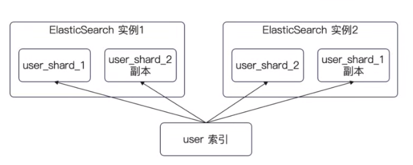
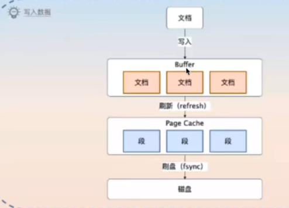
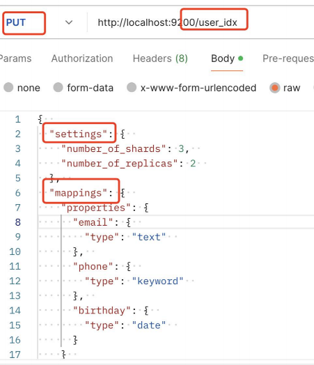
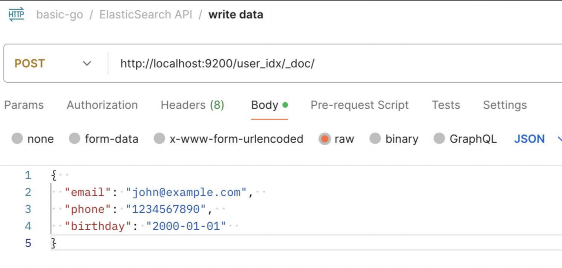
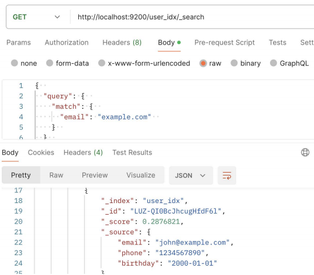
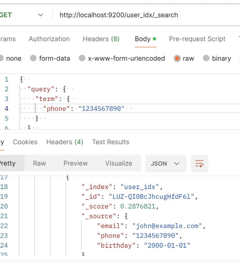
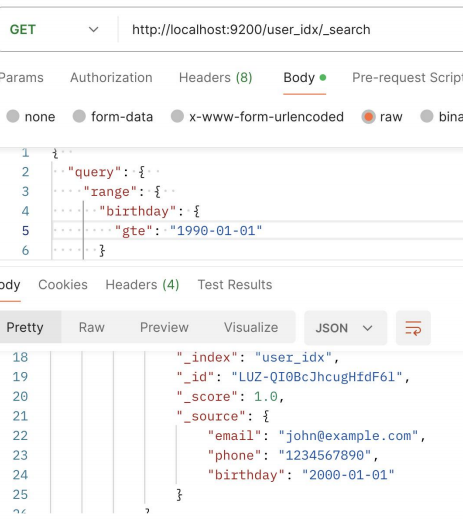

## Es

提供一种简单、高效的方式 来存储、搜索和分析大量数据

ES 支持近实时的搜索

ES 支持极大数据量

ES 提供 Resful API


主要核心就是 : 搜索

搜索引擎的搜索并不依赖 ES，因为搜索引擎优先出现 。 但是他们底层都是 倒排索引

`搜索、广告、金融`


数据的组织方式 : 

- `索引`: 类比 Mysql 的表

- `文档` : 类比 Myssql 的表的数据

数据的部署方式 :

- `分片`: 类比关系数据库的分库分表

- `副本` : 类比主从同步中的从库



### 索引与倒排索引

索引 : 数据本身

倒排索引 : 从属性出发，找到这些属性的数据


### ES 写入流程 :

1. 文档首先写入到 `buffer` 里面

2. 定时刷新到 `page cache` 中 ，这个过程叫做 `refresh` 

3. 刷新到磁盘中



## ES HTTP API

### 创建索引

Es 暴露了 HTTP API 。 可以通过 HTTP 请求来操作整个 CRUD

我们在下面的操作进行了 :

1. 创建了一个索引

2. 制定了 3个分片 和 2个副本

3. 设置了3个字段，并且设置了每个字段的类型 




### 写入数据 & 查询数据

通过 指定 index 和 _doc 表示我们在 `user_index` 写入了数据



我们通过 index 和 search 指定我们查询的数据 

1. 虽然我们并没有指定完整的 email 但是还是返回了预期的结果



### ES 支持的查询

Match Query（匹配查询）：根据字段中的内容进行全文匹配查询。
- 
• Term Query（精确查询）：根据字段中的精确值进行查询，适用于 keyword 类型或者已经执行过分词器的字段。

• Range Query（范围查询）：根据字段中的范围值进行查询，可以用来查询数字或日期范围。

• Bool Query（布尔查询）：通过逻辑运算符（must、must_not、should）组合多个查询条件，实现更复杂的查询逻辑。

• Match Phrase Query（短语匹配查询）：根据字段中连续的短语进行查询，适用于需要保持短语顺序的查询。

• Prefix Query（前缀查询）：根据字段中的前缀进行查询，适用于需要按照前缀匹配查询的场景。

• Wildcard Query（通配符查询）：根据通配符模式进行查询，支持通配符符号（*和?）进行模糊匹配。

• Fuzzy Query（模糊查询）：根据字段中的模糊匹配进行查询，可以通过设置 fuzziness 参数来控制模糊程度。

• Nested Query（嵌套查询）：根据嵌套对象进行查询，以便查询嵌套在文档中的相关信息。

• Aggregation Query（聚合查询）：用于计算、统计和分析数据，包括求和、平均值、最小值、最大值、分组等
操作

### 查询例子

下面分别进行了

1. 一次精确匹配

2. 查询范围 大于等于 的日期






## ES & Go 


### 创建索引

这里可以看到，实际上我们还是需要 构造一个 如 http 一样的 jsonBody

```go
func (s *ElasticSearchTestSuite) TestCreateIndex() {
	ctx, cancel := context.WithTimeout(context.Background(), time.Second*3)
	defer cancel()
	// 这是一个链式调用，你可以通过链式调用来构造复杂请求。
	// 重复创建会报错，所以你可以换一个名字
	resp, err := s.es.Indices.Create("user_idx_test",
		s.es.Indices.Create.WithContext(ctx),
		s.es.Indices.Create.WithBody(strings.NewReader(`
{  
  "settings": {  
    "number_of_shards": 3,  
    "number_of_replicas": 2  
  },  
  "mappings": {  
    "properties": {
      "email": {  
        "type": "text"  
      },  
      "phone": {  
        "type": "keyword"  
      },  
      "birthday": {  
        "type": "date"  
      }
    }  
  }  
}
`)))
	require.NoError(s.T(), err)
	assert.NotNil(s.T(), resp)
	assert.Equal(s.T(), 200, resp.StatusCode)
}

```

### 写入文档

通过 client.index 指定对应的 `index` 然后放入文档

```go
func (s *ElasticSearchTestSuite) TestPutDoc() {
	ctx, cancel := context.WithTimeout(context.Background(), time.Second*3)
	defer cancel()
	resp, err := s.es.Index("user_idx_test", strings.NewReader(`
{  
  "email": "john@example.com",  
  "phone": "1234567890",  
  "birthday": "2000-01-01"  
}
`), s.es.Index.WithContext(ctx))
	require.NoError(s.T(), err)
	require.NotNil(s.T(), resp)
	assert.Equal(s.T(), 201, resp.StatusCode)
}

```

### 搜索文档

```go
func (s *ElasticSearchTestSuite) TestGetDoc() {
	ctx, cancel := context.WithTimeout(context.Background(), time.Second*3)
	defer cancel()
	resp, err := s.es.Search(s.es.Search.WithContext(ctx),
		s.es.Search.WithBody(strings.NewReader(`
{  
  "query": {  
    "range": {  
      "birthday": {
        "gte": "1990-01-01"
      }
    }  
  }  
}
`)))
	require.NoError(s.T(), err)
	assert.Equal(s.T(), 200, resp.StatusCode)
}
```