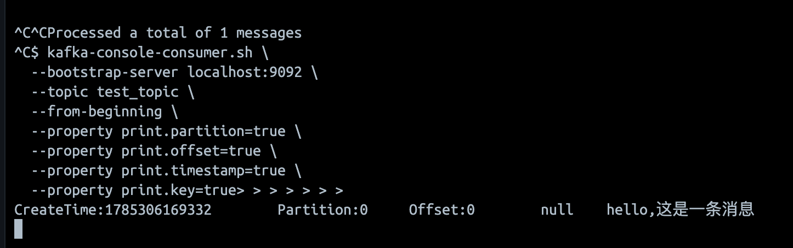
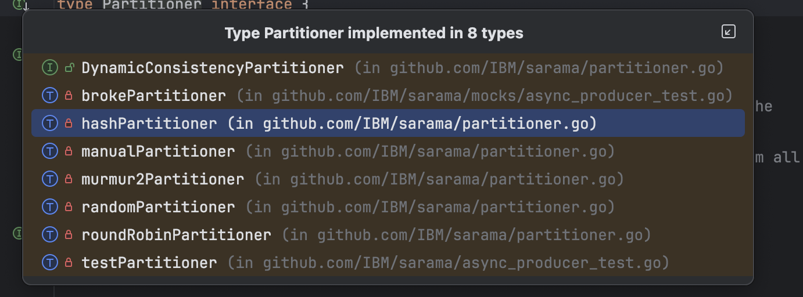

## Saram 入门

发送消息

```go
func TestProducer(t *testing.T) {
	cfg := sarama.NewConfig()
	cfg.Producer.Return.Successes = true

	producer, err := sarama.NewSyncProducer(addrs, cfg)
	assert.NoError(t, err)
	p, offset, err := producer.SendMessage(&sarama.ProducerMessage{
		Topic: "test_topic",
		Value: sarama.StringEncoder("hello,这是一条消息"),
		Headers: []sarama.RecordHeader{
			{Key: []byte("header1"), Value: []byte("header1_value")},
		},
		Metadata: map[string]any{"metadata1": "metadata_value1"},
	})
	assert.NoError(t, err)
	t.Log(p, offset)
}
```



### saram 指定分区

我们观察上面的内容，发现消息发送在来  partition : 0 上面

我们可以看到 `partitioner` 支持 

random : 随机挑一个

RoundRobin : 轮询

Hashkey : 根据 key 的哈希值塞选一个 

Manual : 根据 Message 中的 partition 来选择




### 异步发送

saram 支持 `aysnc` 和 `sync` 两种发送 其中支持异步发送 `async`

初始化 producer 后，从 producer 获取 input 的 channel 并且发送一个消息 。 通过 select 监听 success 和 error 

```go
func TestAsyncProducer(t *testing.T) {
	cfg := sarama.NewConfig()
	cfg.Producer.Return.Successes = true
	cfg.Producer.Return.Errors = true
	producer, err := sarama.NewAsyncProducer(addrs, cfg)
	assert.NoError(t, err)
	msgCh := producer.Input()

	msgCh <- &sarama.ProducerMessage{
		Topic: "test_topic",
		Value: sarama.StringEncoder("hello,这是一条异步消息"),
		// 会在 producer 和 consumer 之间传递
		Headers: []sarama.RecordHeader{
			{Key: []byte("header1"), Value: []byte("header1_value")},
		},
		Metadata: map[string]any{"metadata1": "metadata_value1"},
	}
	// 在实践中，一般是开另外一个 goroutine 来处理结果的
	select {
	case err := <-producer.Errors():
		// 这边是出错了
		val, _ := err.Msg.Value.Encode()
		t.Log(err.Err, string(val))
	case msg := <-producer.Successes():
		// 这边是成功了
		val, _ := msg.Value.Encode()
		t.Log("成功了", string(val))
	}
}
```

### 指定 acks

生产者在发送数据的时候 需要设置一个关键参数 `ack`

1. 0 ; 客户端发送一次，不需要服务端的确认

2. 1 ; 客户端发送，并且服务端写入主分区

3. -1 ; 客户端发送，并且需要服务端同步到所有的 ISR 上 。(ISR 即 所有跟上主分区的从分区)

```go
type RequiredAcks int16
const (
	// NoResponse doesn't send any response, the TCP ACK is all you get.
	NoResponse RequiredAcks = 0
	// WaitForLocal waits for only the local commit to succeed before responding.
	WaitForLocal RequiredAcks = 1
	// WaitForAll waits for all in-sync replicas to commit before responding.
	// The minimum number of in-sync replicas is configured on the broker via
	// the `min.insync.replicas` configuration key.
	WaitForAll RequiredAcks = -1
)
```

### ConsumerGroupHandler 

业务方通过指定 consumer_group 和 topic 进行消费处理。 消费 interface 需要实现 `setup, cleanup,consumeclaim`

```go
func TestConsumer(t *testing.T) {
	cfg := sarama.NewConfig()
	cg, err := sarama.NewConsumerGroup(addrs,"test_group", cfg)
	assert.NoError(t, err)
//...
	ctx, cancel := context.WithTimeout(context.Background(), time.Second*30)
	defer cancel()
//...
	err = cg.Consume(ctx,[]string{"test_topic"}, &ConsumerHandler{})
	assert.NoError(t, err)
}
// ... 
type ConsumerGroupHandler interface {
	// Setup is run at the beginning of a new session, before ConsumeClaim.
	Setup(ConsumerGroupSession) error

	// Cleanup is run at the end of a session, once all ConsumeClaim goroutines have exited
	// but before the offsets are committed for the very last time.
	Cleanup(ConsumerGroupSession) error

	// ConsumeClaim must start a consumer loop of ConsumerGroupClaim's Messages().
	// Once the Messages() channel is closed, the Handler must finish its processing
	// loop and exit. Handlers should also return when ConsumerGroupSession.Context()
	// is done; Messages() alone can block while the partition consumer is retrying
	// (e.g. after a broker disconnect). See examples/consumergroup.
	ConsumeClaim(ConsumerGroupSession, ConsumerGroupClaim) error
}
```

### 异步消费 批量提交

kafka 要求消费后的数据必须提交 。如果不提交，在下一次重启之后 会出现重复提交的情况

下面是一个异步消费的写法

```go
func (c *ConsumerHandler) ConsumeClaim(session sarama.ConsumerGroupSession,
	claim sarama.ConsumerGroupClaim) error {
	ch := claim.Messages()
	batchSize := 10
	for {
		var eg errgroup.Group
		msgs := make([]*sarama.ConsumerMessage, 0, batchSize)
		ctx, cancel := context.WithTimeout(context.Background(), time.Second)
		done := false
		for i := 0; i < batchSize && !done; i++ {
			select {
			case <-ctx.Done():
				// 这一批次已经超时了，
				// 或者，整个 consumer 被关闭了
				// 不再尝试凑够一批了
				done = true
			case msg, ok := <-ch:
				if !ok {
					cancel()
					// channel 被关闭了
					return nil
				}
				msgs = append(msgs, msg)
				eg.Go(func() error {
					log.Println("offset", msg.Offset)
					// 标记为消费成功
					time.Sleep(time.Second * 3)
					return nil
				})
			}
		}
		err := eg.Wait()
		if err == nil {
			// 这边就要都提交了
			for _, msg := range msgs {
				session.MarkMessage(msg, "")
			}
		} else {
			// 这里可以考虑重试，也可以在具体的业务逻辑里面重试
			// 也就是 eg.Go 里面重试
		}
		cancel()
	}
}

```


## 面试题

1. kafka 中 producer 中的 ack 有哪些取值 ？ 分别是什么含义？你用了哪些

0, -1, 1

0 表示客户端发送之后 不需要服务端验证

1 表示客户端发送之后 并且同步到服务端主分区

-1 表示客户端发送之后 并且同步到所有 ISR 上

2. Kafka 中 ISR 是什么意思 ？

所有跟得上主分区节奏的从分区


## 总分：**58 / 100**

按「2 年经验、Golang + Kafka」面试标准看：能证明你用过 Sarama，覆盖了发送/分区/acks/消费组的入门面，但深度、完整度和可追问的生产经验都偏弱，深挖很容易露怯。

---

### 优点

1. **有可运行的 Sarama 代码**：Sync / Async Producer、ConsumerGroupHandler，比纯背概念强，能证明动手过。
2. **Producer 关键点抓得对**：Partitioner（Random / RoundRobin / Hash / Manual）和 `acks`（0 / 1 / -1）是常考项。
3. **消费侧有「批量 + 提交」意识**：知道要 `MarkMessage`，也提到失败可重试，方向对。
4. **结构适合当笔记骨架**：从发消息 → 分区 → 异步 → acks → 消费，学习路径清晰。

---

### 缺点

1. **面试题太薄**：只有 2 道，且第二题「ISR」写成「解咒」，表述不严谨，面试官一追问就挂。
2. **缺少语义与可靠性主线**：至少一次 / 至多一次 / 精确一次、幂等 Producer、事务、重平衡、Consumer Lag、死信、重试，几乎没写。
3. **示例代码有明显硬伤**（面试官很爱抠）：
   - `eg.Go` 里闭包捕获循环变量 `msg`，Go 经典坑；
   - 没用 `session.Context()`，rebalance / 关闭时可能卡死；
   - 只 `MarkMessage`、未说明 auto-commit / 手动 `Commit` 策略；
   - 批次超时 1s、业务 `Sleep 3s`，逻辑自相矛盾。
4. **「你用了哪些」没答完**：acks 题只背取值，没结合业务说选了什么、为什么、出过什么问题。
5. **表达与细节粗糙**：Saram/Sarma、aysnc、塞选等；acks=-1 与 `min.insync.replicas` 的关系没讲清。

---

### 建议（按优先级）

| 优先级 | 建议 |
|--------|------|
| P0 | 把面试题扩到 15～20 道：acks+ISR、分区与顺序、消费组重平衡、offset 提交、至少一次如何做幂等、Sync vs Async 选型、Lag 排查 |
| P0 | 修掉消费示例：闭包、`session.Context()`、失败不提交/重试/死信策略写清楚 |
| P1 | 每道题加「项目经历」：业务场景、选型原因、踩过的坑（重复消费、消息丢失、rebalance 卡住） |
| P1 | 补齐：幂等 Producer、`enable.idempotence`、批量参数（`linger`/`batch.size`）、压缩、监控指标 |
| P2 | 对照官方注释精修术语；和 `kafka_0x01` 基础篇打通，形成「原理 → Sarama → 生产落地」一条线 |

---

### 分项参考

| 维度 | 得分 | 说明 |
|------|------|------|
| Producer 基础 | 70 | acks / partitioner / sync·async 有，深度不够 |
| Consumer 基础 | 55 | 知道接口，提交与生命周期不扎实 |
| 可靠性语义 | 35 | 面试高频区几乎空白 |
| 代码可追问性 | 45 | 能演示，但经不起抠细节 |
| 面试题准备 | 30 | 题量与质量都不足 |
| 表达与准确度 | 50 | 笔误和概念表述拖后腿 |

---

**面试官结论**：当前水平大约是「跟过教程、能写 Demo」；以 2 年经验去面中级岗，过 HR/浅技术面有希望，过深挖 Kafka 生产问题的技术面风险较大。把可靠性语义 + 修代码坑 + 项目故事补上，目标可冲到 **75～80**。