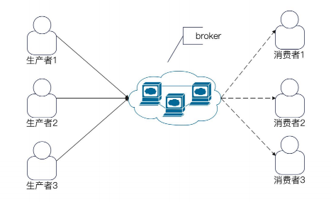
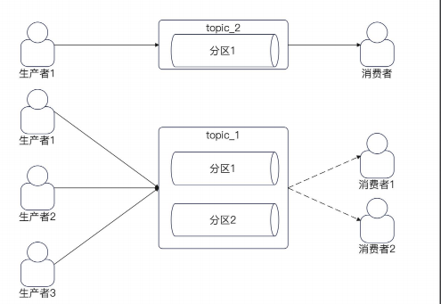
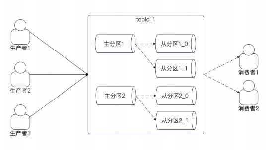
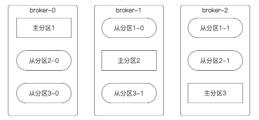
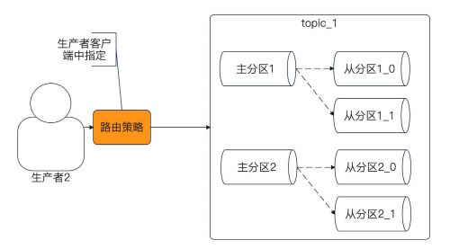
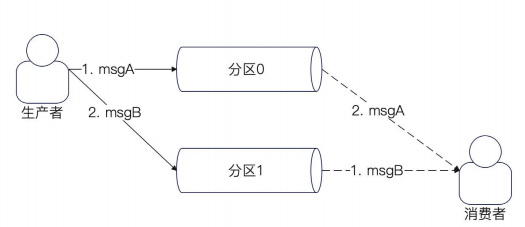
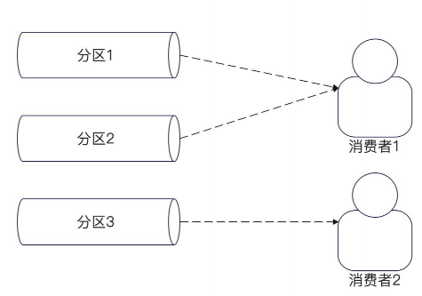
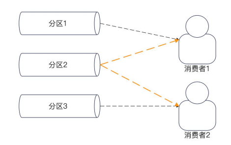

## 消息队列 

消息队列的作用是 : 实现 生产者 和 消费者解耦 

例如 : 

点赞服务聚合推送，批量插入数据库

### kafka 基本概念

生产者 : producer 

消费者 : consumer 

broker : 消息服务器 。 逻辑上的概念 , 实践中 一个 broker 就是一个消息队列进程

topic 与 分区 (parition)

消费者组 与 消费者

### Topic 与 分区 

topic : 可以认为是 消息队列上代表不同业务的 东西 。 简单的认为 一个 业务就是一个 topic

一个 topic 可以有多个分区

Kafka 为了保证 **高可用** 和 **数据不丢失** 分区有 主分区 和 从分区

当 发送消息 到 kafka 上的时候， kafka 会把消息写入 主分区之后 再同步到从分区

### 分区 与 broker 的关系

主分区之间, 不会在同一个 broker 上

同一个分区的 主从分区 也不会在同一个 broker 上

### 分区 与 生产者的关系 

正常情况下，一个 topic 都会有多个分区 。 所以发送者在发送消息的时候 需要选择一个目标分区。 

比较常见的有三种 : 

1. 轮询 : 一个分区发送一次 

2. 随机 : 随机挑选一个

3. hash : 根据 消息中的 key 来筛选一个 目标分区 

### 分区和消息有序性 

Kafka 中的消息有序性 保证是以分区为单位的 。 也就是说 **一个分区内的消息是有序的** 

因此如果要做到 **全局有序**, 那么只能有一个分区

如果要做到 **业务有序**, 需要保证业务的消息都丢在同一个分区里面 

### 分区与消费者组、消费者的关系

一个消费者组可以认为是关心这个 topic 的一个也无妨 

同一个消费者组里面，一个分区最多只能有一个消费者。

一个分区最多有一个消费者 :

1. 如果一个 topic 有 N 个 分区，那么同一个消费者组最多有 N 个消费者

2. 如果消费者性能很差，那么并不能通过 无限增加消费者来提高速率

## 消息队列相关问题

Q : 一个分区只有一个消费者，那么怎么做到 两个业务消费同一条信息。 例如账户更新发送了一个 MQ, 需要 计算服务 和 聚合服务共同消费这次改动

如果两个不同的服务需要消费同一条消息，需要属于不同的 消费者组，从而能够从 同一个 topic 获取相同的信息进行消费

Q : 死信、消息堆积

死信 : 消费多次失败，无法被正常处理的消息，会单独丢进一个 死信队列 DLQ 。 目的是为了把坏消息 隔离出来，避免反复重试拖垮消费者 。

消息堆积 : 生产速度大于消费速度 导致 topic 的消息越堆越多 。

## 面试题

1. 有没有用过 kafka  ？ 用来解决什么问题

用过。 对于 点赞、阅读业务的时候，需要将用户点击 和 数据库操作进行解耦.

在用户获取文章接口的时候，会进行一次数据库自增操作，这会使得接口变慢。 如果考虑使用 go 异步出来 。那么每次点击都会产生一个 goroutine 不安全。并且希望能够做到 自动聚合一部分相同业务的内容增量，所以考虑使用 kafka

2. 什么是 broker , broker 和 分区的关系是什么

broker 是一个逻辑上的概念，可以认为是一个 MQ 的进程 。 一个 broker 拥有一个主分区和多个从分区 。 

3.  什么是 topic , topic 和 分区的关系是什么

一个 Broker 可托管多个 Topic 的多个分区（Leader / Follower 都有）。应说：分区副本尽量打散到不同 Broker；同一分区的 Leader 与 Follower 不在同一 Broker。

4. Kafka 中一个分区可以有多个消费者吗

同一消费者组内，一个分区同一时刻只被一个消费者消费；不同组可并行消费同一分区。Q4 按现有答案答，追问就会挂。

5. 消息积压了怎么办 ？ 

    1. 增加 topic

    2. 异步消费

    3. 批量消费

6. 怎么保证消息的顺序 ？  怎么保证全局有序 ？ 怎么保证业务有序。？

kafka 支持 分区上的有序性，一个分区是消息是有序的。 

全局有序性需要保证所有消息都发送到同一个分区

业务有序性需要保证同一个业务都发送到同一个分区

可以使用 hash + biz-key 来选择一个目标分区进行发送
