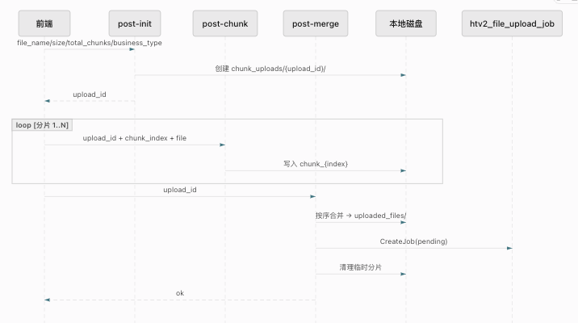

## 需求分析 

对于一个大文件 >= 50mb 的上传, 走单个文件上传的接口很容易超时

1. 单个请求时长过长，容易出发 网关/前端axios 超时

2. 中间失败就要整个文件重传

3. 也可能遇见中间件请求大小限制

## 业务流程

1. 前端拆分文件

2. 通过 `/post-init` . 初始化本次文件的基本信息 

```json
{
file_name  // 文件名
file_size // 文件大小
totalChunks // 总分片数
// .. 
}

```

3. `/post-init` 为每个分片创建临时目录, 然后将本次的 `uploadItem` 存放到 进程级 `map`中并且返回`upload-id`

4. 前端分片带上 `upload-id` 和 `chunk_index` 以及本次的数据到 `post-chunk` 接口

5. 所有数据上传完之后前端调用 `post-merge`接口进行数据到合并，通过 `upload-id` 遍历每一个分区




## 一些问题

1. 数据上传信息记录由进程级 `map` 进行记录，重启之后会丢失 , 并且不支持 跨实例续传

	- 业务上是允许的，因为客户环境只有每次升级才会进行重启，升级前后的上传操作 从业务上看确实需要客户重新操作一次

	- 项目是分环境分数据库部署的，没有多实例要求

## 优化点 

1. 业务没有断点续传。 如果失败的话需要整体重传

	- 如果上传失败了，我们需要重新传整改文件
	- 旧的文件也不会主动清理掉，磁盘上会一直留着，直到运维来清理他

2. 并不能保证 拼接后绝对正确。 