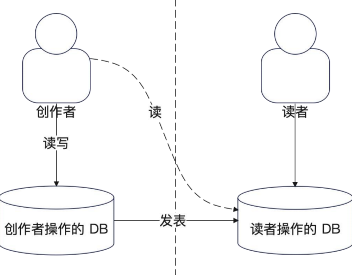
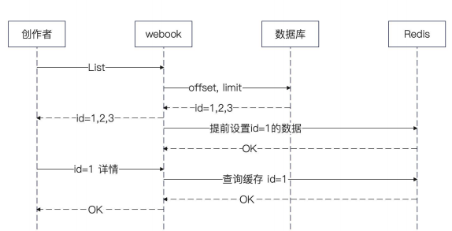

## 简历 preview

简历上 :

设计并实现了一个 发帖 服务

需求分析 :

1. 帖子状态分析 :  未发表 -> 发表 -> 被删除

如果做到一边修改一边可查看

1. 分开存储, 设计一个制作库 一个线上库

## 制作库和线上库的事务问题

我们从 `service` 的角度考虑，其实并不知道 `repository` 层面存储的是什么数据 。 所以就别谈开启事务了

因此我们能做的最好的一点就是 `重试`  . 对于创作者来说就算线上库失败了其实影响也不大

1. 如果看到发表失败，他可以考虑重试

2. 读者完全看不到这个帖子 

如果是站在 `repository` 的角度考虑 就要分 `同库不同表` 和 `不同库` 的问题

对于 `不同库` 的情况， 可以考虑 分步更新 `find - update -> upsert` 

对于 `同库不同表` 可以采用数据库事务进行处理

建表

## Mongodb 

### 雪花算法

因为 系统内增加了 MongoDB 但是我们在 repo 层定义的是 int64 的 ID，因此需要使用雪花算法

## OSS

通过 OSS 来维护 content

## 查询接口

作者的查询接口 : 

列表接口 : 看到自己发表的所有文章, 这是一个分页接口

详情接口 : 当作者选中了某篇文章的时候，能看到文章的全部内容

读者的查询接口 :

搜索接口 : 接入搜索模块之后设计

推荐接口 : 再设计

阅读文章接口 : 当选中某篇文章的时候, 可以看到文章的全部内容

### 分页接口处理

分页接口的三种形态 :

1. Offset + Limit 的形式

2. 之直接定义一个 Page 的形式 。 前端传递了 page 之后需要后端计算出对应的 offset 和 limit

3. 直接定义一个 Cursor 的形式 。 每次查询后，后端控制返回一个 Cursor,让前端使用 。

### 缓存设计

#### PreCache

##### 缓存第一页

大部分没有什么人会缓存分页结果 。 但是很多业务场景，用户只看列表内容的第一页，很少会往后翻 。 因此可以考虑 **只缓存第一页**

实现逻辑 :

1. 查询接口的时候。优先查缓存 然后再查数据库。 判断 `offset == 0` 和 `limit < 100` 则走缓存

2. 更新/新增操作 : 在对于新写文章、编辑文字、发表文章都要清楚相关的 首页缓存

##### 缓存第第一条数据

对于创作者查看文章详情接口，很大概率。创作者在拿到列表之后，只会访问第一条数据 。 所以我们可以考虑进行缓存预加载 。只缓存第一条数据

特点 ：

1. 因为伴随着预测性质，所以这个过期时间设置的很短 。避免内存的开销

改进点 :

1. 不缓存大文档 。 避免浪费内存 

## 面试

1. 什么是 TDD 

2. TDD 和 DDD 的关系 

	- DDD 适合战略规划，TDD 适合落地具体功能。

3. TDD 有什么好处

	- 理清思路、查漏补缺、方便重构、测试完善。

1. 有没有用过 MongoDB ？ 用来解决什么问题 ？ 

2. 为什么要用 Mongodb 用 mysql 行不行

3. 解释一下 mongodb 中集合和文档的关系

4.  如何设计 Mongobd 上的索引 ESR 原则

5. 如何数据存储在 MongoDB上 怎么生成 ID

6. MongoDB 是否支持事务，是否支持跨文档事务，是否支持 ACID

缓存方案 : 淘汰策略

LRU(最近最少使用) , LFU (最近不频繁使用)

1. 优先淘汰普通创作者的数据，尽可能保留大 V 的数据。 LFU 能够达到近似效果 ，LRU 效果会差一些

2. 优先淘汰大对象 

3. 优先淘汰小对象

