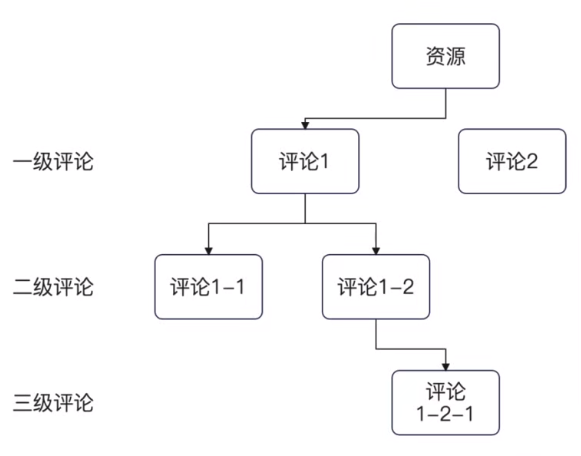
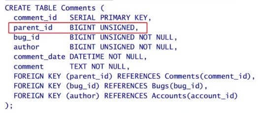
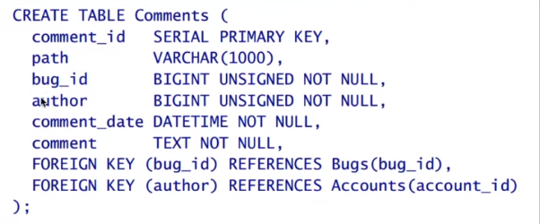
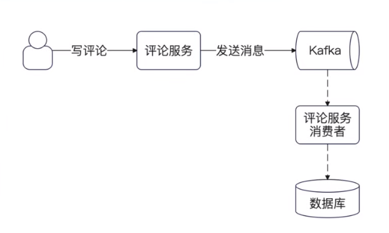

## 简历 preview

简历上 : 实现了一套完整的评论系统


需求分析 :

1. 评论本身是评价一类资源，例如评价文章、视频 

2. 评论本身是可以被回复的

3. 评论本身是可以被点赞的

更加进一步考虑,我们会发现 查询评论本身也是一个高并发场景,打开任何资源都需要考虑加载评论

### 评论设计

#### 回复评论的层级

因为评论也是可以被评论的，所以考虑维护一个树形结构




**邻接表存储 :**

我们可以使用 邻接表存放树形结构，通过设计一个 `partent_id` 来表示自己的父节点

根节点的 `partent_id` 可以表示为 null 或者是 -1




缺点 :

1. 很难找出全部的评论 , 需要找出 paretn_id 然后找出评论 再找出评论

2. 而且删除操作不太好处理

3. 查找的时候是 `join` 操作


**分段式 path设计 :**

一个列维护了从根节点到当前节点的路径 

例如 path `a/b/c`

- 如果路径包含当前节点 那么当前节点就是 `c` 他的父节点就是 `b` 根节点就是 `a` 

- 如果当前路径不包含当前节点,那么`c`就是当前节点的父节点

- 查找的时候是 `like` 操作




#### 确定结构

我们考虑以下几个场景

1. 加载资源的第一页评论

2. 加载资源的第一页评论的直接评论 ，分批加载其他评论

3. 查找评论的更多评论


第一个场景可以认为是根据 `biz+biz_type` 查询

第二第三个场景可以认为是 查询某个节点的子节点

我们发现邻接表 和 path 的设计 都可以很好的查询出来。 但是使用 path 的情况下是使用 `like` 查询 因此最终采用邻接表


#### 表结构设计

字段结构设计 :

1. 引入  rootId 来优化批量查询的问题

索引设计 :

1. `biz、biz_id` 肯定要建立索引 第一个场景

2. `pid` 找父节点一定要增加索引

    -  这个列的 `null`值会非常多

3. `rootId` 加载整个评论也需要索引


所有的索引设计都是根据 `where,order by, select` 如果有 `join` 那么需要考虑 `on`

在没有遇到更新、查询性能瓶颈之前，不需要过于担忧维护索引的开销


```go
struct {
id int
uid int64
biz string
bizId int64

Pid sql.NullInt64

// 所有顶级评论的 id
RootId sql.NullInt64 

Content string
Ctime int64
Utime int64
}
```


### 异步写评论


使用kafka 怎么保证 容错和可用性 

分kafka和分topic 




### 删除评论的设计

删除评论: 是否需要删除其子节点

目前主流的做法就是 : 会把子评论一并删了


PG :

DELETE from comments where pid = 4 return id 

mysql
Select * from comments where pid = 4
Delete * from comments where pid = 4 

能否使用非关系型数据库 ？ 

### 查询接口

热度评论 
业务折中 :

90%都不会超过10个评论的话，那么就没必要计算热度

offset 有并发问题，如果有新id出现，那么可能会导致重复取

#### 缓存处理

缓存第一页

## 面试

1. 怎么在数据库里面设计一个支持树形结构的表，你知道哪些方法 ？ 用过哪些 ？ 各有什么优缺点

2. 什么是外键 ？ 你用过没有。？为什么大厂不推荐使用外键

    - 会对数据库性能有很大的影响
    - 外键约束是一个很强的约束

3. 如何提高评论系统的性能？ 

    - 各种缓存 要不要缓存，长尾不缓存，

4. 如何提高评论系统的可用性？

    - 写 引入kafka
    - 读 各种降级
    - 读实例和写实例分离