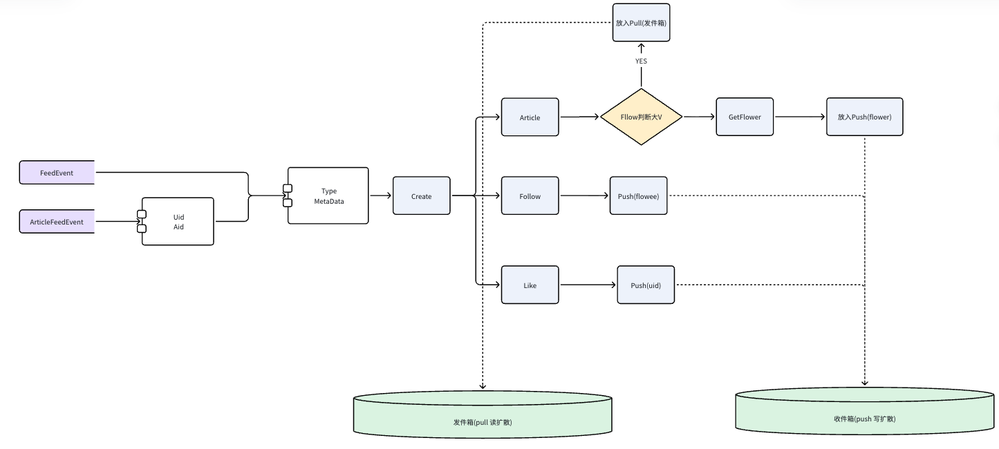

## 简历 preview

简历上 : 实现 关注,点赞, 收藏, 发布文章 Feed 流的实现

## 流程设计

**需求分析 :**

1. 对于用户关注的博主, 希望能够在博主发布文章的第一时间进行通知

2. 对于点赞 , 关注,收藏 操作希望能够第一时间进行通知

**模块分析 :**

提供一个 Feed 服务 供给业务方 读取和写入


### Feed 模块

### 支持的功能

1. 通用的 写入 收件箱

2. 业务定制化的 写入收件箱 并且根据 业务定制 考虑优先写入到发件箱

1. 通用的 查询 用户 Feed 流 

2. 业务定制化的查询 用户 Feed 流


### 表结构设计

对于 收件箱 和 发件箱 维护一个 大JSON列进行处理

创建 `uid`和 `ctime` 的索引

```go
type FeedPushEvent struct {
	Id int64 `gorm:"primaryKey,autoIncrement"`
	// 收件人
	UID int64 `gorm:"index"`
	// Type 用来标记是什么类型的事件
	// 这边决定了 Content 怎么解读
	Type string
	// 大的 json 串
	Content string
	Ctime   int64 `gorm:"index"`
	// 这个表理论上来说，是没有 Update 操作的
	Utime int64
}
```


### 缓存设计 

无 。因为需要保证实时性 并不考虑设计缓存

但是引入 kafka 进行削峰 。 因为在业务上能够容忍 1s -10s 的响应误差




### 其他细节

在 文章服务 写入收件箱的时候考虑定制化服务

对于大V 关注的人很多, 写扩散来说会产生很多内容。 因此根据 用户粉丝数量来判断写入 发件箱还是收件箱

---

同样的 查询用户 Feed 流的时候 同样在文章服务做定制化服务

因为大V 可能发送了文章之后又设置了隐藏，因此会额外根据 status 进行一层过滤

## 难点 & 亮点

**难点 :**

问题 ：

对于文章服务, 如果是一个 大V 采用写扩散会一时间产生很多数据 ，但是普通用户无所谓 。 但是对于一个 普通用户 使用读扩散 会导致请求多次数据库

方案 :

1. 设计 文章服务 混合使用 推拉模型 ，而点赞/关注服务只进行写扩散

**难点 :**

问题 :

1. 读路径 可能存在业务方定制 和 非业务方定制 , 并且还需要考虑数据聚合

方案 :

考虑优先读取业务定制的内容,通过每个handle 自己的实现进行读取。 然后再通过通用逻辑进行读取 。 另外对于 第三方业务方 如果降级的情况 会考虑 不进行读取 。 全局limit查询之后 再聚合内容进行排序

---

**亮点 :**

1. 使用 Kafka 进行异步的处理 Feed 流

2. 设计了一个通用的和业务定制化的 Feed 流 。 关联之前开发的 点赞、收藏、文章服务


## 缺点 

1. Feed 流的存储比较简单 ，非常粗暴的使用 大JSON 进行存储 并且 数据表并没有做定期归档

2. 写入服务还可以再优化，根据判断用户是否是活跃用户，判断是否要使用写扩散保证活跃用户的使用体验


作为面试官，按「2 年经验、能讲清一个完整 Feed 项目」来打分。

## 总分：**62 / 100**

| 维度 | 得分 | 满分 | 说明 |
|------|------|------|------|
| 需求与业务理解 | 12 | 15 | 关注/点赞/收藏/发文通知说清楚了 |
| 架构与方案设计 | 14 | 25 | 有推拉混合，但细节和取舍不够 |
| 数据与存储 | 8 | 15 | 表结构过简，缺容量与演进 |
| 工程实现（Kafka/异步） | 10 | 15 | 有削峰思路，缺可靠性细节 |
| 难点与亮点表达 | 10 | 15 | 方向对，面试官追问容易露怯 |
| 自我反思与边界 | 8 | 15 | 有缺点意识，但深度不够 |

---

## 优点

1. **业务闭环清晰**：从「谁要被通知」到「Feed 读写服务」再到「文章大 V 定制」，简历点能对上故事。
2. **推拉混合有意识**：大 V 写发件箱、普通人写收件箱，这是 Feed 面试的核心考点，方向正确。
3. **知道自己的短板**：大 JSON、无归档、可按活跃用户优化写扩散——自我认知加分。
4. **工程上有基本取舍**：用 Kafka 换 1–10s 延迟，比「全都要实时」更真实。

---

## 缺点（面试里容易被打穿）

1. **「无缓存」说得太绝对**  
   实时性 ≠ 不能缓存。常见做法是：收件箱最近 N 条 Redis ZSet、发件箱热 Key、读路径短 TTL。直接说「无」会被追问「QPS 上去怎么办」。

2. **表结构过于简陋**  
   - 单表 `Content` 大 JSON：如何按 Type 过滤、分页、清理？  
   - `uid + ctime` 索引是否联合？大 V 粉丝千万级写入怎么分库分表？  
   - 发件箱表结构没写出来，推拉混合缺一半。

3. **推拉切换规则模糊**  
   「按粉丝数判断」——阈值多少？阈值变化怎么办？粉丝从 999 涨到 1001 历史数据怎么处理？面试官一追问就虚。

4. **读路径描述含糊**  
   「业务定制优先 → 通用逻辑 → 降级跳过 → limit 再聚合」——  
   多 Handler 如何保证全局时间序？每个源 limit 多少？聚合复杂度？降级后一致性？这些才是 2 年候选人该补的。

5. **Kafka 只停在「削峰」**  
   缺：幂等、顺序（按 uid 分区？）、失败重试/死信、重复投递、消费者并发与乱序。

6. **亮点偏「做过什么」而非「解决了什么」**  
   「用了 Kafka」「接了点赞收藏」——面试官更想听量化效果或具体坑（延迟、重复、空洞 Feed）。

7. **文档结构略乱**  
   功能列表编号重复、发件箱模型缺失、流程图依赖图片但文字没补关键路径。

---

## 建议（按优先级）

### 立刻补齐，面试可讲 3 分钟版

1. **画清两条写路径 + 两条读路径**  
   - 写：普通用户 → 写扩散进粉丝收件箱；大 V → 只写发件箱。  
   - 读：收件箱时间线 ∪ 关注列表里大 V 发件箱 → merge 按时间排序 → 分页。

2. **把「粉丝阈值」说死**  
   例：粉丝 ≥ 1万走拉模式；并说明阈值变更时只影响新内容、或异步回填策略。

3. **缓存改成「有边界的有」**  
   例：用户 Feed 首屏 200 条 ZSet；未命中再查 DB；写路径异步更新。强调与「可容忍秒级延迟」一致。

4. **Kafka 准备 4 个追问答案**  
   幂等（业务唯一键）、分区键（authorId/uid）、至少一次语义下的去重、消费失败策略。

5. **亮点改成「问题 → 方案 → 结果」**  
   例：「大 V 发文写扩散导致写放大 → 粉丝阈值切拉模式 → 峰值写 QPS 从 X 降到 Y」（没有真实数字就说「预期/压测方向」）。

### 建议你能背下来的追问清单

- 分页用 offset 还是 cursor？空洞/重复怎么处理？  
- 取消关注、删文、隐藏后 Feed 如何失效？  
- 点赞/收藏也写 Feed，和文章 Feed 如何统一 Type？  
- 单用户收件箱无限增长怎么办（归档/TTL）？  
- 降级某个业务 Handler 后，用户看到的 Feed 如何保证「还能刷」？

---

## 面试官结论

**能过初级/中级偏初的筛选，但撑不起「独立设计过 Feed」的强叙事。**  
架构骨架有了（推拉混合 + 异步削峰 + 业务定制 Handler），但存储、缓存、一致性、容量、读聚合这几块偏薄，和 2 年「做过但未深挖」的画像吻合。

把推拉边界、读合并算法、Kafka 可靠性、缓存策略补成可口述的闭环后，有机会提到 **75–80**；再补上容量估算和一次真实故障/压测故事，才更像能打的中级候选人。