## 简历 preview

简历上 : 实现 点赞文章Feed

## 前置

什么是 Feed 流 : 用于将实时生成的数据 传递给应用程序

特点 ：

- 实时性: 数据实时推送,确保用户获取最新消息

- 个性化: 根据用户兴趣和行为跳转展示内容

- 多样性: 支持各种类型的内容, 如文本、图片、视频等

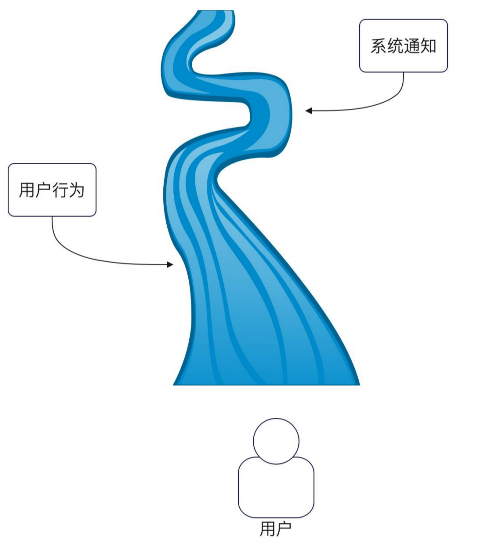


### 解决了什么问题

如果我要查询,  **我关注的人最近发了什么文章**. 我们很容易想到一个实现是直接查询数据库

```sql
-- 我关注的人最近发的文章
SELECT * FROM articles
WHERE author_id IN (我关注的人)
ORDER BY ctime DESC
LIMIT 20
```

但是现有的问题是 :

1. 用户不只是要看文章的更新。 还想要看 `点赞、关注、评论`  。 
	- 每次打开首页都需要 查关注列表 → 查文章 → 查点赞 → 查关注事件 → 自己合并排序。

2. 并且关注的人又很多 。 例如一个人关注了 1000个人 。 那么每次打开首页都需要扫 1000 人的数据

3. 大 V 发送一条内容。 一个大V 如果有100w的粉丝， 那么100w的粉丝每次去查询的时候都会发起 100w个select , 。

因此 Feed 流做的事是 :

1. 在事件发生(发文、点赞) 先记录下来, 整理成 每人一条时间线 。 用户打开首页，仅读这条时间线,不再现场拼凑


| | 没有 Feed | 有 Feed |
|---|---|---|
| 打开首页时 | 实时去查：我关注了谁 → 每人最近文章 → 再拼点赞、关注等 → 自己排序合并 | 直接读「我的收件箱/时间线」 |
| 复杂度 | 读路径很重，关注 1000 人就很惨 | 读路径轻，复杂逻辑提前做完 |
| 返回内容 | 临时拼出来的结果 | 预先沉淀好的事件流 |

---

同理 :

Feed、热榜定时算、缓存预热，都属于同一类思路：

> **把读路径上又重又复杂的活，提前算好（或换个地方算），业务方直接读结果。**

差别主要在「提前到什么时候、给谁算」：

| | 热榜定时算 | 缓存预热 | Feed（推模型） |
|---|---|---|---|
| 何时算 | 定时批处理 | 访问前/启动时 | 事件发生时（有人发文） |
| 给谁 | 通常一份全局榜 | 热点 key | **每个用户一份**时间线 |
| 读的时候 | 直接取榜 | 直接取缓存 | 直接取「我的 inbox」 |


### 需求分析

从已有功能来说, Feed 流的数据来源可以包含 :

- 用户关注的人发表了新的作品
- 用户发表的作品被人点赞、收藏、评论了
- 用户发表的评论被人回复了
- 有人关注了该用户
- 系统通知


目前的平台在组织 Feed 流的时候大体上有两种方式

1. 第一种方式是把前面列举的内容 都合并在一起

2. 只把关注者发表新作品做成 Feed 流 其余做成系统通知


第一种例如 :

```
张三 发布了《Go 并发》
李四 赞了你的文章
王五 关注了你
赵六 发布了《Redis 笔记》
钱七 评论了你：写得真好
```


第二种例如 :

Feed 流
```
张三 发布了《Go 并发》
赵六 发布了《Redis 笔记》
```

系统通知
```
李四 赞了你的文章
王五 关注了你
钱七 评论了你
```

第一种方式实现起来更复杂，并且可以删减代码来转化为第二种 。 因此我们考虑使用第一种方式

### Feed 流式设计模式

#### 拉模型 

这应该是我们最先能想到的一个办法 就是我们直接去手动的获取相关数据。 然后聚合成 Feed 流

这种方式的缺陷 :

- 用户每发起一个查询请求，**最终都会扩散为 N个数据库查询，数据库压力很大**

- **分页问题难以处理** :  我们正常使用 Feed 流查询的时候 都是分页返回 。 例如每次返回 20条, 而这 20条是按照时间戳来排序的。 我们没办法知道这20条会在哪些数据库上

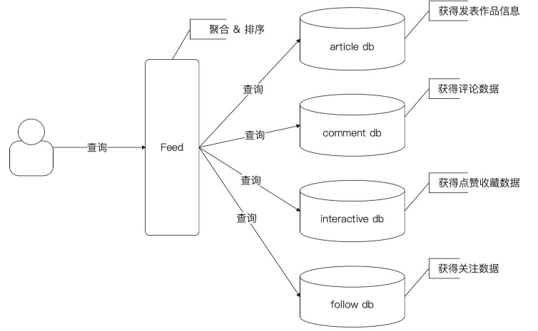

#### 推模型 

推模型是以 Feed 模块为核心, 不同业务方将数据推送过来 。 

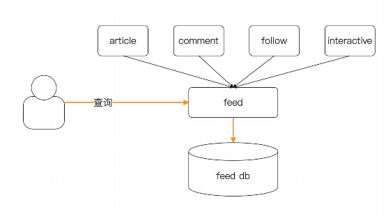


#### 读扩散

我们从 拉模型中 将查询 DB 的操作 改为 查询 `发件箱` 的操作

1. 对于每个业务维护自己的发件箱。 用于通知操作

2.  Feed 服务 每次需要

	- 查询 A 关注了哪些人
	- 再查询 A 关注的人里面, 发件箱里面有什么数据
	- 聚合排序、取出所需的数据

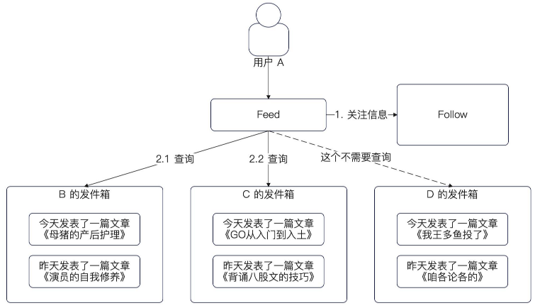

#### 写扩散

从 推模型 中引入 `收件箱` 的概念, 每个业务都有自己的收件箱

对于一个用户爱说，如果用户 A 关注了 用户B.

- 那么 B 再发表一篇新文章的时候 就会把数据写入到 A

- 对于 A 需要查询自己数据的时候 只需要查询自己的 收件箱即可


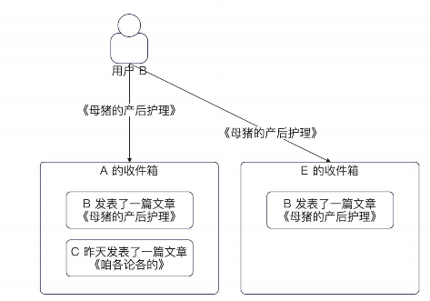


写扩散的缺陷 :

1. **极大的放大的流量** , 如果 B 有 100w 粉丝 。他发一篇文章的时候 就需要同步给 100w 个粉丝

一瞬间就产生了 100w 条记录 


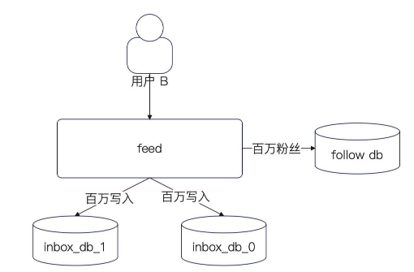


#### 读扩散和写扩散的综合应用

我们知道 

读扩散的缺点 :

1. 每次读取都需要读取 每个业务相关的数据
2. 分页不好处理

写扩散的缺点 :

1. 对于一个 大V来说， 100w的粉丝，一次推送就需要推送 100w条数据

因此我们可以考虑一个基本思路

1. 如果一个人的粉丝并不多, 那么就直接使用写扩散模型

2. 如果一个人的粉丝很多, 那么就直接使用读扩散模型 

并且这里还可以扩展

- 判断粉丝是不是活跃用户，在写入数据的时候 针对活跃用户进行写扩散 

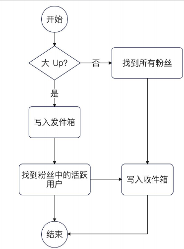


**综合使用的优缺点 :**

综合使用只能说是一个还不错的方案，是我们在读扩散和写扩散之间做了权衡之后不得不考虑的方案。

• 从写流程来说，它依旧有写扩散的问题，但是我们能够限制住写扩散的数据并不多。

• 从读流程来说，它依旧有聚合排序的问题。如果发件箱已经分库分表的话，那么也会存在跨库跨表查询的问
题。

只是说，这两个缺陷都比单独使用读扩散或者单独使用写扩散要轻微，而不是完全没有。

这个综合方案来说，可以优先保障活跃用户的使用体验，而对于非活跃用户来说，它的查询性能就要稍微差一
些。


## 流程设计

### 写入流程

因为 Feed 里面不同类型的数据，字段会不一样 。 怎么存业务方同步过来的数据  


并且我们进一步考虑

1. 我们是否需要存储一些冗余数据 。 例如 用户的昵称，文章的标题

2. 冗余数据的好处就是从 Feed 里面拿到最完整的数据，而不需要进一步回查业务方

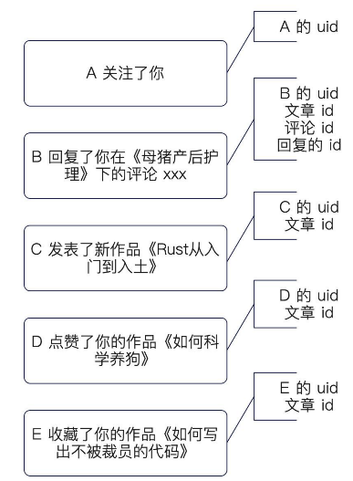

#### 存储扩展数据


对于存储 不同事件 Feed 独有的消息有两种方案

- 一个大的 Json 字段存储这些所有的扩展数据 

```go
type FeedEvent struct {
	ID    int64
	Uid   int64
	Type  string          // 决定 JSON 怎么解读
	Ctime time.Time
	Ext   ExtendFields    // map[string]string，个性化字段
}

type ExtendFields map[string]string
```

- 使用扩展表

```go
type FeedEvent struct{
	Id int64
	Type string
}

type ArticleEvent struct{
	Id int64
	Fid int64
	Article int64
}
```

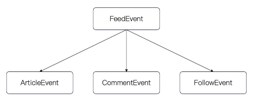

#### 表结构设计

- FeedPushEvent 推模型，写扩散 。 也就是收件箱

- FeedPullEvent 拉模型，读扩散 。 也就是发件箱

最关键的是 我们这个 Content 字段 。 我们设计存储不同事件的个性化字段，是一个 JSON 字段

```go
type FeedPushEvent struct {
	Id int64 `gorm:"primaryKey,autoIncrement"`
	// 收件人
	UID int64 `gorm:"index"`
	// Type 用来标记是什么类型的事件
	// 这边决定了 Content 怎么解读
	Type string
	// 大的 json 串
	Content string
	Ctime   int64 `gorm:"index"`
	// 这个表理论上来说，是没有 Update 操作的
	Utime int64
}

type FeedPullEvent struct {
	Id int64 `gorm:"primaryKey,autoIncrement"`
	// 发件人
	UID int64 `gorm:"index"`
	// Type 用来标记是什么类型的事件
	// 这边决定了 Content 怎么解读
	Type string
	// 大的 json 串
	Content string
	Ctime   int64 `gorm:"index"`
	// 这个表理论上来说，是没有 Update 操作的
	Utime int64
}
```

#### 扩展字段处理流程

在 Feed 的时候 我们并不关心 个性化数据是什么 。 业务方可以随意传递

然后我们再把对应的数据返回回去 。 由 BFF 自己去解决对应的数据查找

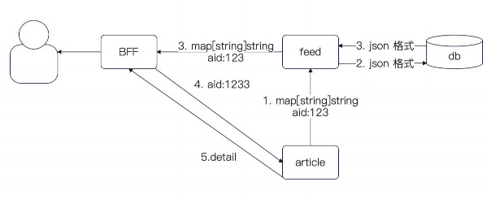


#### 服务定义

定义一个 共用的 `feedService` 和 一个业务自己实现的 `feedHandler` 

对于 FeedService 单纯只处理推模型

而 feedHandler 可以根据业务自定义是否要采用 拉模型

```go
type FeedService interface {
	CreateFeedEvent(ctx context.Context, feed domain.FeedEvent) error
	GetFeedEventList(ctx context.Context, uid, timestamp, limit int64) ([]domain.FeedEvent, error)
}

// Handler 具体业务处理逻辑
// 按照 type 来分。因为 type 是天然标记了哪个业务
type Handler interface {
	CreateFeedEvent(ctx context.Context, ext domain.ExtendFields) error
	FindFeedEvents(ctx context.Context, uid, timestamp, limit int64) ([]domain.FeedEvent, error)
}

```

#### 发表文章

对于发表文章来说，我们需要考虑我们最上面的问题

1. 对于一个 大V 来说, 如果我们发表一篇文章 。 应该是 让用户自己来读 大V的发件箱 ，也就是拉模型 。而不是大V 发送100条消息

2. 所以这里需要额外处理一下


```go
func (a *ArticleEventHandler) CreateFeedEvent(ctx context.Context, ext domain.ExtendFields) error {
	followee, err := ext.Get("uid").AsInt64()
	if err != nil {
		return err
	}
	// 要灵活判定是拉模型（读扩散）还是推模型（写扩散）
	static, err := a.followClient.GetFollowStatic(ctx, &followv1.GetFollowStaticRequest{
		Followee: followee,
	})
	if err != nil {
		return err
	}
	// 粉丝数超过阈值了，然后读扩散，不然写扩散
	if static.FollowStatic.Followers > threshold {
		return a.repo.CreatePullEvent(ctx, domain.FeedEvent{
			Type: ArticleEventName,
			Uid:  followee,
			Ext:  ext,
		})
	} else {
		// 写扩散
		followers, err := a.followClient.GetFollower(ctx, &followv1.GetFollowerRequest{Followee: followee})
		if err != nil {
			return err
		}
		// 在这里，判定写扩散还是读扩散
		// 要综合考虑什么活跃用户，是不是铁粉，
		// 在这里判定
		events := slice.Map(followers.FollowRelations,
			func(idx int, src *followv1.FollowRelation) domain.FeedEvent {
				return domain.FeedEvent{
					Uid:  src.Follower,
					Type: ArticleEventName,
					Ext:  ext,
				}
			})
		return a.repo.CreatePushEvents(ctx, events)
	}
}

```

#### 部分问题

Q : 为什么同步数据的时候是异步接口 ？

在设计 Feed 流的时候，我们一般会说 Feed 对实时性的要求很高。那么就会有一个问题，如果要是实时性要求很
高的话，为什么在这里我还是用了异步接口？


A : 

虽然明面上我们对 Feed 的实时性要求高，但是这种要求其实是秒级，甚至十秒级。也就是说，如果 A 发
了一篇文章之后，B 能够在十秒内知道，那么我们认为这个实时性是可以接受的。

---

### 查询流程

我们在整个 Feed 系统设计里面 只有两个东西 

- 发件箱

- 收件箱

当用户查询 Feed 的时候, 要求我们聚合这两部分数据 。我们有两种方法

- 在 Service 层统一查询 

- 查询的时候转交 handler 来处理 ， Handler 内部可以处理一些和具体业务有关的事情


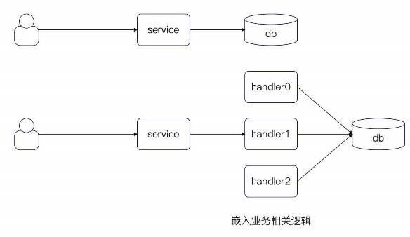


## 面试

1. 什么是 Feed 流 ？ 系统设计方面有什么难点？ 

	- 大数据高并发

2. 在 Feed 里面，什么是拉模型 / 读扩散 ？ 有什么优缺点

3. 在 Feed 里面 什么是推模型/写扩散 ？ 有什么优缺点

3. 在 Feed 里面应该用 推模型还是拉模型 ？

34. 为什么大部分平台都是使用推和拉模型


