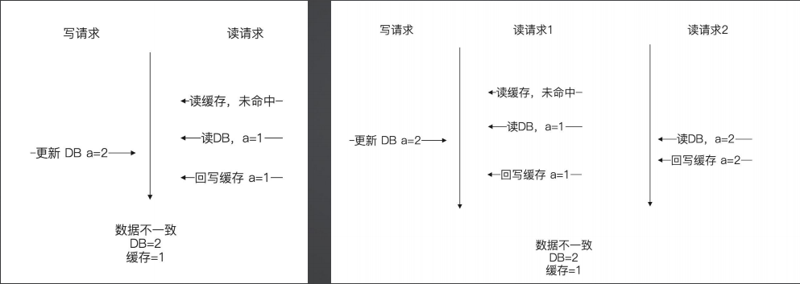
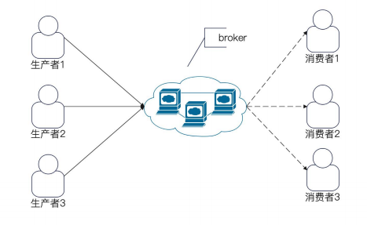
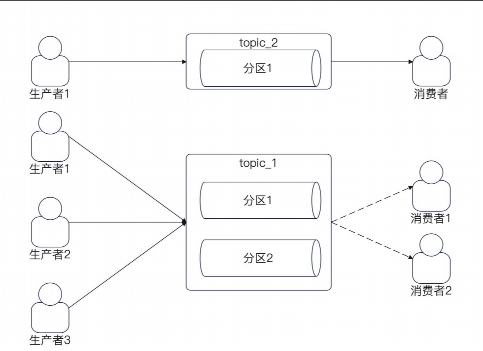
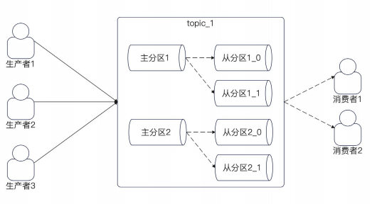
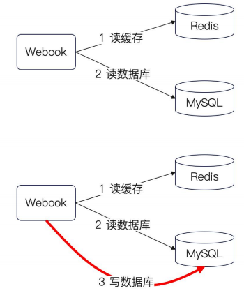

## 简历 preview

简历上 :

设计并实现了一个高并发的 阅读、点赞、收藏服务

需求分析 :

1. 阅读数，每次打开都会加1，但是关掉不会 -1

2. 点赞和收藏都有取消功能

技术分析 :

从使用场景考虑 :

1. 当我们点开一篇文章的时候，会看到这篇文章的阅读、点赞和收藏数量 。 从这里考虑 全部都写在一个服务上会更好处理

2. 用户可以单独查看自己收藏的文章 。 这个角度考虑 收藏单独做成一个服务更合适

从性能的角度考虑 :

1. 拆分成三个服务，三个服务可以独立治理，对于分散读写压力有好处 

从研发效率角度来看 :

1. 拆分三个服务对应代码就有三套，研发效率不高 

因此最终选择研发合并在一起

## 阅读计数

### 业务处理 :

1. 当点击文章服务的 `GetPubslishId` 的时候 进行增加阅读计数
  
    - 先操作数据库 再更新缓存
    - 如果更新缓存失败会导致不一致，但是其实不用管他，因为阅读数不准确从业务角度考虑没什么问题

### 数据库操作 :

同样需要考虑是否一个情况

1. 如果新帖子没计数，那么应该 create

2. 否则的话 update 

因此这边也是 `upsert` 的语义 . 另外我们不能给使用取出计数然后+1 的做法会有并发问题 。 因此使用 `gorm.Expr(`read_cnt`+1)`

### 缓存处理

缓存的设计也会有和数据库一样的问题

1. 如果 Redis key 不存在  和 redis 存在 的情况
2. 因此需要引入 LUA 脚本解决这种情况

## 点赞

### 业务处理

需要支持

1. 点赞

2. 统计点赞数量

3. 某个用户是否点赞过，并且用户可以取消点赞

对于点赞计数，同样和阅读处理一样 。 

点赞和阅读不同，需要支持取消点赞， 因此需要额外维护一张用户点赞表，聚合 `user_id`. 

考虑软删除策略，因此需要额外加入一个 `status` 字段 。 因为取消点赞和点赞是一个很频繁的业务，如果使用硬删除，数据库会有很多 `gap` 

## 收藏

收藏的处理同上述问题

## 其他

### 查询接口

对于 `阅读、点赞和收藏` 的查询接口 这三个是互相独立的，所以可以考虑使用 `goroutine` 进行异步的获取，使用 `error_group` 进行等待

### 缓存一致性

对于 更新 DB 和 数据库操作会存在 缓存一致性问题  如下

考虑业务情况

1. 阅读数、点赞数 或者是 收藏数 并不一定要严格准确，即使不准确也不会对用户产生什么不好的影响

2. 只有高并发的文章才会有并发问题，而高并发的文章，阅读数、收藏数、点赞数本来就很多，少一点也无所谓

## Kafka

kafka 的基本概念

生产者 、消费者、broker、topic 、partition  

broker 可以认为是中间人，是一个逻辑概念 。  broker 可以认为是一个消息队列进程 。

可以简单的认为 一个 业务就是一个 topic . 一个 topic 有多个分区 。 

当我们讨论 topic 有多少个分区的时候，我们主要讨论的是有多少个主分区

### 点赞解耦

我们上面设计的点赞系统是每次请求都进行一次点赞操作，每次都会访问我们的 DB 

因此我们需要引入 Kafka 来进行异步的解耦

1. 在调用 调用获取文章相信的时候 发送对应的阅读事件

2. mQ消费者端，使用 ctxTimeout + channel 控制批量消费

3. 消费插入数据库中使用map对biz进行一次聚合。 然后插入数据库 ，使用事务进行插入 。 

主要优化

1. 多个业务读取文章 是多行sql，现在改成 N 行 ,n <= 多行sql 

2. 开启事务，进行一次提交。 少了 MVCC 等操作。

## 亮点

1. 批量消费 和 批量生产

## 面试题

1. 有没有用过 kafka  ？ 用来解决什么问题

2. 你为什么要使用 MQ，使用MQ 等好处是什么 。 异步，解耦，消峰

3. 介绍一下 kafka :

    - 什么是 broker , broker 和 分区的关系是什么

    - 什么是 topic , topic 和 分区的关系是什么

4. kafka 中 producer 中的 ack 有哪些取值 ？ 分别是什么含义？你用了哪些

5. Kafka 中 ISR 是什么意思 ？

6. Kafka 中一个分区可以有多个消费者吗

7. 消息积压了怎么半 ？

    - 增加 topic
    - 异步消费
    - 批量消费

8. 怎么保证消息的顺序 ？  怎么保证全局有序 ？ 怎么保证业务有序。？
    
    - 全局有序 : 只使用一个分区
    - 业务有序 : 使用 hash类的算法制定生产者发送消息的分区

