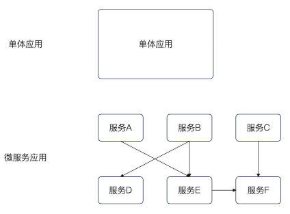
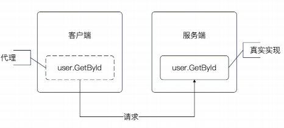
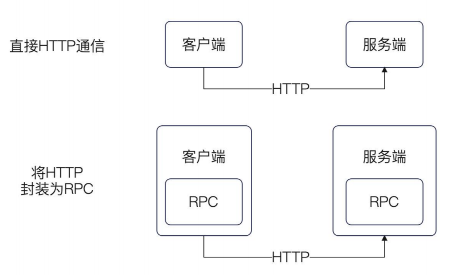
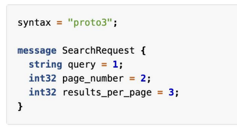
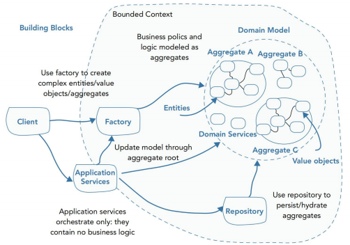
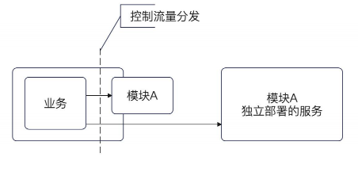

## 简历 preview

简历上 : 将单体业务中的点赞服务拆出一个微服务 并且使用 grpc 进行通行管理


## 微服务

微服务架构 : 将功能分解到各个离散的服务中实现对解决方案的解耦。 

- 每个服务可独立进行 `开发，管理 和 迭代`



### 为什么要使用微服务

为了 **分而治之** :

- 降低复杂度

- 易于开发、测试、部署 和 扩容

#### 模块化 对比 微服务

1. 整合全部模块于一个单体应用，这个过程比较复杂

2. 从运维角度看，**实例才是基本单位**，微服务化的管理力度更细 。 

3. 微服务独立性更强

**这里说一下我的理解 :**

我前司大概有 6-8个业务组 。 按照 `模块化单体+进程角色部署` 进行开发

不过单独拆出了两个业务， 一个 `qass` 跨环境的行情中心 和 配置中心 , 一个 `apitest` 用于进行维护项目的`api`稳定

为什么我们不全部拆成微服务

1. 一次下单 会串着 账户、仓位、ledger、风控。 这一套流程 强事务、强一致

2. 如果拆成微服务 需要考虑 事务 和 最终一致

**那么拆微服务能给企业带来什么收益 :**

**发版时间**

我们知道单体的发版需要依赖整体发版 ， 例如 如果我账户模块改动，想要提前发版，这不可能。 只能发在上一个版本 然后发一次全局的重构

但是如果拆成微服务，我们可以每个服务 自己控制发版时间

官方话就是 ，需要考虑  团队边界、发布节奏、技术异构

**成本**

我们现在单体是 `文字+用户+登陆+点赞` , 但是如果我们点赞的性能跟不上, 在单体阶段我们只能考虑增加**全部机器**的性能

如果我们部署一台 `文字+用户+登陆+点赞` 的服务 需要 1w ，那么如果我们想要单独增加点赞的性能 需要重新部署一台完整的服务 也需要 1w

但是如果我们把点赞拆出来，单独部署一个点赞服务只需要 2k, 那么 1w 可以部署 5 台


## RPC

PRC : 远程过程调用， 允许程序在本地计算机上 调用远程计算机上的字程序，而无需程序员额外变成 



RPC 协议可以简历在很多协议基础之上

- 基于 TCP 的 RPC 协议，典型的国内大厂自研的协议， 比如说 Dubbo 协议。

- 基于 HTTP 的 RPC 协议，比如说 gRPC 协议。而 HTTP 本身又是可以基于 TCP 协议或者 UDP 协议的。




---

**为什么要引入 rpc** 

我们可以看一些接口的文档，他们暴露了一些接口可以让我们使用，我们带上对应的 apikey + apisecret 即可 

但是为什么我们还需要使用 rpc


| | 口语里的 HTTP（REST） | 口语里的 RPC（如 gRPC） |
|--|----------------------|-------------------------|
| 你怎么写代码 | 拼 URL、method、body | `client.Like(ctx, req)` |
| 契约 | OpenAPI / 约定 JSON 字段 | `.proto` / 接口定义，强类型生成 |
| 载荷 | 多为 JSON 文本 | 多为 Protobuf 二进制 |
| 传输 | HTTP/1.1 或 HTTP/2 | 常见 HTTP/2（多路复用） |
| 风格 | 资源导向（`/users/1`） | 方法导向（`UserService.GetUser`） |
| 调试 | 浏览器、curl 极友好 | 要 grpcurl 等工具，稍麻烦 |
| 流式 | 有限（SSE/WebSocket 另说） | 双向流较自然 |

对开发者的体感：RPC 更像「远程函数调用」；HTTP/REST 更像「发一次 Web 请求」。

### GRPC

特点 :

- **高性能 :** 基于 `QUIC` 协议，利用 HTTP2 的双向流特性

- **跨语言 :** 

- **开源 :**

Grpc 使用 `protobuf` 来作为自己的 IDL 语言

IDL : 接口描述语言


`protobuf` 基本原理 :

1. 使用二进制格式进行序列话和反序列化

2. 定义一种标准的消息格式 。 用于表示结构化数据

3. 每个字段都有唯一的标签和类型



#### GRPC 服务端与客户端

服务端 :

1. 通过 Server Listen 启动服务

2. 通过 Register 注册对应的服务

```go
func TestServer(t *testing.T) {
	s := grpc.NewServer()
	// 这个是生成的代码
	RegisterUserServiceServer(s, &Server{})
	l, err := net.Listen("tcp", ":8090")
	assert.NoError(t, err)
	// 启动
	if err = s.Serve(l); err != nil {
		// 启动失败，或者退出了服务器
		t.Log("退出 gRPC 服务", err)
	}
}
```

客户端 :

1. 通过 Dial 来进行通信连接

2. 使用 NewClient 创建客户端

3. 过程调用直接调用 `GetById`

```go
func TestClient(t *testing.T) {
	conn, err := grpc.Dial(":8090",grpc.WithTransportCredentials(insecure.NewCredentials()))

	assert.NoError(t, err)
	client := NewUserServiceClient(conn)
	ctx, cancel := context.WithTimeout(context.Background(), time.Second)
	defer cancel()
	resp, err := client.GetById(ctx, &GetByIdReq{
		Id: 123,
	})
	assert.NoError(t, err)
	t.Log(resp.User)
}
```


## DDD 基本理论

• 限界上下文（Bounded Context）
	
- 描述 我们所要解决的问题上下文
- 描述微服务的边界

• 实体（Entity）

- 标记业务的唯一 ID


• 值对象（Value Object）

- 一堆属性的集合

• 聚合体（Aggregate）

- 一个实体 + N个值对象的 集合

• 工厂（Factory)

- 普通工厂方法在 DDD 中的应用

• 仓库（Repository）

- 数据存储的抽象

• 事件（Domain Event)

- 就是我们说的 MQ event

• 服务（Domain Service）



## 微服务拆分

按照 DDD 的理论拆分微服务， 一个领域就是一个微服务

微服务拆分路线 : 


单体应用 :

1. 完善单元测试。

2. 先抽取公共部分，如utils、helper 等。

3. 引入聚合层解除模块间循环依赖。

4. 按照业务对象划分模块，分到不同的包里。

模块化 :

1. 创建不同的代码仓库，将公共部分、业务模块逐个挪到别的代码仓库。

2. 开始准备微服务环境和服务框架选型。

3. 搭建好 CI 和集成测试环境。

模块依赖化 :

1. 业务模块逐个服务化，解决微服务开发、测试、部署中所遇到的问题。

2. 搭建自动部署和回滚平台。

3. 调研服务治理和网关。

4. 引入消息队列。

5. 引入分布式事务解决方案。

6. 引入分布式任务调度。

7. 搭建可观测性平台：logging、tracing、metrics，以及对应的告警系统

微服务化：

1. 引入服务治理
2. 引入网关
3. 引入回归测试
4. 按照业务分库

### 拆分

拆分方案 :

1. 选定模块
	- 原则 : 先易后难
2. 检测覆盖率
3. 代码拆分
4. 确定技术选型
5. 改造微服务
6. 在原先的应用中 同时使用 本地调用 和微服务调用 。 使用`开关控制流量` 并且`允许回滚`
7. 逐步调整流量
8. 抹除原先的本地调用

##### 流量控制

我们将原先的本地服务 使用 装饰器 重新抽象成一个接口

这个接口支持使用 `threshold` 控制流量，通过随机数控制 。 

```go
func (g *GreyScaleInteractiveServiceClient) GetByIds(
	ctx context.Context, in *intrv1.GetByIdsRequest, opts ...grpc.CallOption,
) (*intrv1.GetByIdsResponse, error) {
	return g.client().GetByIds(ctx, in, opts...)
}

func (g *GreyScaleInteractiveServiceClient) UpdateThreshold(newThreshold int32) {
	g.threshold.Store(newThreshold)
}

func (g *GreyScaleInteractiveServiceClient) client() intrv1.InteractiveServiceClient {
	threshold := g.threshold.Load()
	// [0-100) 的随机数
	num := rand.Int31n(100)
	// 举例来说，如果要是 threshold 是 100，
	// 可以预见的是，所有的 num 都会进去，返回 remote
	if num < threshold {
		return g.remote
	}
	// 假如说我的 threshold 是 0，那么就会永远用本地的
	return g.local
}

```



## 面试

1. 什么是微服务架构 ？ 为什么要使用微服务架构。？

2. 模块化后为什么要微服务化 ？ 

3. Restful 和  微服务架构是什么关系 ？

4. 可以用 HTTP 协议来说实现 微服务架构吗 ？

5. 什么是 RPC ？ RPC 和 HTTP 是什么关系

6. 什么是 DDD ？


---
1. 微服务拆分，怎么拆 ，拆分的具体步骤

2. 微服务拆分有哪些难点

3. 怎么保证微服务拆分没有引入 bug

4. 怎么在线上做灰度发布 ？ 

	- 阈值+随机数