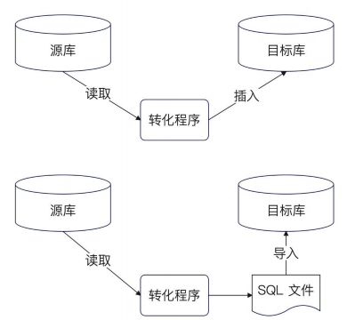
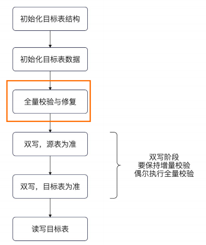
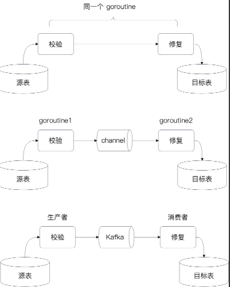
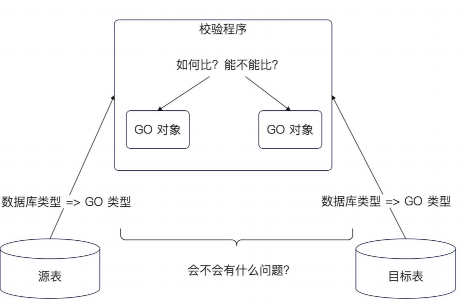

## 简历 preview

简历上 : 点赞、阅读、收藏模块拆分成微服务之后 进行了数据库迁移实现微服务的单独存储

为什么要做数据迁移 :

1. 经过微服务化之后，我们的代码已经拆除去了，但是实际上还是共享一个数据库 。 我们认为 `某个微服务的数据也是单独存储的` 因此还需要做 数据分离

## 迁移

分类 :

- 异构数据迁移

	- 原表和目标表的结构不一样
	- 如果数据库都不一样，也算异构数据迁移
	
	问题 :
		
	- 数据转换 :  不同数据类型可能转出不同的兼容问题，如果是数字会有精度问题
	- 完整性校验 : 数据之间的业务关系很难校验


- 同构数据迁移

方式 :

- 停机迁移

	- 数据迁移比较困难的就是，我们在迁移过程中会有新的数据插入，老的数据更新/删除，导致一致性问题
	- 停机迁移可以很好的规避这部分内容，但是缺点就是应用停了下来

- 不停机迁移

	- 需要考虑 新老数据的更新
	- 需要考虑不能对数据库造成太大的压力

### 不停机迁移

难点 :  `数据始终是变动的` 

不停机迁移的方案 : 

整个不停机迁移可以分成四个阶段：

• **第一阶段：业务读写源表**。在这个阶段，你要完成目标表的数据初始化过程。

• **第二阶段：双写阶段，以源表为准**。在这个阶段，数据会被双写到源表和目标表中，并且读是读源表，如果数据不一致，也是以源表的数据为准。

• **第三阶段：双写阶段，以目标表为准**。在这个阶段，数据也是保持双写，但是读以目标表为准，并且修复数据的时候，是以目标表为准。

• **第四阶段：业务读写目标表**。


### 数据初始化

对于同构迁移 

我们可以使用 `mysqldunmp` 进行导出数据库数据，然后使用 `source`命令执行 sql 进行数据的插入


对于异构数据的话 

我们只能够

1. 批量读取原数据库的数据 
2. 转换为 SQL
3. 在代码中利用 ORM 进行插入



### 校验与修复

不停机数据迁移没办法做到完全保证一致性，所以需要引入数据的校验 从而尽可能大概率的保证一致性

因为在切换目标表或者是原表的过程，总会有一些时间空隙



#### 数据校验

全量校验从方案来说, 就是 **一条一条去比对**

但是如果 **数据量特别大，怎么尽快完成校验与修复** 

场景题 :

1. 在一些大厂的核心业务，一个表可能会有数十亿条数据，如何要求在一天内完成数据同步

答案就是 **并发** 

整个全量校验和修复可以看作两个步骤 : 校验 , 如果发现不一致 则修复

能够想到的做法有下面几个

1. 立刻修复

2. 使用 channel 通知 goroutine 去修复

3. 使用 消息队列 进行异步修复



考虑需要保护住目标表,因此这里引入 `kafka` 

##### 校验基本思路

校验的基本思路就是

1. 从原表获取数据

2. 根据主键去目标着找出对应数据

3. 比较字段是否相等

	- 这里根据业务折中进行处理是否相等的过滤



##### 校验逻辑

1. 我们通过 `offset` 获取 `base` 中的第一条数据 

2. 然后去 `target` 找对应 `id` 的数据，如果没有找到 那么通知修复，如果找到了那么比较，否则通知修复

需要额外考虑的点 :

1. 超时控制，手动取消
2. 数据库连接错误

剩余问题 :
1. 我们可以批量获取一部分数据进行处理

```go
func (v *Validator[T]) validateBaseToTarget(ctx context.Context) {
	offset := 0
	for {
		if v.highLoad.Load() {
			// 挂起
		}

		// 找到了 base 中的数据
		// 例如 .Order("id DESC")，每次插入数据，就会导致你的 offset 不准了
		// 如果我的表没有 id 这个列怎么办？
		// 找一个类似的列，比如说 ctime (创建时间）
		// todo 改成批量，性能要好很多
		src, err := v.fromBase(ctx, offset)
		switch err {
		case context.Canceled, context.DeadlineExceeded:
			// 超时或者被人取消了
			return
		case nil:
			// 你真的查到了数据
			// 要去 target 里面找对应的数据
			var dst T
			err = v.target.Where("id = ?", src.ID()).First(&dst).Error
			switch err {
			case context.Canceled, context.DeadlineExceeded:
				// 超时或者被人取消了
				return
			case nil:
				if !src.CompareTo(dst) {
					// 不相等
					// 这时候，我要干嘛？上报给 Kafka，就是告知数据不一致
					v.notify(ctx, src.ID(),
						events.InconsistentEventTypeNEQ)
				}

			case gorm.ErrRecordNotFound:
				// 这意味着，target 里面少了数据
				v.notify(ctx, src.ID(),
					events.InconsistentEventTypeTargetMissing)
			default:
				// 这里，要不要汇报，数据不一致？
				// 你有两种做法：
				// 1. 我认为，大概率数据是一致的，我记录一下日志，下一条
				v.l.Error("查询 target 数据失败", logger.Error(err.Error()))
				// 2. 我认为，出于保险起见，我应该报数据不一致，试着去修一下
				// 如果真的不一致了，没事，修它
				// 如果假的不一致（也就是数据一致），也没事，就是多余修了一次
				// 不好用哪个 InconsistentType
			}

		case gorm.ErrRecordNotFound:
			// 比完了。没数据了，全量校验结束了
			// 同时支持全量校验和增量校验，你这里就不能直接返回
			// 在这里，你要考虑：有些情况下，用户希望退出，有些情况下。用户希望继续
			// 当用户希望继续的时候，你要 sleep 一下
			if v.sleepInterval <= 0 {
				return
			}
			time.Sleep(v.sleepInterval)
			continue
		default:
			// 数据库错误
			v.l.Error("校验数据，查询 base 出错",
				logger.Error(err.Error()))
			// 课堂演示方便，你可以删掉
			time.Sleep(time.Second)
			// offset 最好是挪一下
			// 这里要不要挪
		}
		offset++
	}
}

```


同时我们还需要反向考虑一个点，如果 `target` 表存在，但是`base`表没有怎么办

因为可能存在硬删除操作

```go
func (v *Validator[T]) validateTargetToBase(ctx context.Context) {
	// 先找 target，再找 base，找出 base 中已经被删除的
	// 理论上来说，就是 target 里面一条条找
	offset := 0
	for {
		dbCtx, cancel := context.WithTimeout(ctx, time.Second)

		var dstTs []T
		err := v.target.WithContext(dbCtx).
			Where("utime > ?", v.utime).
			Select("id").
			Offset(offset).Limit(v.batchSize).
			Order("utime").Find(&dstTs).Error
		cancel()
		if len(dstTs) == 0 {
			// 没数据了。直接返回
			if v.sleepInterval <= 0 {
				return
			}
			time.Sleep(v.sleepInterval)
			continue
		}
		switch err {
		case context.Canceled, context.DeadlineExceeded:
			// 超时或者被人取消了
			return
		// 正常来说，gorm 在 Find 方法接收的是切片的时候，不会返回 gorm.ErrRecordNotFound
		case gorm.ErrRecordNotFound:
			// 没数据了。直接返回
			if v.sleepInterval <= 0 {
				return
			}
			time.Sleep(v.sleepInterval)
			continue
		case nil:
			ids := slice.Map(dstTs, func(idx int, t T) int64 {
				return t.ID()
			})
			// 可以直接用 NOT IN
			var srcTs []T
			err = v.base.Where("id IN ?", ids).Find(&srcTs).Error
			switch err {
			case context.Canceled, context.DeadlineExceeded:
				// 超时或者被人取消了
				return
			case gorm.ErrRecordNotFound:
				v.notifyBaseMissing(ctx, ids)
			case nil:
				srcIds := slice.Map(srcTs, func(idx int, t T) int64 {
					return t.ID()
				})
				// 计算差集
				// 也就是，src 里面的咩有的
				diff := slice.DiffSet(ids, srcIds)
				v.notifyBaseMissing(ctx, diff)
			default:
				// 记录日志
			}
		default:
			// 记录日志，continue 掉
			v.l.Error("查询target 失败", logger.Error(err.Error()))
		}
		offset += len(dstTs)
		if len(dstTs) < v.batchSize {
			if v.sleepInterval <= 0 {
				return
			}
			time.Sleep(v.sleepInterval)
		}
	}
}
```

**异构数据的校验:**

对于异构数据，我们没办法使用 `id` 进行查找，所以只能考虑其他 唯一键去寻找相同数据

#### 数据修复

#### 数据修复的基本逻辑

target_missiong : 那么就是 insert。 获取原表数据进行插入

neq : 那么就是更新，使用原表数据来覆盖

base_missiong : 代表目标表多了数据应该删除目标表数据


并发问题 :

Q : base找到了数据， 但是更新的时候 base 删除了数据  。 target 的更改会失败

A : 重新开启一轮修复

```go
func (o *OverrideFixer[T]) Fix(ctx context.Context, id int64) error {
	var src T
	// 找出数据
	err := o.base.WithContext(ctx).Where("id = ?", id).
		First(&src).Error
	switch err {
	// 找到了数据
	case nil:
		return o.target.Clauses(&clause.OnConflict{
			// 我们需要 Entity 告诉我们，修复哪些数据
			DoUpdates: clause.AssignmentColumns(o.columns),
		}).Create(&src).Error
	case gorm.ErrRecordNotFound:
		return o.target.WithContext(ctx).
			Where("id = ?", id).Delete(new(T)).Error
	default:
		return err
	}
}
```

### 双写

我们经历了全量的校验与修复之后就可以考虑进行双写了


由于是两个数据库 开启不了 数据库本地事务

分布式事务 : 性能很差

需要考虑 双写 + 流量切换。 即 考虑读写哪个数据源 


#### 方案 1

引入原子类进行并发控制, 监听配置变更进行切换 数据源

dao层面，双写两张表，如果源表失败则退出，如果目标表失败 等待 校验与修复

问题是

1. 增删改都需要写一份代码

#### 方案 2 ConnPool

Prepare : 预编译语句

Select 都用于 Query

增删改用于 Exec

1. Query返回的结构体，error并没有暴露出来，所以处理 error 的话，只能 panic


额外在增加一个双写的 DAO

1. 然后根据 pattern 进行控制

```go
type DoubleWriteDAO struct {
	src     InteractiveDAO
	dst     InteractiveDAO
	pattern *atomicx.Value[string]
}

func NewDoubleWriteDAOV1(src *gorm.DB, dst *gorm.DB) *DoubleWriteDAO {
	return &DoubleWriteDAO{src: NewGORMInteractiveDAO(src),
		pattern: atomicx.NewValueOf(patternSrcOnly),
		dst:     NewGORMInteractiveDAO(dst)}
}
```

通过实现以下几个接口进行实现双写的操作

```go

// ConnPool db conns pool interface
type ConnPool interface {
	PrepareContext(ctx context.Context, query string) (*sql.Stmt, error)
	ExecContext(ctx context.Context, query string, args ...interface{}) (sql.Result, error)
	QueryContext(ctx context.Context, query string, args ...interface{}) (*sql.Rows, error)
	QueryRowContext(ctx context.Context, query string, args ...interface{}) *sql.Row
}

type TxBeginner interface {
	BeginTx(ctx context.Context, opts *sql.TxOptions) (*sql.Tx, error)
}

// ConnPoolBeginner conn pool beginner
type ConnPoolBeginner interface {
	BeginTx(ctx context.Context, opts *sql.TxOptions) (ConnPool, error)
}

// TxCommitter tx committer
type TxCommitter interface {
	Commit() error
	Rollback() error
}
```


## 面试要点

1. 不停机迁移的基本步骤

2. 你的数据校验方案是什么

3. 你的数据修复方案是什么 ？ 如何保证数据正确性 ？  怎么解决并发问题 ？

	- 不使用 MQ 来进行数据的更新只当作触发器

4. 在数据迁移的每个阶段，你是怎么考虑保护着数据库的

	- 调度时机考虑
	- 查询改成批量，修复改成批量。 
		- 修复的批量该成 kafka 批量消费

5. 如果 kafka 瓶颈了怎么办，消息积压了怎么办？ 


---


 1. 为什么 你要使用 Kafka 直接校验之后修复数据不行吗

 2. 增量校验和修复、业务写数据、全量校验和修复同时进行，有什么并发问题 ？ 怎么解决？

 3. 在主从同步下，校验和修复有什么注意事项

 4. 怎么保证在数据迁移的时候 不影响业务

 5. 你使用了哪些优化手段来加速迁移数据的过程
