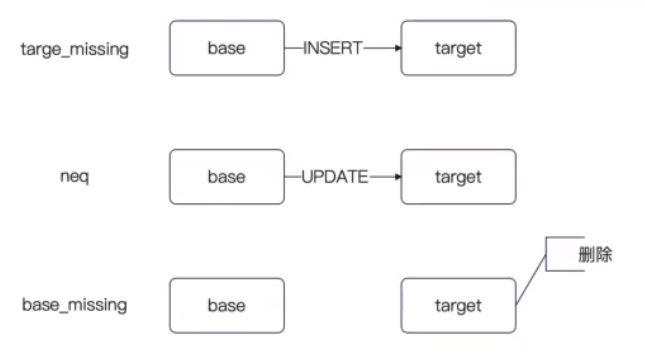
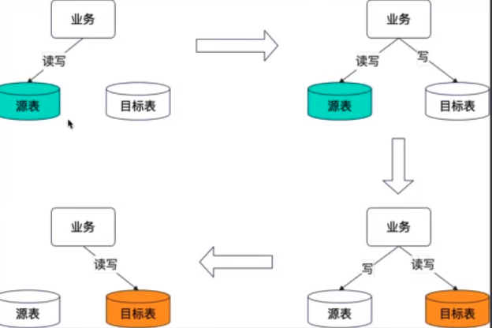
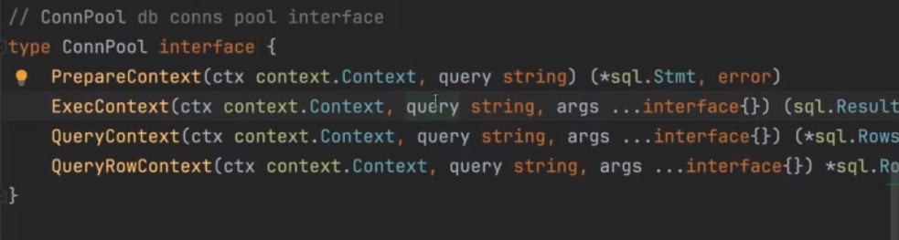

## 简历 preview

简历上 :

#### 数据修复的基本逻辑

target_missiong : 那么就是 insert。 获取原表数据进行插入

neq : 那么就是更新，使用原表数据来覆盖

base_missiong : 代表目标表多了数据应该删除目标表数据

并发问题 :

Q : base找到了数据， 但是更新的时候 base 删除了数据  。 target 的更改会失败

A : 重新开启一轮修复

### 双写

由于是两个数据库 开启不了 数据库本地事务

分布式事务 : 性能很差

需要考虑 双写 + 流量切换。 即 考虑读写哪个数据源 

#### 方案 1

引入原子类进行并发控制, 监听配置变更进行切换 数据源

双写两张表，如果源表失败则退出，如果目标表失败 等待 校验与修复

问题是

1. 增删改都需要写一份代码

#### 方案 2 ConnPool

Prepare : 预编译语句

Select 都用于 Query

增删改用于 Exec

1. Query返回的结构体，error并没有暴露出来，所以处理 error 的话，只能 panic

## 面试要点

1. 不停机迁移的基本步骤

2. 你的数据校验方案是什么

3. 你的数据修复方案是什么 ？ 如何保证数据正确性 ？  怎么解决并发问题 ？

	- 不使用 MQ 来进行数据的更新只当作触发器

4. 在数据迁移的每个阶段，你是怎么考虑保护着数据库的

	- 调度时机考虑
	- 查询改成批量，修复改成批量。 
		- 修复的批量该成 kafka 批量消费

5. 如果 kafka 瓶颈了怎么办，消息积压了怎么办？ 
 