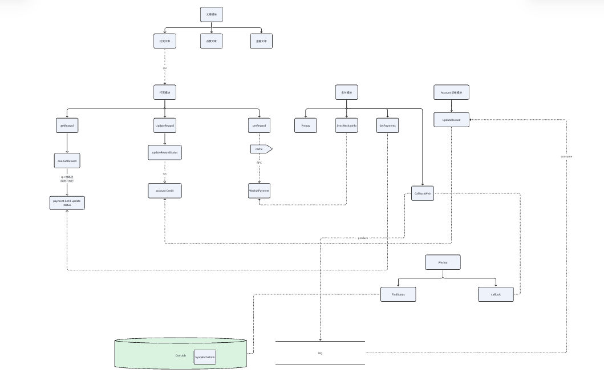
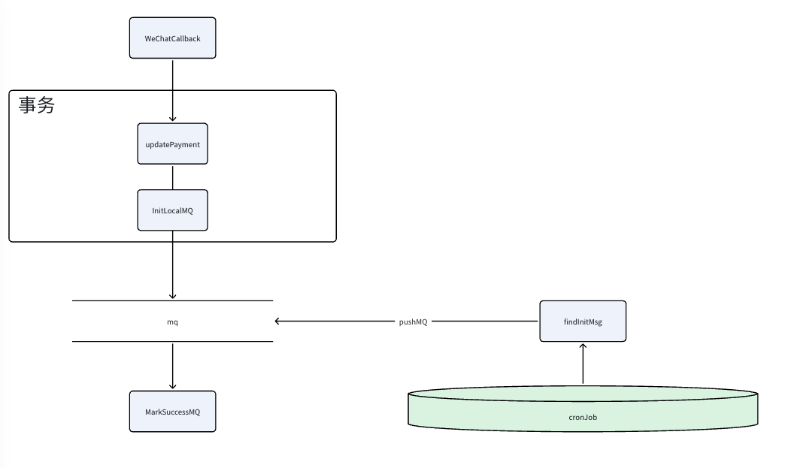

## 简历 preview

简历上 : 支持用户使用微信支付进行文章的打赏功能 以及 用户对账流程


## 流程设计

**需求分析 :**

1. 用户能够选择一篇文章 通过 微信支付 进行打赏

2. 支付成功后 用户能够在自己的余额里面看到扣款 以及 被打赏的金额，同时可以看到对应的流水


**模块设计 :**

考虑支付是一个通用的模块, 并且支付可以额外对接审计，账号，反洗钱等模块 所以把支付模块单独拆分出来

设计 `支付、用户资产、打赏` 三个模块

---

**功能分析 :**

用户模块支持 :

1. 查看业务流水
2. 更新用户资产


打赏模块支持 :

1. 查看文章打赏记录
2. 发起支付请求

支付模块支持 :

1. 向第三方发起支付请求
2. 接受微信支付的calback 
3. 查询发起的支付信息



---

## 难点 & 亮点

问题 : 

微信支付回调后如果成功那么不会在此推送消息, 我们使用 MQ进行通知下游,如果MQ发送失败那么将丢失该信息

方案 :

1. 引入 本地消息表 

2. 使用 本地事务 开启 支付表 和 本地消息表的写入 。 并且设置 消息表 init

3. 只有当MQ发送成功之后才会设置 本地表 success 。 

4. 定时任务 定时轮询 init 的任务进行补偿

----

问题 :

由于本地消息表的引入, 可能带来重复消费的问题

方案 : 

1. 在下游账户处理模块， 设置了 `biz_id + biz + account + account_type` 的联合唯一索引

2. 并且引入 redis 进行查询优化, 预先判断 redis 的状态

---

问题 :

可能存在 微信回调消息发送失败, 微信回调只会默认会在 30分钟之后不再回调 不管成功或是失败

方案 :

1. 定时任务 定期扫描 超过约30分钟的未完结订单 主动查询微信状态 并写回

---

问题 :

获取打赏信息的时候 ,我们会先去查询 打赏表的数据,如果打赏表数据还未完成 。会通过慢路径查询支付表的信息进行更新 用于加快状态的轮询。

方案 : 

1. 考虑限流时候降级, 对于限流的时候不走慢路径

2. 在 账户资产更新 MQ 的时候 会一并更新对应的 状态


---

亮点 :

模块拆分 与 边界  + gRPC

- 支付只关心第三方与支付单状态

- 打赏只关心 业务单和分账意图

- 账户只关心余额与流水


## 缺点

1. 缺少定时自动对账的机制。 涉及 `打赏-支付-记帐` 三个流程

2. 在 MQ 更新 账户资产 和  打赏表的时候 。 并不是强一致的, 我们优先更新 打赏表, 如果之后调用 rpc 处理 账户资产失败了 。 那么会发送告警 由人工手动修复


## 其他细节

### 支付消息必然发送成功

支付的一个核心步骤是由 微信来回调的 . 我们原先的处理是 


1. 微信回调

2. 更新支付表状态

3. 发送消息给 MQ 通知账户变更

如果这里 MQ 发送失败,那么将会丢失这笔消息 。但是支付消息可以认为是一个非常关键的功能 。 

所以考虑优化引入了 本地消息表

表结构设计

1. 主要字段 `content` 和 `status`   

2. 我们通过 content 记录原有的 `MQ` 信息 使用 `status` 维护 MQ 的状态 分为 `init,success,failed`

```json
{
id: "id"
content: ""
stauts: ""
Ctime: ""
Utime: ""
}
```




流程优化设计 :

1. 使用 事务控制 更新 支付表状态 和 写入本地事务表 并且初始化 init

2. 只有当我们成功发送 MQ 之后才把 本地事务表设置 success 

	- 这里可能会造成重复发送

3. 开启一个定时任务，批次获取 init 的状态, 然后发送 MQ 消息 。 如果半小时内都发送失败 设置 failed . 发送成功之后设置 success

### 接口幂等性分析

由于改造了本地事务之后，可能会产生重复消费数据 . 我们在下游 账户更新的时候 

通过 redis+ 本地索引来处理 。 

我们设置 账户流水表的 唯一索引 `biz,biz_id,account,account_type` 进行过滤

`biz_id` 就是 微信回调里面带的 `tradeNoId` 

使用 redis 进行初步过滤 使用 唯一索引进行兜底


### 打赏详情降级处理

1. 我们打赏的时候 会先查询我们打赏表 如果打赏已经是支付状态 会直接返回

2. 否则会去查询一遍支付表

对于限速的状态,我们会抛弃这个慢路径。 这条慢路径，由 MQ 进行处理, MQ 会较慢一点时间 更新到支付表的状态 。

```go
func (s *WechatNativeRewardService) GetReward(ctx context.Context, rid, uid int64) (domain.Reward, error) {
	// 快路径
	r, err := s.repo.GetReward(ctx, rid)
	if err != nil {
		return domain.Reward{}, err
	}
	if r.Uid != uid {
		// 说明是非法查询
		return domain.Reward{}, errors.New("查询的打赏记录和打赏人对不上")
	}

	// 有可能，我的打赏记录，还是 Init 状态
	// 已经是完结状态
	if r.Completed() || ctx.Value("limited") == "true" {
		// 我已经知道你的支付结果了
		return r, nil
	}

	// 这个时候，考虑到支付到查询结果，我们搞一个慢路径
	// 你有可能支付了，但是我 reward 本身没有收到通知
	// 我直接查询 payment，
	// 只能解决，支付收到了，但是 reward 没收到
	// 降级状态，限流状态，熔断状态，不要走慢路径
	resp, err := s.client.GetPayment(ctx, &pmtv1.GetPaymentRequest{
		BizTradeNo: s.bizTradeNO(r.Id),
	})
	if err != nil {
		// 这边我们直接返回从数据库查询的数据
		s.l.Error("慢路径查询支付结果失败",
			logger.Int64("rid", r.Id), logger.Error(err.Error()))
		return r, nil
	}
	// 更新状态
	switch resp.Status {
	case pmtv1.PaymentStatus_PaymentStatusFailed:
		r.Status = domain.RewardStatusFailed
	case pmtv1.PaymentStatus_PaymentStatusInit:
		r.Status = domain.RewardStatusInit
	case pmtv1.PaymentStatus_PaymentStatusSuccess:
		r.Status = domain.RewardStatusPayed
	case pmtv1.PaymentStatus_PaymentStatusRefund:
		// 理论上来说不可能出现这个，直接设置为失败
		r.Status = domain.RewardStatusFailed
	}
	err = s.repo.UpdateStatus(ctx, rid, r.Status)
	if err != nil {
		s.l.Error("更新本地打赏状态失败",
			logger.Int64("rid", r.Id), logger.Error(err.Error()))
		return r, nil
	}
	return r, nil
}
```


## 总分：**72 / 100**

对应 **2 年经验中级偏上**：系统设计与可靠性意识不错，能讲清主链路和几个关键问题；但深度、闭环和对面试追问的准备还不够稳。

---

### 评分拆解

| 维度 | 分数 | 说明 |
|------|------|------|
| 需求与业务理解 | 14/20 | 主流程清楚，但对账、分账、退款几乎空缺 |
| 模块拆分与边界 | 16/20 | 支付 / 打赏 / 账户划分合理，亮点明确 |
| 可靠性设计（消息必达、补偿） | 18/20 | 本地消息表 + 定时补偿是加分项 |
| 幂等与一致性 | 12/20 | 有唯一索引思路，但一致性模型讲得偏浅 |
| 降级与工程细节 | 8/10 | 慢路径 + 限流降级有工程味道 |
| 表达与面试可讲性 | 4/10 | 结构散、术语错误多，容易被追问打穿 |

---

### 优点

1. **边界意识好**  
   「支付只关心第三方与支付单」「打赏关心业务单」「账户关心余额流水」——这是面试里很吃香的表述，说明做过拆分，不是堆接口。

2. **抓住了支付域真难点**  
   微信回调只推一次成功、MQ 可能丢、回调有时效——都点到了，再配本地消息表 + 定时扫 init 补偿，对 2 年经验来说已经超过很多只会 CRUD 的候选人。

3. **幂等有兜底思路**  
   `biz + biz_id + account + account_type` 唯一索引 + Redis 前置过滤，主路径对、兜底也对。

4. **会主动说缺点**  
   缺自动对账、账户与打赏非强一致靠告警人工修——面试官通常加分，显得务实。

5. **有可落地的代码片段**  
   `GetReward` 快慢路径 + `limited` 降级，能证明不是纯理论。

---

### 缺点（面试里容易被打穿的点）

1. **「对账」名不副实**  
   简历写「对账流程」，正文却写「缺少定时自动对账」。2 年经验可以不做完整对账，但简历与口述必须对齐，否则会被认定夸大。

2. **一致性模型说不清**  
   「优先更新打赏表，RPC 失败靠人工」——面试官会问：为何不先账后业务 / 同事务 / Outbox 统一出口？最终一致还是人工一致？超时重试与幂等如何配合？这里准备不足。

3. **本地消息表细节偏薄**  
   - `failed` 后怎么办？（死信、告警、人工重放）  
   - 发送成功但改 status 失败 → 重复投递，下游如何保证？  
   - 定时任务并发扫同一批 init 如何防重？  
   - content 序列化格式、版本兼容？  
   这些是「本地消息表」题的标配追问。

4. **Redis 幂等设计不严谨**  
   「预先判断 Redis 状态」太模糊：key 是什么？TTL？先 Redis 还是先 DB？Redis 挂了怎么办？正确叙事应是：**DB 唯一约束是真相，Redis 只是加速，不能单独当幂等源**。

5. **Golang / 工程深度弱**  
   全文几乎没有：gRPC 超时与重试、context 传递、回调验签、并发安全、事务边界、错误码。2 年 Golang 岗会被追问这些。

6. **表达与硬伤**  
   `calback`、`stauts`、`ctx.Value("limited")`（类型不安全、难测）、JSON 伪结构不规范——细节会拉印象分。

7. **退款 / 部分失败 / 重复打赏** 几乎未覆盖  
   支付面试常问：重复回调、金额篡改校验、订单超时关单、退款与冲正。

---

### 建议（按优先级）

**1. 先改简历表述（立刻做）**  
   - 改为：「实现微信支付打赏；用本地消息表保证支付结果可靠投递；账户侧幂等入账」  
   - 不要写「完整对账」，除非补一版：按日对 `支付成功单 vs 账户流水 vs 打赏状态` 的差异报表 + 告警。

**2. 准备一张 2 分钟口述主链路**  
   发起打赏 → 建业务单/支付单 → 微信下单 → 回调验签 → 本地事务写支付状态+Outbox → 发 MQ → 账户幂等入账 → 更新打赏状态；失败靠定时补偿 + 主动查单。

**3. 把三个「追问答案」写死**  
   - 为何本地消息表而不是直接依赖微信重试？  
   - 重复消息如何保证只加一次钱？  
   - 打赏已成功、账户失败如何发现与修复？（最好从「人工」升级到「对账任务 + 可重放」）

**4. 补齐技术细节清单（半页纸即可）**  
   - 回调验签、金额与 `out_trade_no` 校验  
   - Outbox 状态机：`init → sending → success / failed`  
   - 定时任务：分页、`FOR UPDATE SKIP LOCKED` 或租约，避免多实例抢同一批  
   - 幂等：先插流水（唯一索引）再改余额；冲突当成功返回  
   - 主动查单：状态机只允许 Init→Success/Failed，禁止回退

**5. 代码展示再打磨**  
   - 限流标记不要用 `ctx.Value("limited")`，改成明确参数或中间件注入的 `Limiter`/`Degrade` 标志  
   - 慢路径更新打赏状态时说明：是否只更新、是否再触发入账（避免查询接口变成写副作用）

**6. 面试话术升级一句**  
   不要只说「模块拆了」；说：「支付可复用到会员/订单，打赏是支付的一种业务形态，账户是账本，三者用 MQ 最终一致，用唯一键兜底。」

---

### 面试官结论

这份材料说明候选人**做过真实支付链路，懂拆分和消息可靠性**，对 2 年经验够用；但若现场只能复述文档、答不上一致性与对账追问，分数会掉到 60 左右。把「对账诚实化 + Outbox/幂等细节 + 2 分钟口述」补上，冲击 **80+** 更稳。