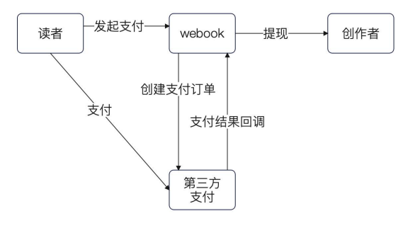
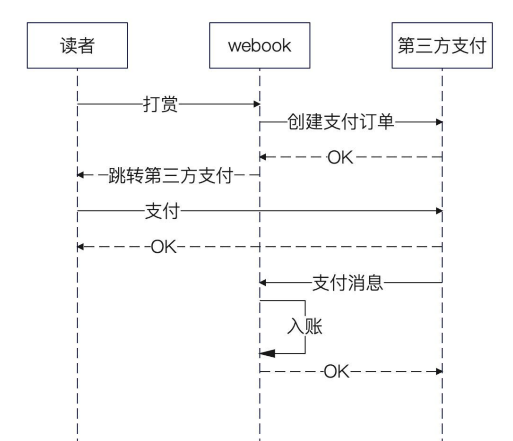
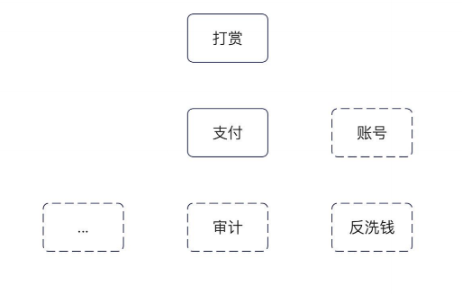
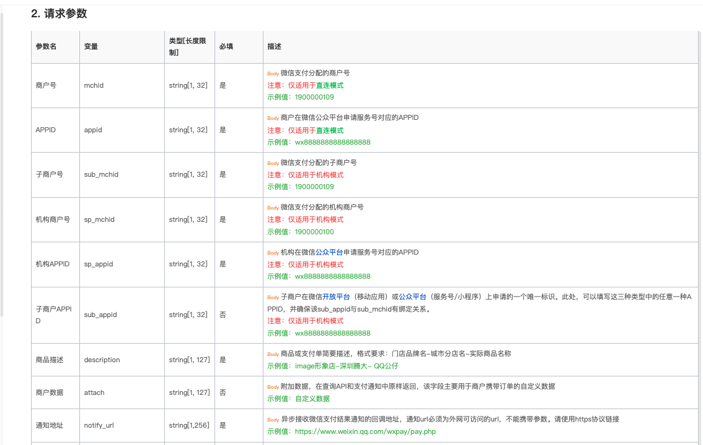
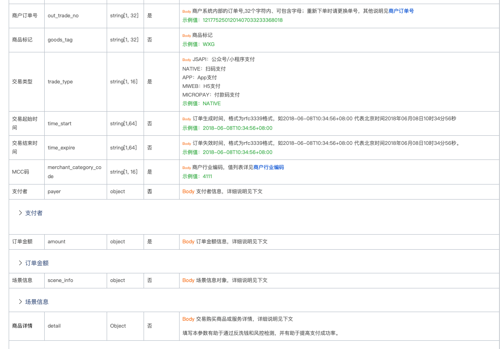
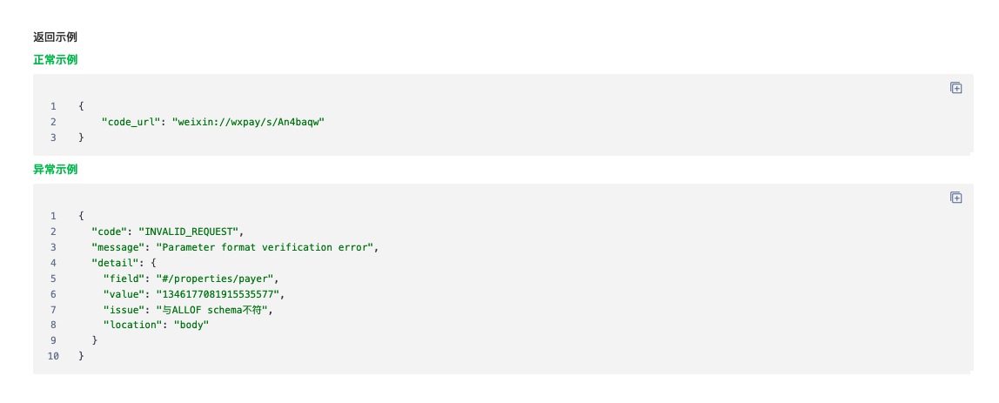
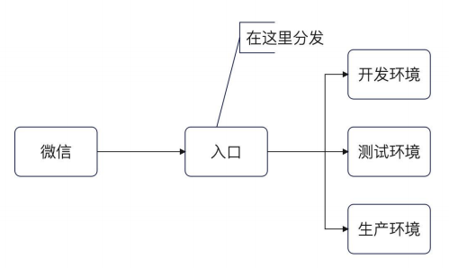
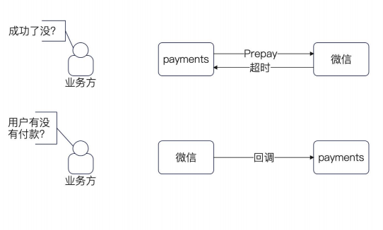
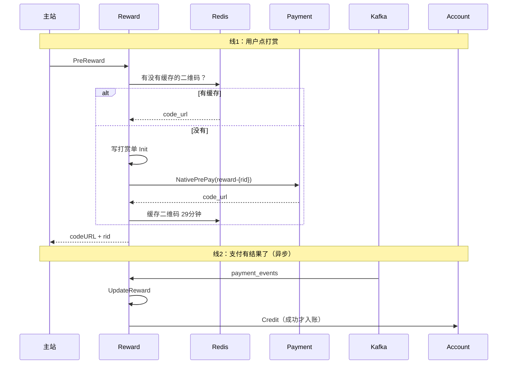

## 简历 preview

简历上 :

实现了一套完整的打赏支付流程和简单对账

需求分析 :

1. 为了激励创作者，在文章模块支持打赏功能 

主要用例如下 :

1. 读者 : 发起支付

2. webook : 记录打赏，调用第三方服务进行支付

3. 创作者 : 提现 (这里不实现，因为微信提现涉及审计相关的内容)

4. 第三方支付 : 实际完成支付的地方




## 设计过程

### 支付过程

实际支付流程如下 :

1. 读者点击打赏

2. webook 创建一个支付订单

3. Webook 跳转第三方支付

4. 读者扫码支付

5. 第三方支付回调给 webook 

6. webook 得到支付结果，记录结果并更新系统状态



说一下这里和微信登陆的不同 


| | 支付回调 | 登录重定向回调 |
|--|---------|---------------|
| 是什么 | 服务端 → 服务端 的结果通知 | 浏览器 OAuth 回跳 |
| 谁在请求你 | 微信支付服务器 | 用户浏览器 |
| 你在干什么 | 更新支付状态、通知业务 | 换身份、建用户、发登录态 |
| 有没有用户页面 | 通常没有 | 有，整条链路围着浏览器转 |
| 失败了怎么办 | 微信重试；你们还有主动查单兜底 | 用户重新扫码登录 |

微信登陆我们校验之后 会自动重定向

而支付回调是一个异步的，仅仅发送通知


### 模块划分

打赏功能 我们不假思索的会认为是一个模块 。 但是实际上可以进行额外的拆分

- 支付本身 。 和第三方支付打交道

- 利用支付模块实现的打赏模块

因此实现一个打赏模块，实际上要处理两个微服务 `支付` 和 `打赏`



### 接口分析

可以看到必传的参数有

`mchid, appid, sub_mchid, sp_appid, mcc` 这里都是 微信那边给的对应 id

`descripition, notify_url, out_trade_no, trade_type` 分别是 商品描述,通知地址,商户系统内部id,交易类型


[微信下单接口](https://pay.weixin.qq.com/doc/global/v3/zh/4012354752)






返回结果如下 :

我们可以使用在线的二维码生成，展示这个二维码





#### 接口设计思路

根据接口请求和返回, 我们采用最小化原则 可以定义出 下列接口

```go
type PaymentService interface {
	// Prepay 预支付，对应于微信创建订单的步骤
	Prepay(ctx context.Context, pmt domain.Payment) (string, error)
}

type Payment struct {
	Amt Amount
	// 代表业务，业务方决定怎么生成，
	// 我们这边不管。
	BizTradeNO string
	// 订单本身的描述
	Description string

	Status      PaymentStatus
	// 第三方那边返回的 ID
	TxnID string
}
```

##### 问题1 BizTradeNO

BizTradeNO 理论上是业务方传递过来的，但是存在一个问题 

对于 在打赏的情况下，如果用户第一次点击打赏 的时候，没有支付。后续要再次打赏 。 

业务方应该要  考虑：缓存前一次的二维码，或者直接生成一个新的 BizTradeNO

如果不缓存，每一次打赏并且取消支付再次打赏，会call多次 wechat 以及插入 init 数据到数据库中

### 表结构设计

仅考虑保留 `currency ,amt , tradeNo ,status,txnId` 后续如果有其他字段可以考虑使用 `extra_blob` 进行维护


```go
type Payment struct {
	Id  int64 `gorm:"primaryKey,autoIncrement" bson:"id,omitempty"`
	Amt int64

	Currency string
	// 可以抽象认为，这是一个简短的描述
	// 也就是说即便是别的支付方式，这边也可以提供一个简单的描述
	// 你可以认为这算是冗余的数据，因为从原则上来说，我们可以完全不保存的。
	// 而是要求调用者直接 BizID 和 Biz 去找业务方要
	// 管得越少，系统越稳
	Description string `gorm:"description"`

	// 后续可以考虑增加字段，来标记是用的是微信支付亦或是支付宝支付
	// Type uint8 // 微信支付或者支付宝支付
	// 也可以考虑提供一个巨大的 BLOB 字段，
	// 来存储和支付有关的其它字段
	// ExtraData

	// 业务方传过来的
	BizTradeNO string `gorm:"column:biz_trade_no;type:varchar(256);unique"`

	// 第三方支付平台的事务 ID，唯一的
	TxnID sql.NullString `gorm:"column:txn_id;type:varchar(128);unique"`

	Status uint8
	// Utime 上面要创建一个索引
	Utime int64 `gorm:"index"`
	Ctime int64
}
```

### 接收支付通知

对于微信那边会通知一个回调到 notifyURL 上 。 但是有一个问题

1. 这个地址通常是 线上地址 。 我们开发环境和测试环境怎么接受这个 http 请求

解决办法 :

`考虑转发请求` 

1. 考虑配置多个回调域名，特定域名就打到特定的环境上 

2. 考虑在回调路径上做一些特殊的标记，比如 /test 就打到测试环境




### 处理支付通知

1. 更新数据库状态 和 TxnId

2. 同时传递消费数据到 kafka 中 

```go
func (n *NativePaymentService) updateByTxn(ctx context.Context, txn *payments.Transaction) error {
	status, ok := n.nativeCBTypeToStatus[*txn.TradeState]
	if !ok {
		// 这个地方，要告警
		return fmt.Errorf("%w, %s", errUnknownTransactionState, *txn.TradeState)
	}
	// 核心就是更新数据库状态
	err := n.repo.UpdatePayment(ctx, domain.Payment{
		BizTradeNO: *txn.OutTradeNo,
		Status:     status,
		TxnID:      *txn.TransactionId,
	})
	if err != nil {
		return err
	}

	// 发送消息，有结果了总要通知业务方
	// 这里有很多问题，核心就是部分失败问题，其次还有重复发送问题
	err1 := n.producer.ProducePaymentEvent(ctx, events.PaymentEvent{
		BizTradeNO: *txn.OutTradeNo,
		Status:     status.AsUint8(),
	})
	if err1 != nil {
		// 加监控加告警，立刻手动修复，或者自动补发
		n.l.Error("发送支付事件失败",
			logger.String("biz_trade_no", *txn.OutTradeNo),
			logger.Error(err1.Error()))
	}
	return nil
}
```

### 对账处理

和微信交互的场景主要有两个

1. 调用 prepay 接口, 创建预支付订单 。  比较容易出现的情况就是 `超时`，如果超时没办法确认成功还是失败

2. 处理回调的时候失败了，你同样不知道用户是支付了还是没支付




我们能够想到的办法就是让客户端重试

#### 处理回调失败的问题

微信在回调通知我们的时候 也可能会失败 。 当失败多次之后，微信就会放弃该条消息

所以我们需要一个兜底机制，来使用 `tradeNo` 定时的去请求微信，更新订单状态

定时的去获取 还在 `init` 定任务，并且已经过期的任务 。 然后查询 微信获取状态进行更新 。 

这里的定时任务交由我们是之前实现的 分布式任务实现 。 

```go
func (s *SyncWechatOrderJob) Run() error {
	offset := 0
	// 也可以做成参数
	const limit = 100
	// 三十分钟之前的订单我们就认为已经过期了。
	now := time.Now().Add(-time.Minute * 30)
	for {
		ctx, cancel := context.WithTimeout(context.Background(), time.Second*3)
		pmts, err := s.svc.FindExpiredPayment(ctx, offset, limit, now)
		cancel()
		if err != nil {
			// 直接中断，你也可以仔细区别不同错误
			return err
		}
		// 因为微信没有批量接口，所以我们这里也只能单个查询
		for _, pmt := range pmts {
			// 单个重新设置超时
			ctx, cancel = context.WithTimeout(context.Background(), time.Second)
			err = s.svc.SyncWechatInfo(ctx, pmt.BizTradeNO)
			if err != nil {
				// 这里你也可以中断，不过我个人倾向于处理完毕
				s.l.Error("同步微信支付信息失败",
					logger.String("trade_no", pmt.BizTradeNO),
					logger.Error(err.Error()))
			}
			cancel()
		}
		if len(pmts) < limit {
			// 没数据了
			return nil
		}
		offset = offset + len(pmts)
	}
}
```

### 打赏设计过程

#### 表结构设计

1. 文章模块 和 文章 id 

```go
type Reward struct {
	Id      int64  `gorm:"primaryKey,autoIncrement" bson:"id,omitempty"`
	Biz     string `gorm:"index:biz_biz_id"`
	BizId   int64  `gorm:"index:biz_biz_id"`
	BizName string
	// 被打赏的人
	TargetUid int64 `gorm:"index"`

	// 直接采用 RewardStatus 的取值
	Status uint8
	// 打赏的人
	Uid    int64
	Amount int64
	Ctime  int64
	Utime  int64
}
```

### 功能设计

1. 创建/查询打赏请求
2. 缓存二维码结果
3. 监听支付结果,更新打赏状态


| reward 负责 | reward 不负责（交给别人） |
|-------------|---------------------------|
| 创建/查询打赏单 | 跟微信下单、验签回调 → **payment** |
| 缓存二维码 | 真正加余额 → **account** |
| 听支付结果，更新打赏状态 | 用户登录、文章内容 → **主站 webook** |
| 支付成功后触发入账 | |


流程如下 : 



---


## 面试

1. 微信的支付流程 ， prepay 和 处理回调

2. 怎么处理支付的回调 ？ 关键是，怎么分发/区别 不同环境收到的支付回调

3. 金额应该怎么存 ？ 

4. 怎么防止重复支付？ 

5. 如果微信支付的回调处理失败怎么办 ？