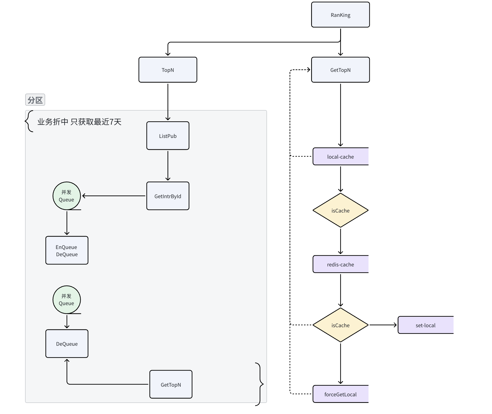

## 简历 preview

简历上 : 实现多实例部署下的 热榜 异步计算和查询

## 流程设计

**需求分析 :**

需要能够获取到最近7天 前100点赞的数据

**模块分析 :**

设计一个 RankService 支持获取 TopN 的操作

### 模块设计

1. 提供一个基于 本地缓存 + Zset 实现的热榜设计 并且通过 分key 热点信息

2. 提供一个离线计算的热榜服务, 使用小根堆进行维护数据 。使用分布式锁 启动时固定实例进行计算热榜

## 难点 & 亮点

**问题 :**

热榜服务要求高可用 高性能 以及处理较大的数据 怎么做到 ? 

**方案 :**

1. 使用 本地缓存 + Redis 的方式进行 处理高可用 。 如果本地缓存和redis 缓存都实效 加载本地已过期的进行兜底

2. 较大的数据 可以采用 分key 的方式进行处理 。 或者通过业务折中的方式，例如 只考虑最近7天的 top 数据，最近 7 天可能最多也就100w条

---

**问题 :** 

Zset 不可能进行较大数据量大计算, 这会给机器带来很大的压力 

**方案 :**

1. 采用定时任务 离线计算 。 

2. 使用 优先队列维护一个小根堆，固定 TopN 的数量。 每次分批进行获取数据加载计算

---

**亮点 :**

1. 考虑在多实例部署的情况下, 可能会存在 多个实例同时计算一个热榜，并且每个热榜都会有细微的偏差。 使用分布式锁+自动续约的机制 控制同一时间只有一个 节点 在进行计算

2. 使用 Hacknews 模型 `Score = (p - 1) / (T + 2)^G` 公式进行计算热点信息。防止点赞数量被老贴市场霸占

3. 在 Redis 存 TopN 的时候晴空 Content 避免占用较大的内存

## 缺点

1. 缓存方式比较简单 

2. 强一致性不足

## 总分：**62 / 100**

按「2 年 Golang 后端」面试标准看：方向对、有架构意识，但**深度不够、表述不严谨、经不起追问**。能过初筛讲清故事，很难稳住深挖。

| 维度 | 分数 | 简评 |
|------|------|------|
| 问题定义与业务抽象 | 70 | TopN + 近 7 天边界清楚 |
| 架构设计完整性 | 65 | 多级缓存 + 离线计算主链路合理 |
| 技术细节与落地 | 50 | 缺关键实现、参数、边界条件 |
| 难点亮点说服力 | 68 | 锁、堆、HN 公式有亮点，但讲不透 |
| 表达与专业度 | 55 | 错别字、占位符多，像草稿 |
| 面试可追问准备 | 48 | 几乎没有「被问住」时的备用料 |

---

## 优点

1. **主路径合理**：查询走本地缓存 → Redis → 兜底；计算走离线 TopN + 小根堆，符合热榜常见做法，不是乱堆关键词。
2. **有业务折中意识**：用「近 7 天 / 约 100 万」控数据量，比硬扛全量排序更像有生产经验。
3. **亮点选得对**：多实例分布式锁、Hacker News 时间衰减、ZSet 不存 Content——这些正是面试官能追问的点。
4. **主动暴露缺点**：缓存简单、强一致不足，至少说明你知道系统边界，比只会吹「高可用高性能」好。
5. **有架构图**：比纯文字更容易在面试里讲清读写两条链路。

---

## 缺点（面试会被卡住的地方）

1. **简历描述太空**：「多实例部署下的热榜异步计算和查询」没有规模、指标、职责边界，面试官第一问就会要数字。
2. **方案停在名词层**：分 key、小根堆、分布式锁、自动续约都点到了，但缺：
   - 分 key 规则（按天？按互动类型？怎么合并 TopN？）
   - 堆的维护时机与批大小
   - 锁用 Redis/etcd？续约失败怎么办？持锁实例挂了呢？
   - 本地缓存过期后仍兜底，跨实例一致性怎么说？
3. **公式只写了不解释**：`Score = (p - 1) / (T + 2)^G` 里 p/T/G 含义、G 怎么选、和「点赞数排序」差在哪，不讲等于没亮点。
4. **图文对不齐**：图里有并发 Queue、分区、`forceGetLocal`，正文几乎没展开，面试官对着图一问，你会空。
5. **「高可用」论证弱**：本地 + Redis 失效后用过期数据，是降级不是高可用；没有说明降级 SLA、空榜、穿透、击穿。
6. **表达不专业**：`xxxx`、`实效→失效`、`晴空→清空`、`Hacknews`，会直接拉低可信度。
7. **缺点写完就停了**：「强一致性不足」没有影响面和为何可接受，像没想完。

---

## 建议（按面试准备优先级）

1. **补一组可说的数字**：数据量、TopN、计算周期、单次计算耗时、QPS、缓存命中率、锁超时/续约周期。没有真实数也要给合理量级。
2. **准备 3 层回答**：一句话结论 → 架构步骤 → 细节/权衡。例如「为何小根堆」：只要 Top100，堆复杂度 O(n log k)，比全量排序或大 ZSet 更合适。
3. **把追问清单写进稿子**，至少覆盖：
   - 多实例本地缓存不一致怎么办？
   - 计算中途失败，半成品会不会写进 Redis？
   - 分 key 后如何得到全局 Top100？
   - 锁续约失败 / 时钟漂移 / 脑裂
   - 缓存击穿（热榜 key 过期瞬间）
4. **讲清 HN 公式**：老帖高赞为何会被新帖追上；G 调大/调小的业务含义。
5. **把图里的并发 Queue 讲成 Go 实现**：channel + worker pool、batch size、背压，对应 2 年经验该有的落地感。
6. **润色表述**：去掉占位符和错别字；简历改成「近 7 天 Top100 热榜：离线小根堆计算 + Redis ZSet + 本地缓存，分布式锁保证单实例计算」。
7. **缺点改成「已知取舍」**：例如强一致不必要，因为热榜允许分钟级延迟；用计算周期 + TTL 把最终一致说清楚。

---

## 面试官视角一句话

作为 2 年经验候选人，这份材料证明你**做过热榜、懂分层和折中**，但目前更像设计草稿，不像能扛 20–30 分钟深挖的面试稿。把「分 key / 锁续约 / 公式参数 / 并发队列 / 降级语义」补实，并清掉错别字，分数大概能到 **75–80**；再补上指标和失败场景，才比较稳。

