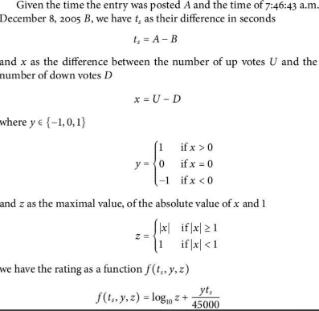
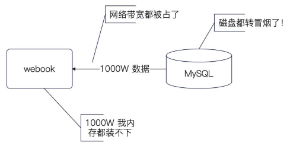
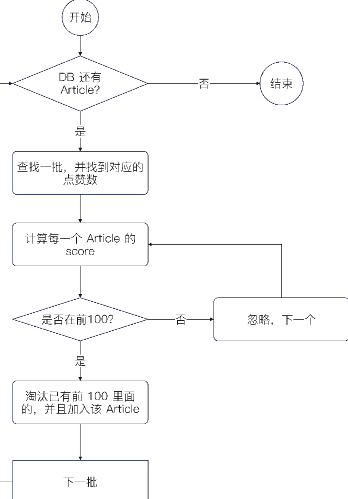
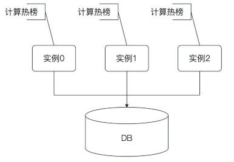
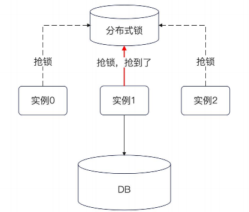
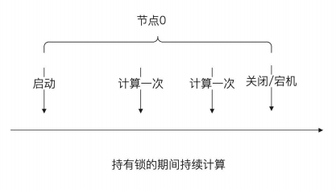
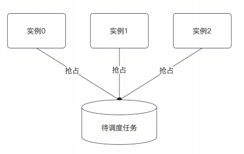
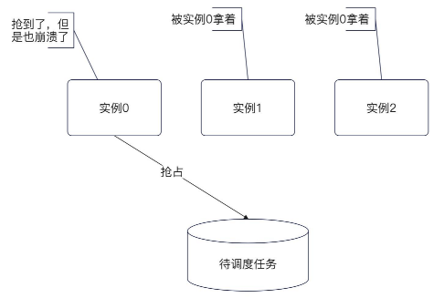

## 简历 preview

简历上 :

设计了一个 热榜

需求分析 :

一些问题 ：

1. 什么样的才算是热点 ？ 

2. 如何计算热点 ？ 

3. 热点必然带来高并发，怎么保证性能

4. 如果热点功能崩溃了，怎么降低对整个系统的影响

### 算法模型

Hacknews 模型 `Score = (p - 1) / (T + 2)^G` 

模型认为 : 得票数最重要，而后热度随着时间衰减

Reddit 模型 



### 数据计算

考虑一点 : 是否需要 **实时计算**

#### 实时计算的难点

1. 要扫描全表，找出所有帖子的点赞数和发表时间

2. 计算每个帖子的 score 并且全局排序

难点在于 : 全表扫描 + 全局排序



#### 异步计算

由于全表计算的困难，我们考虑使用异步定时计算

解决方案包括 : 

1. 每隔一段时间就计算一次热榜

2. 在异步的情况下，计算的时间可以比较长，但是依旧不能太长 

在这个基础上考虑

1. 怎么设计缓存，保证有极好的查询性能

2. 怎么保证可用性，保证在任何情况下都能拿到热榜数据


##### 计算热榜的算法实现

1. 从数据库中拉取一批文章（batchSize），再找到对应的 点赞数，计算 score。

2. 使用一个数据结构来维持住 score 前 100 的数据。如果 该批次中有 score 比已有的前 100 的还要大，那么就从 数据结构中淘汰热度最低的。

3. 加入更高 score 的。

4. 全部数据计算完毕之后，数据结构中维护的就是热度前 100 的

5. 将这些数据装入 Redis 缓存

这里使用的数据结构可以使用已经封装好的优先队列 也就是小根堆




放入缓存有两个关键点 :

1. 热榜数据不需要保存在数据库中。 一些公司会把这些内容保存到数据库里面用于大数据分析

2. 在 Redis 的过期时间，要比计算间隔长，最好留有足够的重试时间 。 

### 查询接口的处理

使用 `atomicx.Value` 进行本地缓存 

在操作的时候优先操作本地缓存，如果本地缓存找不到数据，再去查找 redis 缓存  。然后回写 本地缓存
 
 
 ### 可用性问题

 一个降级策略，对于 数据库和Redis 都崩崩溃的情况下 。 如果本地缓存也失败了

 那么可以增加一个 `ForceGet` 的流程，即 不管本地缓存是否已经过期 我们都获取数据 。 

 ## 极致的缓存方案

 在大多数时候，追求极致性能的缓存方案，差不多就是本地缓存 + Redis 缓存 + 数据库。

 那么：

 - 查找的时候，就要先查找本地缓存，再查找 Redis，最后查找数据库

 - 更新的时候，就要先更新数据库，再更新本地缓存，最后更新（或者删除）Redis。核心在于一点，本地缓存的操作几乎不可能失败

 高级的亮点在于：

  - 本地缓存可以预加载。也就是在启动的时候预加载，或者在快过期的时候，提前加载

  - 本地缓存可以用于容错。也就是如果 Redis 崩溃，这时候依旧可以使用本地缓存。例如，正常过期时间是三分钟，但是本地缓存会设置五分钟。如果数据已经超过了三分钟，那么会尝试刷新缓存，如果刷新失败，那么就继续使用这个已经“过期”的本地缓存。在部分场景下，可以考虑让本地缓存永不过期，同时异步任务刷新本地缓存。好处是可以在 Redis 或者 MySQL 崩溃的时候，依旧提供缓存服务。


  ## 当下的问题

  如果我们部署了多个实例，那么多个实例会同时执行这个计算热榜的任务。 

  理论上来说 同一时刻计算的结果应该是一样的，但是大多数都不是同一时刻，这会导致 在实例1看上的 和 实例2看上的结果会有细微的差距

  

  因此我们需要考虑 控制任务只在一个节点上进行运行

  ### 分布式锁方案

  使用分布式锁来控制 goroutine 的计算方式 

  1. 因为我们知道任务的运行 timeout 时间。 所以不需要开启续约

  2. 另外解锁失败的话，最多 r.Timeout 就会自动释放 也不需要担心

  

  但是上述方案会出现一个问题， 这个只能控制同一时刻 只有一个 goroutine 计算，但是控制不住 计算了一次之后别的机器就不要计算热榜了

  所以我们可以考虑

  1. 在启动的时候拿到锁，而后不管几次都不会释放锁 

  

  分布式锁的具体实现如下

  1. 定时任务每次运行 ，尝试拿分布式锁

  2. 如果拿到 异步开启自动续约

  3. 下一次正常运行，不需要额外拿锁

  ```go
  func (r *RankingJob) Run() error {
	r.localLock.Lock()
	defer r.localLock.Unlock()
	if r.lock == nil {
		// 说明你没拿到锁，你得试着拿锁
		ctx, cancel := context.WithTimeout(context.Background(), time.Second)
		defer cancel()
		// 我可以设置一个比较短的过期时间
		lock, err := r.client.Lock(ctx, r.key, r.timeout, &rlock.FixIntervalRetry{
			Interval: time.Millisecond * 100,
			Max:      0,
		}, time.Second)
		if err != nil {
			// 这边没拿到锁，极大概率是别人持有了锁
			return nil
		}
		r.lock = lock
		// 我怎么保证我这里，一直拿着这个锁？？？
		go func() {
			r.localLock.Lock()
			defer r.localLock.Unlock()
			// 自动续约机制
			err1 := lock.AutoRefresh(r.timeout/2, time.Second)
			// 这里说明退出了续约机制
			// 续约失败了怎么办？
			if err1 != nil {
				// 不怎么办
				// 争取下一次，继续抢锁
				r.l.Error("续约失败", logger.Error(err1.Error()))
			}
			r.lock = nil
			// lock.Unlock(ctx)
		}()
	}

	ctx, cancel := context.WithTimeout(context.Background(), r.timeout)
	defer cancel()
	return r.svc.TopN(ctx)
}
```

### 基于 mysql 的分布式任务调度

基本思路就是

1. 在数据库中创建一张表， 里面是等待运行的定时任务

2. 所有的实例都试着从这个表里面 抢占 等待运行的任务 , 抢占到了就执行




#### 抢占但是崩溃

如果一个实例抢占了，但是还没执行完毕，直接崩溃了怎么办 ？ 

引入 **续约机制** , 实例0 要不断更新数据库的更新时间证明自己还活着




## tbd