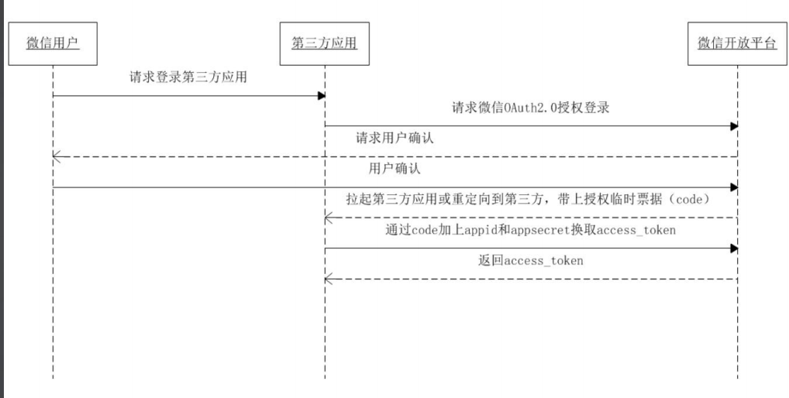
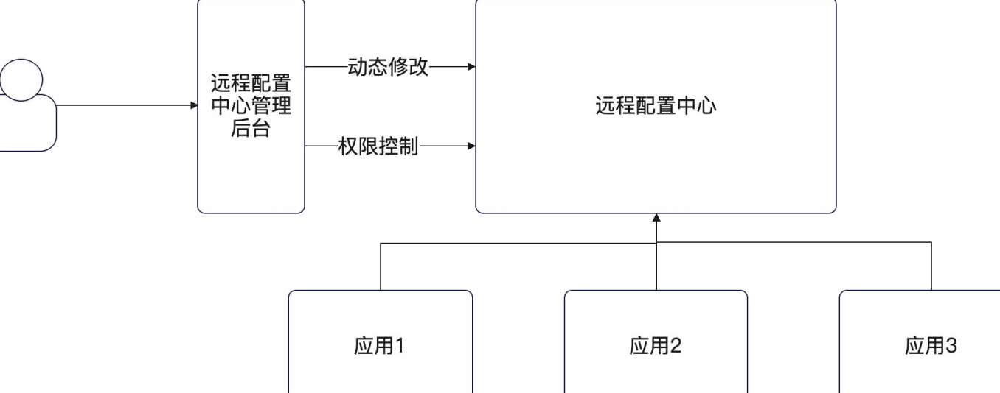

## 简历 preview

简历上 :

1. 设计并实现了 完整的 高安全性,高可用,高扩展的 登陆与注册 服务

面试中 :

1. 系统支持 邮箱注册,短信验证登陆,系统扫码登陆的功能, 使用 JWT + Cookie 的形式维护登陆状态, 采用 长短Token 进行续期. 采用 Lua+滑动窗口 实现非访问登陆的限流 

2. 短信验证登陆支持 阿里云和腾讯云的切换, 使用负载均衡算法进行处理切换 同时设计对应的降级策略 failover 保证服务崩溃也能使得部分功能正常

3. 对接微信开发平台 实现微信扫码登陆 处理2次回调内容

难点 : 

1. 一开始使用 cookie + session 实现的注册与登陆，在使用 wrk 压测的时候 发现 redis 有很大的压力. 决定牺牲一点性能 采用 JWT

2. 用户表设计的时候 由于密码是隐私内容 需要考虑加密, 在选择加密算法的时候进行了选择, 经历了xxx,最后选择 bcrypt

3. 使用 wrk 压测的时候发现，登陆接口并没有限制会引入大量异常流量，于是自己设计了一个限流中间件，利用 Redis 本身的单线程特性，采用滑动窗口实现

4. 在对接微信扫码登陆时, 因为需要本地测试，但是 微信api返回的是 注册域名的 跳转链接 。 最后改了本地的 hosts实现测试。 另外因为之前表设计缺陷，实现该功能后额外增加了一列微信，并且重新设计了唯一联合索引

5. 全部开发使用 DDD 模式架构进行整理，使用 TDD 业务开发 整个开发过程比较繁琐，另外引入装饰器模式 和 面向接口编程在牺牲开发效率的情况下 保证系统的高扩展性


## 跨域问题

跨域问题 是因为 : 发请求的域名 + 端口  和 接收请求的域名 + 端口 对不上 。 比如 前端 localost:3000 发到 localhost:8080 上

对于跨域问题 : 浏览器会提前发送一个 `preflight` 询问自己愿意接受的请求

解决的办法 :  `Gin` 提供了解决问题的 中间件来处理

通过 `middle` 设置 :

- AllowCrendentials : 允许带上用户认证信息
- AllowHeader : 业务请求可以带上的头
- AllowOrigin : 哪些来源是可以被允许的

```go
cors.New(cors.Config{
			AllowOrigins:     []string{"http://localhost:3000", "http://localhost:3001"},
			AllowHeaders:     []string{"Content-Type", "Authorization"},
			AllowCredentials: true,
			ExposeHeaders:    []string{"x-jwt-token", "x-refresh-token"},
		})
```

## 加密

选择加密算法的标准就一个, 难破解. 需要考虑以下的问题 :

- 相同的密码

- 难以通过碰撞来破解

常见的加密算法 :

1. md5 

2. 在 `1` 的基础上引入 `salt` 这里需要额外存储

3. 使用 `PBKDF2`,`BCrypt` 随机盐值的加密算法进行加密

## Cookie & Session & JWT

### Cookie

浏览器存储一些数据到本. 

不安全 : 可以通过 `cookie-editor`插件进行获取

一些设置 :

`Domain`: cookie 可以用在什么域名下

`Path`: Cookie 可以用在什么 `path` 下

`max-Age`: 过期时间

`Http-only`: 如果设置为true, js代码无法使用这个 cookie 

`Secure`: 只能使用于 `https` 协议


#### 一些有意思的问题

Q : 为什么有一些网站喜欢禁用 Cookie 


A : 没看懂 说实话，安全相关的内容 难理解

### Session

我的理解 就是一个 key-string , 不过他是由后端存储

但是他还是强依赖 cookie , 无非最重要的一点就是 `cookie如果存放敏感信息会被获取,所以引入session,传入 session_id 用于后端校验`

**如何让客户端懈怠 session_id :**

1. 最佳的方式就是放在 `cookie`中, 毕竟 `cookie`还可以设置 `secure` 

如果禁用了 `cookie` 可以考虑放在 `header` 和 `sess_id` 中

### JWT

JWT 由 `header+playload+sign` 组成

JWT 与 Session 比较 :

优点 :

- 不依赖第三方存储

- 适用于分布式环境

- 提高性能 (没有 Redis 访问)

缺点 :

- 对加密依赖非常大

- 最好不要在 JWT 放置敏感信息

### 退出问题

Session 的退出，需要先把 cookie 删了 然后把 `session`本身删了

但是 `JWT` 本身是无状态的，所以旧的`token`在没有过期 其实也是能用的

`JWT` 如果要实现退出登陆，只能够考虑使用 `redis` 黑名单的机制

但是我们已经实现了 长短token, 如果记录黑名单需要在登陆校验的时候 也要传入黑名单 。这导致长token会被频繁调用

所以考虑 `JWT` 中存放 `session-id` 使用 `session-id`进行黑名单控制


## 安全性问题

Q : 我们实现登陆与注册系统之后 有一个最大的问题就是

1. 任何人都可以注册
2. 任何人都可以登陆

因此我们需要考虑 `限流` 

这里采用 `Redis`+lua 滑动 窗口限流

---

Q : 如何保证 JWT 或者是 Session 泄漏 攻击者假冒你

采用验证码二次验证，对比上一次的信息 例如 `user-agent` 

## 性能问题

使用 `wrk` 进行性能压测

`wrk -t1 -d1s -c2 -s ./script.lua urlpath/signup` 

参数解释如下. :

`-t`: 线程数量

`-d`: 持续时间 

`-c`: 并发数量

`-s`: 测试脚本

压测下来预计会发现两个问题

1. 加密算法 . JWT 在注册和登录后会进行加密和解密，预计相差 `10倍`

2. 数据库查询

### 优化数据库查询

我们常见的一种写法是 `cache-db-cache` 

```go
func FindById() {
	cache.Get()

	db.Get() 

	_ := SetDB()
}
```


#### 场景问题决策

Q : `Session` 的 过期时间如何刷新 ?

- 用户每次访问, 都刷新. 如果 session 部署在 redis 上，那么影响很大

- 快要过期了我再刷新 。 有 gap

- 固定时间刷新，引入 `updateAt` 参数 , 用户每次访问的时候 如果超过固定的时间 那么刷新


Q : 长短 `token` 

短 token : 用于访问资源

长 token : 短 token 过期之后，生成一个新的短 token

这里其实是依赖的前端，我们在登陆接口的时候返回两个 `token`

然后提供一个 `refresh` 接口,如果 短token 失效，让前端用长token请求刷新一下


## 第三方服务治理

整体思路 :

1. 尽量不要搞崩第三方

2. 万一第三方崩了，你的系统还能够稳定运行

### failover 

failover (失效转移)

如果第三方崩了 那么就直接换一个服务商

策略有 :

1. 轮询

	- 缺点每次都从头开始，负载不均衡
	- 如果 sms svc 很多, 轮询很慢

2. 动态轮询

	- 每次使用 `i%length`的方式进行轮询
	- 不过这里需要注意并发问题 需要引入 `atomic` 

3. 动态判断第三方

	- 真的计算服务商是否还在运作正常 . 
	- 可以从错误率
	- 响应时间判断

## OAuth2

### 微信

微信扫码登陆 看着更像是 TCP 链接的三次握手 分为

1. 请求登陆
2. 返回确认请求
3. 确认
4. 带上 uuid 进行请求
5. 返回 access token




## 配置

之前我们一开始使用的是 `build tag` 进行配置控制

我们如果要优化配置可以从下面的方式进行考虑

1. 启动参数 ，命令行工具传入的参数 。 例如 `mysqlroot:password`

2. 环境变量 

3. 配置文件。 使用 viper 制定 path 进行读取

4. 远程配置中心 。 etcd 

配置文件的缺点 :

1. 不够灵活
2. 权限控制
3. 实时更新



## 日志

使用 `zap` 进行日志处理, `zap` 本质上是维护了一个全局 `logger`

可以考虑使用 适配器模式封装一下 `zapper` 

Gin 可以考虑使用 `middleware` 进行打印日志

1. 通过在 `ctx.Next()`前后处理对应的数据
2. 但是我们无法获取到 `resp`,我们需要自己重新实现一个 `respWriter`

Gorm 可以考虑使用 `config.Logger`实现


其他的地方只能考虑从 Service 插入 logger 或者是维护全局 logger的形式进行输出com

## 面试题

1. 什么是 `Gin` 的 `middle-ware` ？ 能解决什么问题 ？ 

2. 什么是跨域问题，怎么解决 ？ 

3. 跨域问题需要设置哪些头部 ？ 

4. 什么是 cookie，什么是 session ? 

5. cookie 和 session 比起来有什么缺点 ？ 

6.  Session ID 可以放在哪里？ 如果Cookie禁用

7.  用户密码加密算法的选取

8.  怎么做登陆校验 ? 利用 Gin 的 middleware

9.  刷新 Session 过期时间的几种方案

10. 增强登陆的安全性
- 怎么保护 session_id ?主要还是启用 https协议，设置 cookie 的 secure
- 怎么做到 在session_id 和 jwt-token泄漏之后保护着客户 ？ 记录登陆的额外信息

11. 如何保护 Web 服务 ？ 针对 IP限流、整个集群限流


Redis :

1. 你用 Redis 解决过什么问题？ 

2. 你知道 Redis 支持哪些数据结构 ？ 用过哪些 ？ 用来解决什么问题？ 

3. 各个数据结构的底层实现 ？ 

4. 当你更新数数据的时候 先更新数据库还是先更新缓存，有没有一致性问题 (这在登陆与注册超纲了吧)

5. 如何解决一致性问题


1. 什么是依赖注入，如何在 Go 实现 依赖注入

2. 什么是面向接口编程 ？ 为什么要面向接口编程 ？ 

3. 什么是 Ioc 控制反转


微信登陆 (TBD)

1. 微信扫码登陆的流程

2. 为什么微信的回掉地址，域名必须是你预先注册的

3. 如果我的临时授权码(code)被黑客拿到了会怎么样

4. state有什么作用 ？ 如何使用 state ?

---

1. 什么是长短 token ？ 为什么要用长短两个 token ？ 

2. 长短 token 的过期时间应该怎么设置 ？

3. 怎么保证长token的安全性，万一泄漏了怎么办 ？ 

4. 使用 JWT token 怎么退出登陆

5. 使用 长短 token 之后怎么退出登陆

5. 使用 JWT 还需要再使用 Session 吗


## 亮点提升

Gin : 

**Web治理 :** 熔断、限流、降级

限流实现 ：

单机限流 :

  - 令牌桶算法

  - 漏桶算法

  - 滑动窗口算法

  - 固定窗口算法


基于 Redis 限流

基于 Redis IP 限流

[Gin插件库](https://github.com/ecodeclub/ginx)


Gorm :

1. 为 `Gorm` 提供可观测性的插件实现

2. 实现读写分离插件

3. 提供 BeforeFind 函数


第三方服务治理 :

1. 可以设置一个 同步转异步的 容错机制 。 当第三方不可用的时候，将当前请求存储到数据库中，后续再单独启动一个 gouroutine 异步的发送出去


考虑布隆过滤器进行黑名单过滤