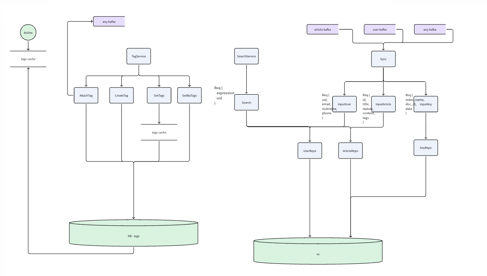

## 简历 preview

简历上 : 设计并实现了 搜索

## 流程设计 

**需求分析 :**

1. 支持用户创建 标签, 查看已有标签, 删除标签

2. 支持用户给指定文章打标签

3. 支持用户查询 对应关键字的文章 并且把 打过标签的文章优先返回

**模块分析 :**

考虑标签应该是一个通用的功能 所以将标签单独拆分一个模块 

并且不希望业务直接写入ES，单独设计一层 搜索和插入服务。 将读和写拆成两个服务

### 标签服务 模块

#### 支持功能

1. 覆盖标签

2. 创建标签

3. 获取用户的全部标签

3. 获取用户给某篇文章打的全部标签

#### 表结构设计

设计 Tag 表, 和 TagBiz 表 用于统计用户创建的 tag 和 用户给文章标记的 Tag

索引设计 :

在 Tag 表上设计了 uid 为 索引，保证 获取用户的全部标签的时候能够命中

在TagBiz表设计了 `biz_id,biz` 和 `uid` 设计了索引, 同时tagBiz 设置 `target_id` 外键连接 `tag` 表

考虑 uid 的不可变性, 设计 tagBiz 表的时候冗余了  uid 的设计，从而在查寻用户给某篇文章打的标签的时候 不需要去Join Tag表 加速查询

#### 缓存设计

在获取用户的全部标签的时候, 考虑使用缓存预加载进行优化

1. 在程序启动的时候，提前全量扫描一次数据库

2. 将数据分key 加载到 redis-list 中

3. 在获取全部标签的时候 预先读取缓存再去操作数据库 

### 插入搜索模块

支持

1. 通用的插入逻辑 `content_id,content`

2. 业务定制化的 user 和 article 的插入逻辑

#### Es 索引设计

文章表结构设计 :

1. title , content , id ,status . 这里引入 status 主要是为了后续 用户可以查看到仅自己可以见的文章处理

用户表设计 :

1. nickename, email(text), phone, id .  email设计称为 text 而不是keyword是因为正常人很难记住邮箱

#### 数据插入处理

使用 Kafka 开启 3个 Consumer 分别监听 文章, User, Any 的插入

1. 因为我们在索引中引入了 id 字段, 保证了在并发场景下是 upsert 语意

### 查询搜索模块

1. 支持查询有关用户的信息

2. 支持查询有关文章的信息
	- 并且将用户打过标签文章的内容优先返回

#### 联合 Tag 查询

Es 支持通过 父子关系 和 内嵌文章进行联合查询 但是性能过差 。 我们这里采用二次查询的方式实现联合查询

1. 先查询 Tag 里面的内容， 查询当前 用户已经打过标签的 文章 id

2. 再去查询有关keywords的文章信息，并且使用 TermQuery Boost 增加在第一次查询出来的权重

## 难点 & 亮点

**问题 :**

1. 用户在给某个文章打标签的时候 都会加载一次自己已有的全部标签, 预计这里会是一个高频的全量扫表过程

**方案 :**

1. 使用 Redis-list 预加载一次全部用户的全部标签内容

2. 每次查询优先查询缓存 再查询数据库,对于未命中的内容 再次更新缓存

---

**问题 :**

1. 在获取用户给某篇文章的所有标签内容处理时 都需要去 Join 一次 Tag 表 . Join操作会变慢

**方案 :**

1. 因为 Uid 的不可变性。我们设计的 tag 是基于 Uid 的 。不存在 用户A给 文章 A打了标签。 突然这个标签变成用户 B 的情况 。 所以在 TagBiz 冗余了 Uid 字段加速查询

---

**问题 :**

1. 用户对一篇文章重复打标签可能会有并发问题 。 因为我们使用 kafka 进行发送Es信息

**方案 :**

1. 在对应 producer 的时候, 使用 key 绑定对应的uid 保证同一个uid 的内容只会发送到同一个分区

---

**亮点 :**

1. 实现了 两个 Tag 内容之前的查询 , 使用二次查询的方法 实现 用户查询有关文章的时候, 优先返回已打标签的文章

**亮点 :**

1. 搜索服务拆分成 `sync` 和 `search` ,读写分离 。 业务方面不直连 Es . 并且 支持 `InputAny` 方便业务快速上线

**亮点 :**

1. 预加载的时候 使用 pipeline 进行打包发送 redis 指令 

## 缺点

1. 仅实现了 文章和标签的相关服务 。 实现内容过少，并没有聚合点赞收藏等业务

2. Kafka 部分少了兜底机制

## 总分：**61 / 100**

定位：2 年经验、项目深挖准备材料。能讲清主流程和模块边界，但多处方案经不起追问，Golang 工程深度偏弱。面试中「能讲」可以，**扛不住连环追问**。

| 维度 | 分数 | 说明 |
|------|------|------|
| 需求与模块拆分 | 72 | 标签独立、读写拆分思路清楚 |
| 表结构 / 索引 | 65 | 有索引与冗余意识，外键与命名易被挑 |
| 缓存设计 | 42 | 启动全量预加载是明显硬伤 |
| ES / 搜索 | 60 | 二次查询 + Boost 合理，缺量化与一致性 |
| Kafka / 并发 | 48 | 问题与解法错位 |
| 难点亮点表达 | 68 | 有结构，但方案可信度不足 |
| 自我认知 | 70 | 知道功能少、缺兜底 |
| Golang 工程深度 | 35 | 几乎看不到语言/并发/落地细节 |

---

### 优点

1. **需求 → 模块 → 表 → 缓存 → MQ → ES** 叙事完整，面试官能跟着走。
2. **标签独立模块 + sync/search 读写分离 + 业务不直连 ES**，符合中级对边界的基本要求。
3. TagBiz **冗余 uid 避免 Join**、ES **二次查询 + Term Boost**（相对 nested/父子文档）是可讲的取舍。
4. 有**难点/亮点/缺点**框架，并提到 Kafka 缺兜底、功能未聚合，比只会吹亮点强。
5. 提到 **pipeline 批量写 Redis**、**id upsert**，说明接触过落地细节。

---

### 缺点（面试里最容易被打穿的点）

1. **缓存方案危险**  
   启动全量扫库、把「全部用户全部标签」塞进 Redis List：冷启动、内存、扩缩容、局部失效都没讲。2 年经验里这是减分点，不是加分点。List 也不适合标签的增删改；一致性（写标签后如何更新缓存）几乎空白。

2. **并发问题与解法错位**  
   「重复打标签」应落到：**DB 唯一约束 / 事务 / 幂等**。Kafka 按 uid 分区只保证**同 uid 有序**，解决不了重复打标、更解决不了跨服务幂等。面试官一追问就会露馅。

3. **ES 细节经不起问**  
   - email 用 text：理由偏弱，应讲分词、模糊、精确匹配、keyword 多字段。  
   - status 字段只点到，未见权限/过滤怎么做。  
   - upsert、同步延迟、最终一致性、失败重试几乎没准备。

4. **表设计表述不严谨**  
   TagBiz `target_id` 外键、索引 `(biz_id, biz)` + `uid` 缺查询路径说明；「覆盖标签」语义不清。

5. **缺量化与 Golang 深度**  
   无 QPS、延迟、数据量、缓存命中率。无接口抽象、超时取消、consumer 并发、错误处理、压测——对 Golang 岗这是硬伤。

6. **材料完成度**  
   「其他细节」空、序号重复、resume「搜索」与正文「标签+搜索」焦点略散。

---

### 建议（按优先级）

**1. 重写缓存故事（必改）**  
改成：按 uid 懒加载 / 热点预热；Hash 或 String+JSON；打标/删标时删缓存或局部更新；讲穿透、击穿、雪崩之一即可。删掉「启动全量预加载所有用户」。

**2. 对齐「重复打标」叙事**  
主答：唯一索引 `(uid, biz, biz_id, tag_id)` + 幂等；Kafka 分区 key 只作为「同步有序/同用户串行」的补充，不要当并发正解。

**3. 补 3 个可量化数字**  
例：标签人均条数、搜索 P99、sync 延迟、日增量。没有真实数据就给设计目标量级，比没有强。

**4. 准备 5 个追问答案**  
- 标签写后搜索多久可见？  
- sync 失败怎么办？（重试、DLQ、对账）  
- 缓存与 DB 不一致怎么办？  
- Boost 权重怎么定、如何验证效果？  
- 为何不用 nested / join / 宽表？

**5. 补 Golang 落地半页**  
Consumer 并发模型、context 超时、接口分层、ES client 错误处理、本地单测怎么 mock——面试官常从这里区分 1 年和 2 年。

**6. 收束简历表述**  
简历写「标签 + 搜索（读写分离）」或主讲一条线，避免「实现了搜索」却大段讲标签预热。

---

### 面试官一句话结论

**能过初筛讲项目，过不了深挖。** 模块拆分和二次查询+Boost 可以撑住 10–15 分钟；缓存全量预加载和「Kafka 解决重复打标」会把印象从「还行」拉到「基础不扎实」。把这两处改掉，材料有机会到 **75+**；再补量化与 Golang 细节，更接近 2 年合格线。