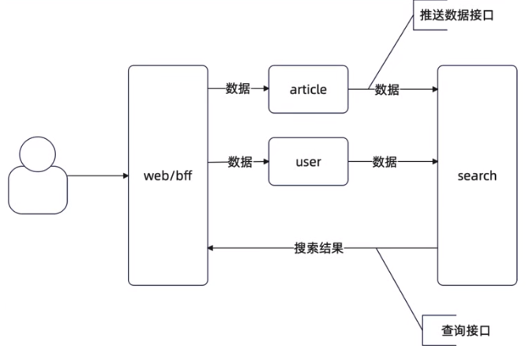
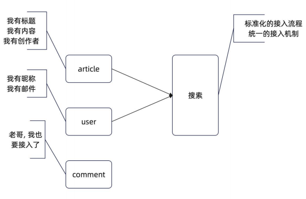
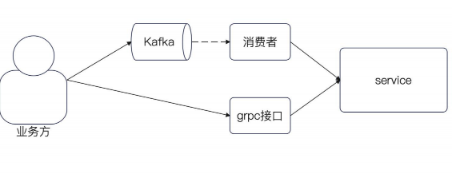
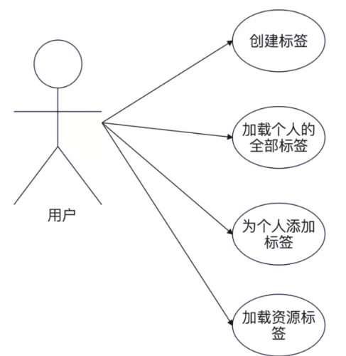
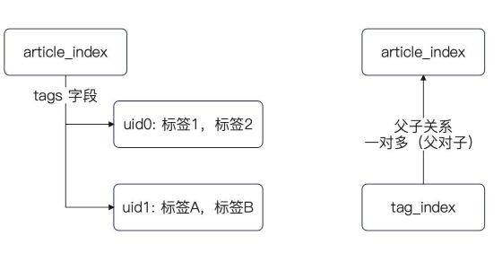

## 简历 preview

简历上 : 设计并实现了 搜索

### 需求分析

平台里面都会有一个搜索栏 大体上的目的是 : 

- 方便用户快速找到所需的内容

- 增加广告收入


支持搜索主要是支持 :

- 搜索具体的用户

- 搜索某篇文章

因为需要考虑使用使用 ES 进行实现, 所以需要把这两个服务原有的数据 额外的 写入到 ES 中 。 




---

Q : 为什么 不是用户直接写入到 ES 

A : 从 DDD 的角度来说 , es 并不考虑 user 的索引怎么确定 也不处理一些业务相关的内容 。 所以只能通过 search 服务

## 搜索流程设计

### 推送接口

1. 支持业务定制化的结构 和 统一处理的结构

2. 提供统一处理接口 和 定制化接口

```proto
service SyncService {
  rpc InputUser (InputUserRequest) returns (InputUserResponse);
  rpc InputArticle (InputArticleRequest) returns (InputArticleResponse);
  rpc InputAny(InputAnyRequest) returns(InputAnyResponse);
  // 同步标签
  // rpc InputTags()
}
```

### 推送接口实现

唯一需要注意的一点就是,我们需要传入 `user.Id` 保证是 updateSert 语意

```go
func (h *UserElasticDAO) InputUser(ctx context.Context, user User) error {
	_, err := h.client.Index().
		Index(UserIndexName).
		Id(strconv.FormatInt(user.Id, 10)).
		BodyJson(user).Do(ctx)
	return err
}
```




### es 表结构设计

#### 文章表结构

mapping : 

title : type : text 

content : type : text 

id : type long ; (贯穿业务的id)

status : type : interger 


#### 用户表结构

mapping :

nickname : type : text

email : type : text (不使用keyword，正常人很难记住邮箱)

phone : type : keyword 

id : tyoe long 

- (这里要不要处理,理论上来说前端是不支持的 。 用户层面应该是看不到的，但是客服预计能看到)

### 搜索接口设计

```go
service SearchService {
  // 这个是最为模糊的搜索接口
  rpc Search(SearchRequest) returns (SearchResponse);
}
```


### 搜索接口的实现

```go
func (s *SearchServiceServer) Search(ctx context.Context,request *searchv1.SearchRequest,)(*searchv1.SearchResponse, error) {
	resp, err := s.svc.Search(ctx, request.Uid, request.Expression)
	if err != nil {
		return nil, err
	}
	return &searchv1.SearchResponse{
		User: &searchv1.UserResult{
			Users: slice.Map(resp.Users, func(idx int, src domain.User) *searchv1.User {
				return &searchv1.User{
					Id:       src.Id,
					Nickname: src.Nickname,
					Email:    src.Email,
					Phone:    src.Phone,
				}
			}),
		},
		Article: &searchv1.ArticleResult{
			Articles: slice.Map(resp.Articles, func(idx int, src domain.Article) *searchv1.Article {
				return &searchv1.Article{
					Id:      src.Id,
					Title:   src.Title,
					Status:  src.Status,
					Content: src.Content,
				}
			}),
		},
	}, nil
}
```


```go
func (h *UserElasticDAO) Search(ctx context.Context, keywords []string) ([]User, error) {
	queryString := strings.Join(keywords, " ")
	query := elastic.NewBoolQuery().Must(
		elastic.NewMatchQuery("nickname", queryString),
	)
	resp, err := h.client.Search(UserIndexName).Query(query).Do(ctx)
	if err != nil {
		return nil, err
	}
	res := make([]User, 0, len(resp.Hits.Hits))
	for _, hit := range resp.Hits.Hits {
		var ele User
		err = json.Unmarshal(hit.Source, &ele)
		if err != nil {
			return nil, err
		}
		res = append(res, ele)
	}
	return res, nil
}
```

### 推送消息

我们在推送消息那个模块引入 3个 kafka 进行异步的推送消息

1. 为不同的业务定义不同的 event , 而后业务方朝特定的 Topic 发送消息

2. 定义一个统一的 Event 的格式



## 标签流程设计

### 标签功能

- 提升用户体验

- 提高搜索引擎优化

- 社交分享

- 个性化推荐

全局标签、个人标签、通用标签

1. 用户创建标签

2. 用户对某个资源打上标签



### 表结构设计

创建两张表

1. Tag 表 , 索引 uid .  主要是为了解决 加载个人的全部标签的 内容

2. TagBiz 表, 记录某个人对某个资源打的标签 。 


1. 理论上我们可以通过 TagBiz 查询一次 Tag 进行获获取 Uid。 但是会多一次自查询 。 尤其是我们在覆盖标签的写法的时候 删除的时候很麻烦


```
// delete from tag_biz where tid IN
// (select distinct id from tag where uid = ?) AND biz = ? AND biz_id = ?
```

2. 我们为什么要外键 。  Tid 必须对应完整的 Id 字段 。 避免脏关系  。 并且设置级联删除，删除标签的时候 关联的 tag_bizs 一起清理掉


```go
type Tag struct {
	Id int64 `gorm:"primaryKey,autoIncrement"`
	// 我要不要在这里创建一个唯一索引<uid, name>
	Name string `gorm:"type=varchar(4096)"`
	// 要在 uid 上创建一个索引
	// 因为你有一个典型的根据 uid 来查询的场景
	Uid   int64 `gorm:"index"`
	Ctime int64
	Utime int64
}

// TagBiz 某个人对某个资源打了标签。
type TagBiz struct {
	Id    int64  `gorm:"primaryKey,autoIncrement"`
	BizId int64  `gorm:"index:biz_type_id"`
	Biz   string `gorm:"index:biz_type_id"`
	// 冗余字段，加快查询和删除
	// 这个字段可以删除的
	Uid int64 `gorm:"index"`
	//TagName string
	Tid   int64
	Tag   *Tag  `gorm:"ForeignKey:Tid;AssociationForeignKey:Id;constraint:OnDelete:CASCADE"`
	Ctime int64 `bson:"ctime,omitempty"`
	Utime int64 `bson:"utime,omitempty"`
}
```

### 缓存方案

对于获取用户的全部 tags 我们使用 `redis-list` 进行缓存预加载

1. 提供一个 `PreloadUserTags` 在程序启动的时候 获取全量的tags 分为多个不同的 `uid` list 进行插入

```go

func (repo *CachedTagRepository) PreloadUserTags(ctx context.Context) error {
	offset := 0
	const batch = 100
	for {
		dbCtx, cancel := context.WithTimeout(ctx, time.Second)
		// 在这里还有一点点的优化手段，就是 GetTags 的时候，order by uid
		tags, err := repo.dao.GetTags(dbCtx, offset, batch)
		cancel()
		if err != nil {
			return err
		}
		for _, tag := range tags {
			rctx, ccancel := context.WithTimeout(ctx, time.Second)
			err = repo.cache.Append(rctx, tag.Uid, repo.toDomain(tag))
			ccancel()
			if err != nil {
				continue
			}
		}
		if len(tags) < batch {
			return nil
		}
		offset += batch
	}
}

func (r *RedisTagCache) Append(ctx context.Context, uid int64, tags ...domain.Tag) error {
	data := make([]any, 0, len(tags))
	for _, tag := range tags {
		val, err := json.Marshal(tag)
		if err != nil {
			return err
		}
		data = append(data, val)
	}
	key := r.userTagsKey(uid)
	// 利用 pipeline 来执行，性能好一点
	pip := r.client.Pipeline()
	pip.RPush(ctx, key, data...)
	if r.expiration > 0 {
		pip.Expire(ctx, key, r.expiration)
	}
	_, err := pip.Exec(ctx)
	return err
}
```

### 标签 + 搜索

使用 kafka 发送一个通用的信息到 any里面 。 注意这里需要保证有序性 因此需要设置key

```go
func (svc *tagService) AttachTags(...)error {
	err := svc.repo.BindTagToBiz(ctx, uid, biz, bizId, tags)
	if err != nil {
		return err
	}
	// 异步发送
	go func() {
		ts, err := svc.repo.GetTagsById(ctx, tags)
		if err != nil {
			svc.logger.Error("查询标签失败", logger.Error(err.Error()))
			return
		}
		// 这里要根据 tag_index 的结构来定义
		// 同样要注意顺序，即同一个用户对同一个资源打标签的顺序，
		// 是不能乱的
		pctx, cancel := context.WithTimeout(context.Background(), time.Second)
		defer cancel()
		err = svc.producer.ProduceSyncEvent(pctx, events.BizTags{
			Uid:   uid,
			Biz:   biz,
			BizId: bizId,
			Tags: slice.Map(ts, func(idx int, src domain.Tag) string {
				return src.Name
			}),
		})
		if err != nil {
			svc.logger.Error("发送标签搜索事件失败", logger.Error(err.Error()))
		}
	}()
	return nil
}

&sarama.ProducerMessage{
    Topic: "search_sync_data",
    Key:   sarama.StringEncoder(fmt.Sprintf("%d_%s_%d", tags.Uid, tags.Biz, tags.BizId)),
    Value: sarama.ByteEncoder(data),
}
```

**标签索引定义 :**

```json
{
  "mappings": {
    "properties": {
      "tags": {
        "type": "keyword"
      },
      "uid": {
        "type": "long"
      },
      "biz": {
        "type": "keyword"
      },
      "biz_id": {
        "type": "long"
      }
    }
  }
}

```

### 关联两个查询

一个问题 ：

1. 我们标签和文章是两个索引, 我们需要解决一个类似 mysql 一样的 JOIN 查询

ES 提供了两种方式

1. 内嵌文档 

2. 父子关系




这两种性能很差，我们采用多次查询的方式 

- 先查询标签，找到对应的 biz id

- 查询 article ,子 title 和 conent 的查询基础上进一步叠加是否在第一次查询到的 biz id 

1. 先去 tags 查询出符合条件的 artclie - id
2. 然后再去 article 查询对应的 文章。并且设置文章命中的 权重更高

```go
	ids, err := a.tags.Search(ctx, uid, "article", keywords)
	if err != nil {
		return nil, err
	}
	// 加一个 bizids 的输入，这个 bizid 是标签含有关键字的 biz_id
	arts, err := a.dao.Search(ctx, ids, keywords)
	if err != nil {
		return nil, err
	}
	// ..

func (h *ArticleElasticDAO) Search(ctx context.Context,tagArtIds []int64,keywords []string,) ([]Article, error) {
	queryString := strings.Join(keywords, " ")
	// 标签命中
	tagArtIdAnys := slice.Map(tagArtIds, func(idx int, src int64) any {
		return src
	})
	title := elastic.NewMatchQuery("title", queryString)
	content := elastic.NewMatchQuery("content", queryString)
	or := elastic.NewBoolQuery().Should(title, content)
	if len(tagArtIds) > 0 {
		tag := elastic.NewTermsQuery("id", tagArtIdAnys...).Boost(2.0)
		or = or.Should(tag)
	}
	query := elastic.NewBoolQuery().Must(
		or,
		elastic.NewTermQuery("status", 2),
	)
	// ..
}
```


## 面试

1. 你有没有用过 ES ？ 用它来解决什么问题？ 

2. ES 中的倒排索引是什么？ 为什么叫做倒排索引 ？ 

3. ES 是如何组织倒排索引的 ？ 核心是利用了 FST 结构

4. ES 的节点类型有哪些？ 他们的作用是什么 ？

5. ES 的写入过程是怎么样的 ？ 为什么说他是近实时的 


---

1. 什么是缓存预加载？ 

2. 怎么判定一个场景要不要缓存？  缓存时间多久？ 

	- 同一个资源，短时间内不会被重复访问 就不需要缓存
	- 理论上缓存时间应该根据用户的习惯来定

3. 如何控制 ES 返回的结果

4. 怎么在 ES 中解决类似 Mysql Join 的查询场景 ？