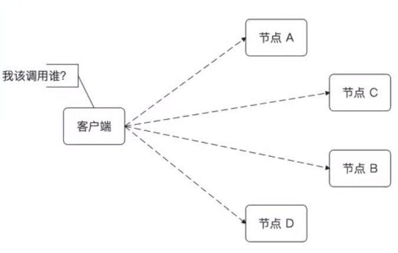
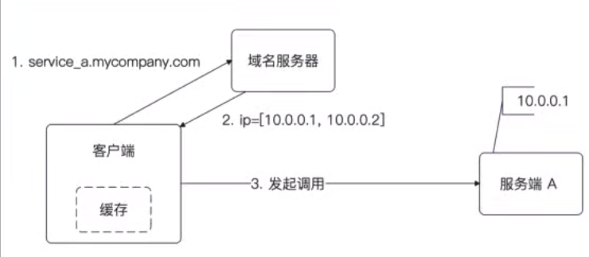
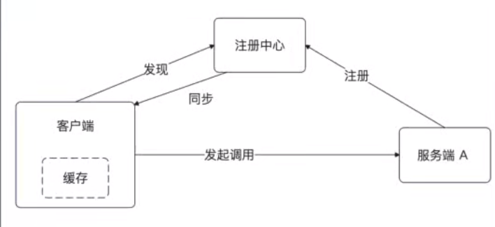
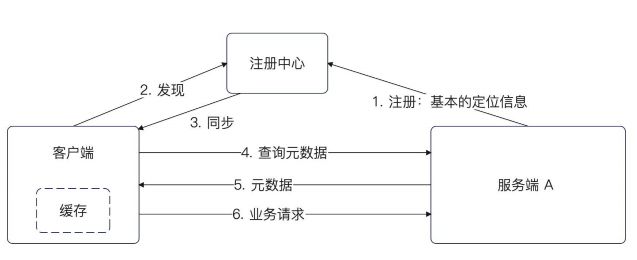
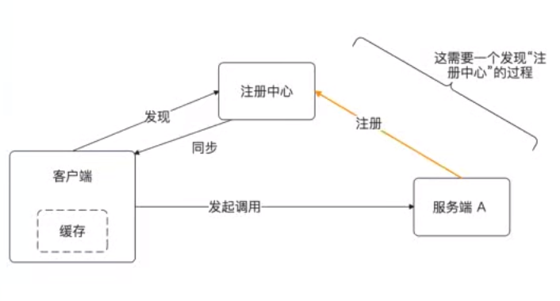
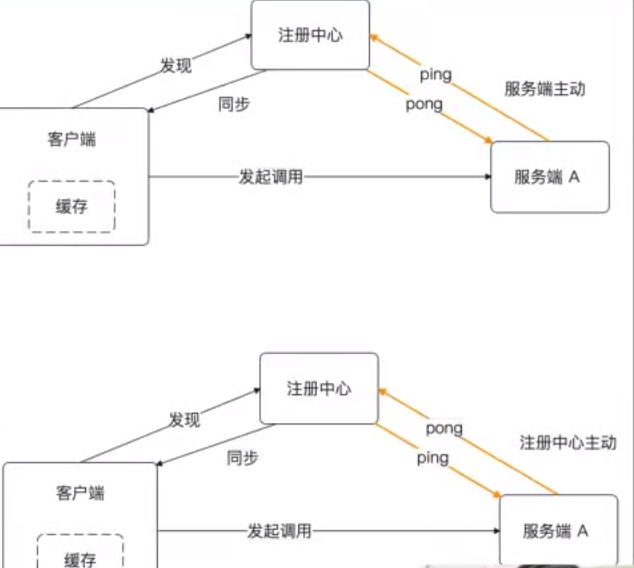
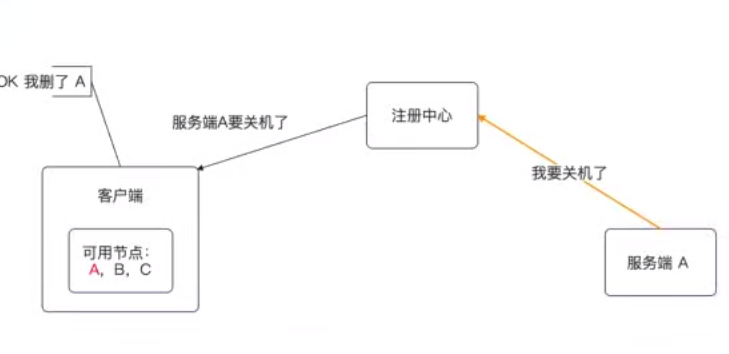
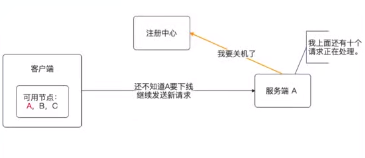
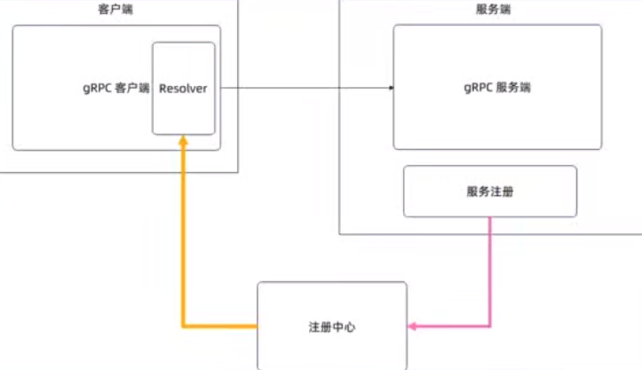

## 简历 preview

简历上 :

1. 使用 xxx 进行了服务的注册与框架

## 服务注册与发现

在微服务架构里面，我怎么知道哪些机器上部署了我需要的服务

### IP + 端口
最原始的形态就是 : `IP+端口`  . 不过这个不能称为 服务注册与发现 ， 因为既没有注册 也没有发现

缺点 :

1.  IP 是会变的 不好维护

### 域名 + DNS

另外一个思路 : 使用域名 + DNS . 因为 IP 经常变动 所以考虑使用域名代替

考虑解析域名的开销，所以 一般在客户端这边缓存解析域名的结果

优点 :

- 简单好用 ，不需要额外的组建

缺点 :

- 如果客户端不缓存 DNS 结果，每次调用都会多一次调用

- 如果客户端缓存 DNS 结果，那么就可能无法及时更新本地可用节点列表

域名解析的问题是不能及时得到通知，那么能不能让域名服务器主动通知一下节点变化 

---

一个域名 可以有多个 IP 地址 。 域名可以认为是一个 连锁品牌 而 每一个 IP 可以认为是一家分店

看来眼代码，我们 Gin 写的 HTTP 内容其实并没有牵扯到域名注册的逻辑 。 

而且我工作的代码，域名注册也是由运维负责的 

### 注册中心

注册中心的原理就是 ：

1. 服务端在启动的时候 主动在注册中心注册一下

2. 客户端在第一次发起调用之前，先查询注册中心，而后缓存住可用节点

3. 注册中心在服务端节点发生变动的时候 ,`主动通知` 客户端

缺点 :

1. 注册中心在大规模集群下，会成为瓶颈

**注册中心自省 :**

dubbo 提出来的概念， 随着集群规模增长 加上 微服务框架复杂度上升，

1. 导致注册中心的 **数据越来越多**, **更新越来越频繁**

于是有了服务自省

1. 保留注册中心, 但是注册中心里面只有最小化的数据

2. 剩余跟服务有关的元数据，通过一个元数据服务来暴露

### 服务注册

问题 :

1. 什么时候进行服务注册 ？ 

 - 暴露端口的时候注册 ？

 - 健康检查通过就注册 ？ 

 - 所有前置计算完成之后再注册

2. 注册什么数据 ？ 

- 定位信息 : IP + 端口 

- 其他信息. 一般和微服务框架等具体功能有关系

### 服务端和注册中心保持心跳

1. 服务端主动保持心跳，服务端每隔一段时间就朝着注册中心发送一个心跳

2. 注册中心主动 。 注册中心主动朝着所有服务端节点发送心跳

主要讨论 ：

- 心跳间隔多长
- 如何判定节点连不上 ？ 一次心跳连不上还是多次心跳连不上 ？

### 服务下线

如果服务端关闭了，就需要通知注册中心，而后注册中心通知客户端

客户端就会把该节点从可用列表里面挪走

服务端优雅下线 :

问题 : 服务端 A 不能告诉注册中心自己下线了之后就立刻退出

1. 需要先通知注册中心，下线

2. 而后 服务端不在接受新请求。（在网络中读取一般的请求，也会直接拒绝）

	- 中间件类似的机制 

3. 服务端需要等待正在处理的请求结束 

4. 等服务端已经接受的请求处理完毕，服务端结束运行

5. 还需要额外考虑 定时任务，分布式事务，数据库事务

## 接入服务注册与发现

### gprc 时候注册中心

gpc 在客户端提供 Resolver 进行对服务的解析 

但是他并没有在 服务端提供 `register` 的功能， grpc 根本不知道你使用的是不是注册中心

### grpc 使用注册中心 etcd 

## 服务注册与发现的高可用

### 高可用

高可用围绕三个点三条边来思考 :

- 服务端崩溃怎么办？ 

- 注册中心崩溃怎么办 ？

- 客户端崩溃 ？。不需要处理

三条边 :

- 注册中心和服务端之间无法通信怎么办 ？

- 注册中心和客户端之间无法通信怎么办？ 

- 客户端和服务端之间无法通信怎么办？ 

	- failover

**服务端崩溃 :**

服务端崩溃 -> 注册中心发现 -> 通知客户端, 中间有时间间隔

简单来说 如果服务端崩溃，那么我们就要切换一个节点来重试 也就是 `failover` 

**注册中心崩溃了怎么办 :**

先描述很难崩溃

- 启用注册中心高可用方案, 例如部署一个集群，多活方案

- 双注册中心方案, 注册的时候同时注册两个注册中心，在一个注册中心崩溃之后可用使用离国内外i啊一个注册中心

- 按照业务拆分多个注册中心 

然后在解决真的崩溃的问题

如果真的崩溃了，客户端怎么办

- 使用本地缓存的可用节点信息

如果真的崩溃了，服务端怎么办

- 如果是新节点，注册失败直接退出服务，如果是老节点继续提供服务

**注册中心与服务端无法通信:**

1. 继续保持服务，并且告警，并且考虑是否要退出

## 面试

1. 服务注册与发现，有哪些组件

	- 客户端、服务端、注册中心
	- 监控平台

2. 什么是注册中心 ？ 为什么要使用注册中心 ？ 直接使用 IP 或域名行不行？ 

	- 一种中间件 用于注册支持的服务的内容

3. 注册的时候，注册了什么数据

	- 定位信息 和 其他信息 （分组信息，权重信息）

4. 在使用注册中心的整个流程是什么

5. 注册中心怎么知道服务端已经崩溃 

6. 注册中心和服务端怎么保持心跳

7. 心跳的间隔怎么设置 ？ 有什么影响 

8. 服怎么避免偶发性心跳失败 

9. 服务端在下线的时候需要注意什么？ 具体的步骤是什么

10. 客户端和注册中心需要保持心跳吗