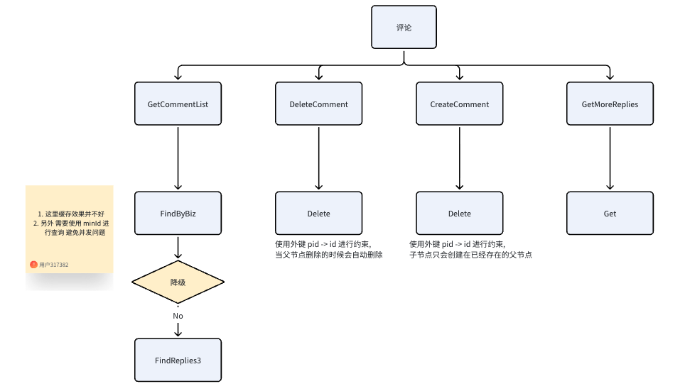

## 简历 preview

简历上 : 设计并实现了 用户的 评论功能, 支持多层级的评论回复

## 流程设计

**需求分析 :**

1. 需要支持 用户 某篇文章进行评论

2. 需要支持 用户 给评论 进行评论

3. 需要支持 获取评论，以及获取子评论，创建评论，删除评论

**模块分析 :**

1. 用户 可以给文章进行 评论 也可以给 用户的评论 进行评论 ， 可以抽象为 用户给某个资源进行评论 因此将评论 单独抽象成一个服务

### 评论服务模块

#### 支持的功能

1. 获取第一页的评论

2. 删除评论

3. 创建评论

4. 获取单条评论

5. 获取子评论

#### 表结构设计

1. 设计 <PID, id> 外键, 因为我们不允许子评论出现在一个不存在的父评论上 。 并且我们希望在删除父评论的时候 同步删除子评论。

2. 引入 RootID, 因为是通过 邻接表创建的 评论结构 。额外创建一个 RootId 列 能够优化查询顶级评论下全部评论的时间

3. PID 和 RootID 的类型是 Sql.NullInt64 因为顶级节点的父节点是空 。 这里考虑优化成 -1 

```go
type Comment struct {
	ID int64

	Uid int64
	Biz   string `gorm:"index:biz_type_id"`
	BizID int64  `gorm:"index:biz_type_id"`


	PID sql.NullInt64 `gorm:"index"`
	// 外键指向的也是同一张表
	ParentComment *Comment `gorm:"ForeignKey:PID;AssociationForeignKey:ID;constraint:OnDelete:CASCADE"`

	RootID sql.NullInt64 `gorm:"index:root_ID_ctime"`
	Ctime  int64         `gorm:"index:root_ID_ctime"`

	// 评论的内容
	Content string

	Utime int64
}
```

#### 获取评论列表功能设计

我们需要获取对应业务的 第一页所有评论，并且返回前3条子评论

1. 直接根据 biz 和 bizID 进行查询

2. 考虑到并发问题 使用 minID 进行偏移控制 。 如果使用 offset 可能会频繁变化

3. 在降级到时候 考虑不去读取子评论 。 遍历所有顶级节点 然后并发的去查询子评论


#### 其他细节

1. 创建和删除 的时候 通过外键进行约束

2. 查询顶级评论的时候 根据 RootId 进行优化




## 难点 & 亮点

**问题 :**

对于多级评论的表结构设计

方案 :

使用邻接表的方案进行设计评论表 。设计 外键 <pid, id> 控制 插入子评论的时候 不应该插入到不存在的父评论 。 以及删除父评论的时候应该同步删除子评论

---

**亮点 :**

1. 在查找第一页评论的时候 需要返回对应的前3条子评论 。 考虑在服务降级的时候，不走这部分慢查询 。 

2. 考虑 用户可以评论 别人的评论 和文章 将评论服务单独拆成一个服务 并且使用 biz + biz_id 进行通用化处理

3. 使用 minId 进行第一次分页查询，避免 offset 在高并发插入下 会漏

4. 表结构设计 冗余 RootID 列，在查询顶级评论的时候能够直接查询全部回复 ，而不需要递归一整颗树


## 缺点

1. 没有较好的缓存方案，例如加载第一页的时候可以考虑 维护一个热榜评论，并且缓存第一页 定时刷新

## 总分：**68 / 100**

对标 **2 年 Golang**、简历点「多层级评论」：能讲清主干，但深度、完整性和面试表达还不够稳，容易被追问卡住。

---

### 分项（满分）

| 维度 | 分 | 说明 |
|------|-----|------|
| 需求分析 / 边界 | 14/20 | 功能列全了，缺非功能（QPS、延迟、一致性、审核） |
| 表结构 / 建模 | 16/20 | 邻接表 + RootID + FK 方向对，细节经不起深挖 |
| 查询 / 分页 | 12/20 | 知道 minID、降级，论证不严谨，实现路径模糊 |
| 亮点可讲性 | 14/20 | 有点，但缺「为什么 / 怎么权衡 / 踩过什么坑」 |
| 表达与材料质量 | 12/20 | 结构尚可，笔误多、描述空、像草稿 |

---

### 优点

1. **服务抽象合理**：`biz + biz_id` 把「评文章 / 评评论」统一成资源评论，符合可扩展拆分，面试官一般认可。
2. **树存储选型正确**：邻接表 + 冗余 `RootID` 是常见方案；外键约束父子存在性、级联删也说得通。
3. **有工程意识**：第一页带前 3 条子评、降级不查子评、`minID` 代替 `offset`，说明想过热路径和并发插入。
4. **有自省**：主动写「缺缓存」比硬吹完整方案更加分。

---

### 缺点（面试里会被追的）

1. **「多层级」与实现深度不匹配**  
   简历写多层级，正文几乎是「顶级 + 若干子评」。要明确：产品是无限嵌套还是只展示两级；邻接表如何保证插入时 `PID/RootID` 一致。

2. **分页说法不严谨**  
   高并发下 `offset` 的问题主要是**重复/跳过、深分页成本**，不是简单「漏数据」。`minID`（游标）要讲清排序键（`id` 还是 `ctime`）、同时间戳、方向（上滑/下滑）。

3. **级联硬删很脆**  
   真实产品多为软删、子评保留并标「父评已删」。只说 `OnDelete:CASCADE` 会被问：误删恢复、审核下架、计数怎么维护。

4. **「前 3 条子评」实现空洞**  
   按时间还是热度？一次 SQL 还是 N+1？并发查子评的限流、错误、超时？降级开关与指标？这些不补，亮点站不住。

5. **空值方案半吊子**  
   `sql.NullInt64` vs `-1` 只提「考虑」，没有索引、查询条件、GORM 写入的结论。

6. **缺面试常问块**  
   创建时事务与 RootID 赋值、内容长度/敏感词、计数（回复数）、鉴权（谁可删）、幂等、缓存一致性——几乎空白。

7. **材料完成度低**  
   `description: xxxx`、错别字、口语化、无接口草图/时序，显得准备不充分。

---

### 建议（按优先级）

1. **准备 3 分钟口述稿**：需求 → 为何独立评论服务 → 表（PID/RootID）→ 第一页查询（含前 3 条子评）→ 降级 → 已知不足（缓存）。控制在 2～3 分钟。
2. **画清两种删除语义**：硬删级联 vs 软删；选一种并说清对列表、计数、子评展示的影响。
3. **把分页讲死**：排序字段、`WHERE id < ? ORDER BY id DESC LIMIT`、为何不用 `offset`、边界 case。
4. **补「前 3 条」实现**：例如按 `root_id` 批量取 + 应用层截断，或窗口函数；说明为何不用「每条顶级再查一次」做默认路径。
5. **补一条缓存方案（哪怕未做）**：第一页热评 ZSet / 本地+Redis、失效（写删、TTL）、穿透与击穿——对应你自己写的缺点。
6. **对齐简历用词**：若只做两级展示，简历改成「支持回复与两级展示」；若真支持 N 级，补插入校验与查询深度限制。
7. **准备 5 个追问答案**：并发插评、父评不存在、删父留子、深分页、评论热点文章打爆 DB。

---

### 一句话结论

**68 分**：方向和关键词对，够「做过评论」的入门讲述；要过认真的 Golang 一面/二面，需要把分页、删除语义、子评批量查询和缓存权衡讲扎实，并把材料从草稿修到能直接口述的版本。