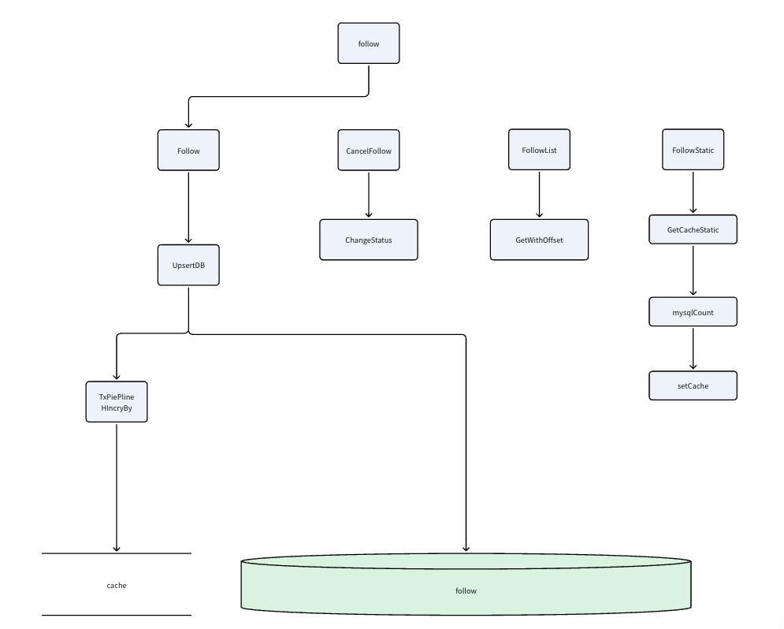

## 简历 preview

简历上 : 实现了一个完整的用户关系功能 支持 关注、取消关注、获取关注列表


## 流程设计

**需求分析 :**

1. 要求支持 用户的关注，取消关注，获取关注列表，获取关注数量的功能

**模块分析 :**

1. 完全独立的一个业务，单独拆分成一个模块


### 关注模块

#### 支持的功能

1. 关注某人

2. 取消关注

2. 查看用户粉丝列表

3. 查看用户关注列表

4. 查看用户关注数量

#### 表结构设计

表结构维护 Follower 和 Followee 以及 status 进行维护关系之间的展示

并且创建 唯一索引 <follower_followee> 和 普通索引 <followee_follower> 来优化 查询用户的关注列表和粉丝列表

```go
type FollowRelation struct {
	ID int64 `gorm:"primaryKey,autoIncrement,column:id"`

	Follower int64 `gorm:"type:int(11);not null;uniqueIndex:follower_followee,priority:1;index:followee_follower,priority:2"`
	Followee int64 `gorm:"type:int(11);not null;uniqueIndex:follower_followee,priority:2;index:followee_follower,priority:1"`

	Status uint8

	// 这里你可以根据自己的业务来增加字段，比如说
	// 关系类型，可以搞些什么普通关注，特殊关注
	// Type int64 `gorm:"column:type;type:int(11);comment:关注类型 0-普通关注"`
	// 备注
	// Note string `gorm:"column:remark;type:varchar(255);"`
	// 创建时间
	Ctime int64
	Utime int64
}
```


#### 缓存设计

使用 Hash 结构维护一个 `follow` 和 `followee` 的关注和被关注数量 

使用 TxPiepline 进行一致性控制 

在关注和取消关注的时候 进行同步的 +1 和 -1 操作


#### 其他细节

1. **拉黑，屏蔽** 的功能不额外创建表进行存放 。 考虑这个操作是一个低频操作，因此使用 status 直接存放到 关系表里面

2. 对于 关系表 ， 一个用户关注100个人，那么行数就会增加100倍。 使用 阿里的 `tablestore` 进行类似分库分表的优化

3. 获取用户关注数量和粉丝数量的时候 。 优先去获取 Redis 的数量 然后再通过 Mysql Count 进行统计

4. 获取关注列表不进行缓存 。

	- 考虑是一个低频操作 缓存命中率低
	- 并且是一个分页查询 不好缓存





## 难点 & 亮点

**问题 :**

1. 维护关注数量 , 我们可以采用单独创一张表进行实现。 但是为关注服务直接创一张表太重了 

方案  :

1. 因此使用 Redis 进行直接统计 计数 在关注和取消关注的时候分别操作

2. 在获取关注数量的时候 使用 Cache-Aside快慢路径 ， 优先获取 Redis 的数据 然后再根据 Count 进行计数 。 因为 我们关注表的索引设计，保证了能够命中索引

---

**问题 :**

1. 创建了唯一索引后 <followee_follower> 。这个只能解决查询粉丝数量，但是对于关注数量 并不能很好的命中索引

方案 :

1. 反向创建一个普通索引，不需要额外创建唯一索引 因为原有的索引就能控制  。

---


**亮点 :**

1. 使用 `tablestore` 进行维护大数据量级的 关系信息 。 避免自身系统的复杂性

2. 使用 TxPiePline 进行 控制 同时写入 粉丝和关注 的计数  。

3. 获取关注和粉丝列表是一个分页接口 考虑 用户使用频率低 缓存命中率差。不进行额外缓存

4. 取消关注 通过 表设计的 status 进行处理 更新 status 就可以完成取消关注，软删除 。 并且在关注功能的时候 ， 使用 Upsert 保证语意


## 缺点

1. 对于关系维护的大数据量级处理 只是引入了三方的 tablestore 进行处理比较简单

2. 如果 Redis 崩溃，那么会有大部分 Count操作进入到 我们的Mysql 中 并没有很好的容错机制


## 总分：**68 / 100**

对「2 年经验、讲关注关系模块」的面试准备来说：**骨架够用，能过一轮筛选，但扛不住有经验的面试官追问。** 更像「能把做过的事串起来」，还没到「能把设计讲透、把坑讲清楚」。

---

### 优点

1. **需求边界清晰**：关注 / 取消关注 / 列表 / 数量，模块独立，简历表述和正文能对上。
2. **表设计基本正确**：`Follower + Followee` + 唯一索引防重复关注，反向普通索引服务粉丝查询，这是面试里常见的加分点。
3. **有取舍意识**：列表不缓存（低频 + 分页）、拉黑用 `status` 软状态、取消关注用 status + Upsert，说明不是只会「全量加 Redis」。
4. **有自我批评**：缺点里提到 Redis 挂了打爆 MySQL、tablestore 引入偏简单，态度加分。

---

### 缺点（面试里容易被打穿）

1. **一致性讲错/讲浅了**  
   `TxPipeline` 只保证 **Redis 内部多命令原子**，不保证 **MySQL ↔ Redis** 一致。面试官一问「DB 成功、Redis 失败怎么办？」现在的稿子接不住。

2. **索引表述前后矛盾**  
   前文唯一索引是 `follower_followee`，难点里写成「唯一索引 `<followee_follower>`」——细节错了会显得没真正想清楚。

3. **计数方案深度不够**  
   Hash + 同步 ±1 + Cache-Aside，缺：key 设计、并发丢更新、缓存击穿/雪崩、冷启动回源、与 DB 对账。

4. **亮点偏「名词」**  
   `tablestore`、Pipeline 写得很空，2 年经验候选人若只背名词，追问「为什么不用分表 / 为什么不用计数表」会立刻露馅。

5. **业务边界漏洞**  
   未关注却要拉黑、自己关注自己、重复关注并发、软删后重新关注的语义、分页游标 vs offset，基本没准备。

6. **几乎没有 Golang 工程视角**  
   接口分层、Repo、事务边界、幂等、错误码、超时降级——对「Golang 岗」这是硬伤。

7. **文档完成度差**  
   `xxxx`、`TxPiepline` 拼写、序号重复（两个「2.」），会给面试官「准备潦草」的印象。

---

### 建议（按优先级）

| 优先级 | 做什么 |
|--------|--------|
| P0 | 把一致性故事补全：写路径（先 DB 再 Redis / Outbox / 对账）、读路径降级、Redis 不可用时的限流与熔断 |
| P0 | 画一张「关注 / 取消关注」时序图，标清事务、Upsert、status、计数更新顺序 |
| P1 | 准备 3 个追问标准答：并发重复关注、未关注拉黑、百万粉丝列表分页 |
| P1 | 把 tablestore 改成「可选扩展」：先讲单机/单库上限与分片思路，再提引入外部存储的原因与代价 |
| P2 | 补一层 Go 实现：`FollowService` 接口、幂等、GORM 事务片段，能对着代码讲 2 分钟 |
| P2 | 修正文案与术语：Pipeline 拼写、索引名统一、标题 description 写完整 |

---

### 分项参考（面试官视角）

| 维度 | 分数 | 说明 |
|------|------|------|
| 需求与模块拆分 | 78 | 清楚，但偏浅 |
| 存储与索引 | 72 | 方向对，表述有错 |
| 缓存与一致性 | 55 | 最大短板 |
| 难点/亮点说服力 | 60 | 有点，深度不够 |
| 自我认知与表达 | 70 | 有缺点意识，文档粗糙 |
| 对 2 年岗的匹配度 | 68 | 能讲项目，难打深水区 |

---

**一句话**：当成「项目介绍提纲」大约 70+；当成「能过中高级追问的面试稿」现在大概 60 出头。把 **DB–缓存一致性** 和 **3～5 个边界追问** 补扎实，整体可以冲到 **80+**。