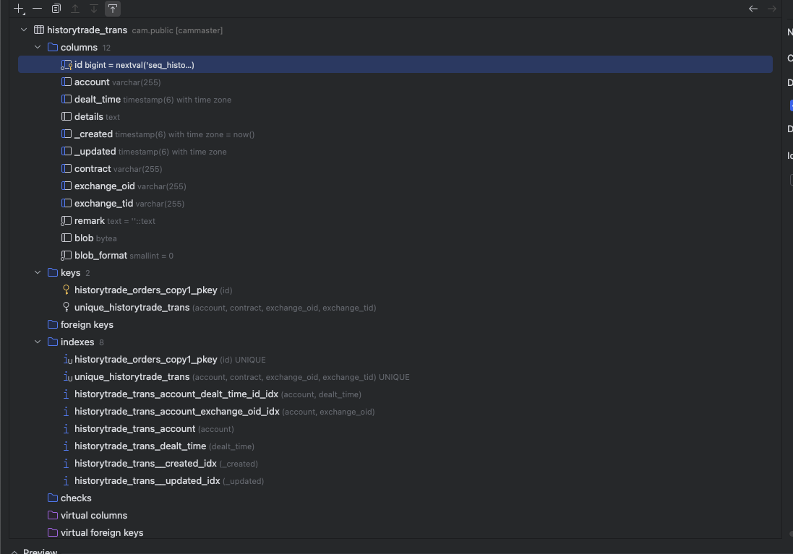
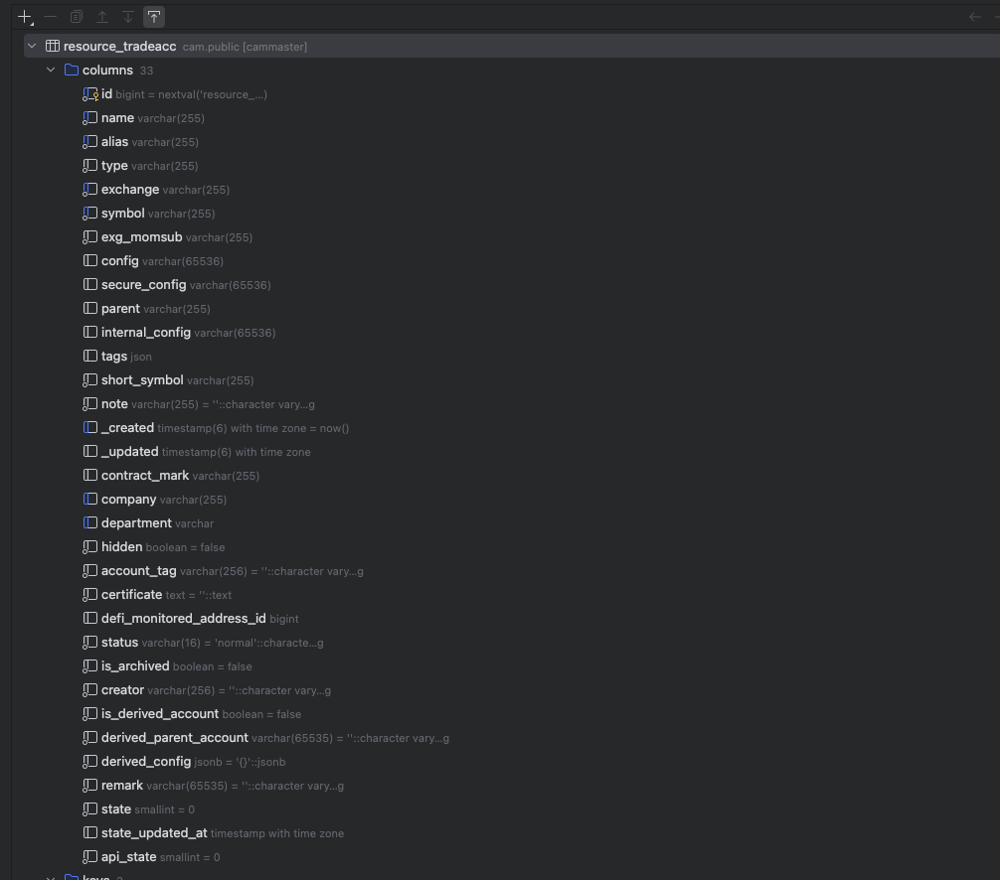
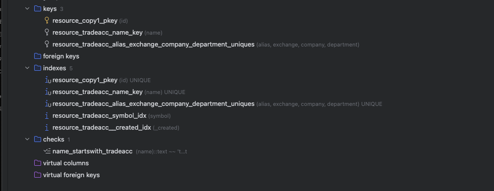

学累了我就看面经，看多了就会发现都是一些什么神人在卷，然后就不想学了

本篇面筋来自 : https://www.nowcoder.com/discuss/631514581503926272?sourceSSR=users

## 店匠科技 一面

### 算法题 

两数之和

1. 暴力做法 N^2 匹配
2. 优化做法 通过 Map 进行标记

```go
func twoSum(nums []int, target int) []int {
    hashTable := map[int]int{}
    for i, x := range nums {
        if p, ok := hashTable[target-x]; ok {
            return []int{p, i}
        }
        hashTable[x] = i
    }
    return nil
}
```

### 聊项目

#### 系统数据模型怎么设计的

说实话我自己做的项目都数据库表可以说是抄的，我们系统的呢

对于一张数据表 `historytrade_trans` 我们拥有



对于一张 `Tradeacc` 表 我们拥有





Trans表中，我们把会演进的内容放到了 `detail` 中 ，好处是 如果增加或者是删除字段 不需要频繁更改 列

通用设计表的步骤 :

区分实体 :

主数据  :
 
 - 特征 : 数据少,变，被引用 
 - 例如 : 账户表
 - 默认倾向 : 宽表 + 局部 Json

事件 :

 - 特征 : 多,追加写,按时间查
 - 例如 : 成交表
 - 默认倾向 : 窄表 + payload

 关系 :

 - 特征 : 关联 A-B 
 - 例如 : 关系表
 - 默认倾向 : 极简列 + 联合唯一


#### 监控关注的业务指标

- 我们只关注 IP 层级的限速
- 入库率


### 八股

#### Session 是什么

1. 不清楚
2. 前端有session，可以直接拿到apifox用

#### 一致性

1. 不清楚

#### 分布式事务

1. 不清楚

## 店匠科技 二面

### 算法题

一个文件里有40亿个数字，找出最大的10个数字

写不下去了有点累