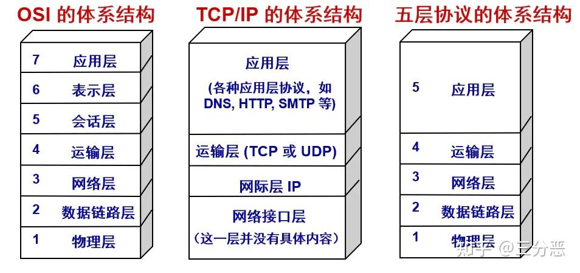
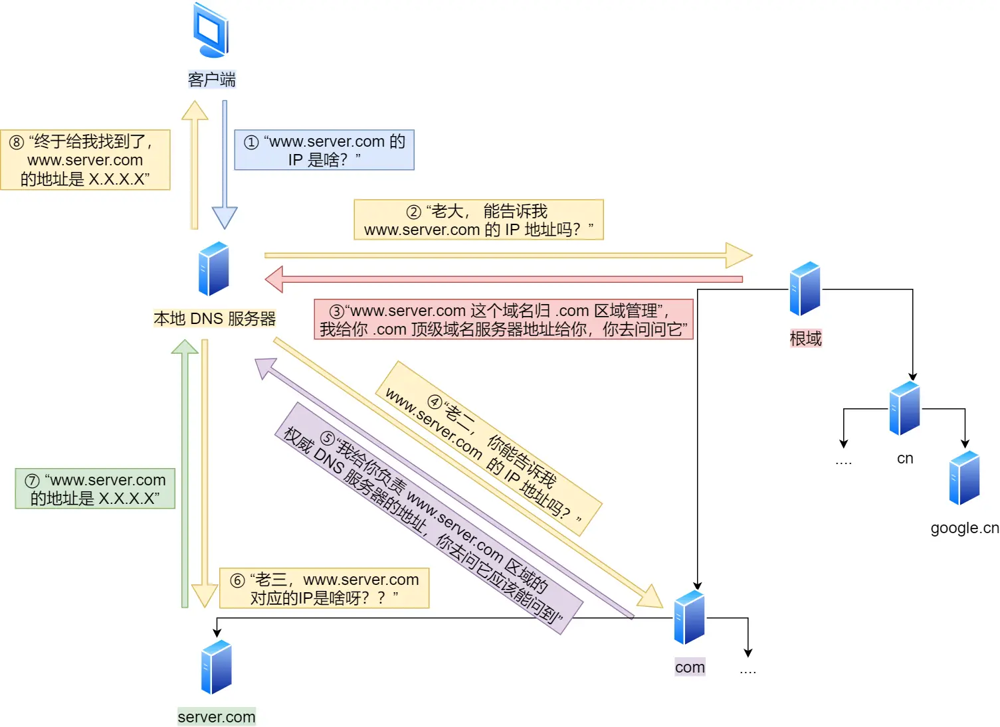

写在开头 :

本次复习主要使用 : https://www.xiaolincoding.com/network/

个人对此上面的评价 : 应该很难找到同效益的平替内容了, 如果有人不知道这个他可能会去b站上面看考研的来复习？

## TCP/IP 网络模型有哪几层

应用层、传输层、网络层、网络接口层

这是TCP/IP的体系结构, 之前可能学习的都是7层网络结构，内容太复杂了

**其中传输层有 :**

TCP 和 UDP 两个传输协议

TCP 自身拥有 : 流量控制，超时重传，拥塞控制

UDP 相对简单称为不可靠协议

**网络层 :**

IP 协议 : 组装传输层的报文加上IP包头组装成IP报文进行传递

## 键入网址到网页显示,期间发生了什么

### HTTP

浏览器解析 `URL`, 一个 URL 到组成如下 :

`http:` URL表示访问数据的协议

`//` + `web服务器` + `数据源文件路径名`

对URL进行解析之后，会根据这些信息来生成 HTTP 请求报文

### DNS

`查询服务器域名对应的IP地址` 进行发送对应的 HTTP 消息

域名则是上面的 `web服务器` 例如 `www.server.com` 

### IP + TCP/UDP 协议栈

找到对应的 IP 地址后, 通过 IP 协议进行传输

然后根据 TCP 和 UDP 的方式进行发送和接受数据

##  TCP 链接 (三次握手)

1. 服务端主动监听某个端口，处于 `LISTEN` 状态
2. 客户端主动发起链接 `SYN`，处于 `SYN_SENT`
3. 服务端收到发起链接，返回 `SYN+ACK` , 处于 `SYN_RCVD` 
4. 客户端收到服务端发起的 `SYN+ACK` 后发送 `ACK` 处于 `ESTABLISHED` 状态

## 感悟

基础篇讲的内容很多，但是我看了一些内容感觉都是 `无用的` ，至少对工作开发无用，如果我是面试官我也不会以这种问题去刁难
